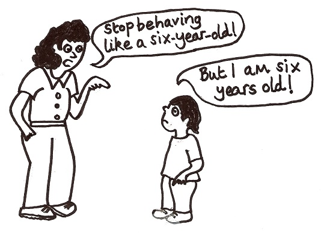

## Поведения/OTP


---
## Да си преговорим!

* Какви представляват процесите?
* Как си комуникират процесите?
* Какво в връзка между процеси?
* Какви абстракции над процеси знаем?

---
## Съдържание

1. Защо Erlang не е статично типизиран?
2. Тип спецификации и dialyzer
3. Поведения
4. OTP

---
### Защо erlang не е статично типизиран?

Вие как мислите?

---
### Защо erlang не е статично типизиран?

* Динамичното типизиране помага с hot code reloading (промяна на цели модули и функции runtime).
* Дистрибутиран erlang прави това още по-трудно (node-ове извикват функции/пращат съобщения).
* Динамичното типизиране помага с изпращане на всякакви съобщения.

---
### Защо erlang не е статично типизиран?

* Опит за статична система за изпращане на съобщения в езика [Links](http://links-lang.org).
* Erlang-ският receive не може да бъде направен в Links, понеже всеки receive ще трябва пълно да изразходва всички pattern-и за съобщения, за да минава type checker-a.

---
### Защо erlang не е статично типизиран?

* Изпращането на съобщения допълнително ще затрудни типовата система.
* Всяка функция ще трябва да има допълнително информация за какви съобщения приема.
* Тоест вместо `A -> B`, нещо като `A ~ C -> B`, където `C` са видовете съобщения, на които функцията "може да приеме".

---
### Защо erlang не е статично типизиран?

* Друг проблем би бил "смъртта", или терминирането на процес.
* Наблюдаването на процес би изисквало да може да приема точно `{:EXIT, ...}` съобщение.
* С други думи, ако всеки процес има типове `(m, d)`, където `m` са съобщения, които приема и `d` причини за смъртта на един процес, тогава само процес `(a, _)` би наблюдавал процес `(_, a)`, което е доста лимитиращо.

---

#### Story time

* Имало е много опити през годинитe за типизиране на Erlang.
* Един от тях е бил през 1997 воден от Simon Marlow (lead GHC dev) и  Philip Wadler (haskell design, заслуги за теорията зад монадите).
* Резултатът бил този [научен труд](http://homepages.inf.ed.ac.uk/wadler/papers/erlang/erlang.pdf)

---
### Защо erlang не е статично типизиран?

* След като процесите и съобщенията са едни от най-важните неща за Ерланг, става ясно защо тази система не е добавена.
* Други опити за типизиране на Erlang също се провалили.
* Трябва ли да изоставим всякаква надежда?

---
### Dialyzer


---
### Dialyzer

* Има инструмент, наречен *dialyzer*, който се използва доста нашироко.
* Той си идва със собствен type inference механизъм, наречен *success typing*.

---
#### Как работи?

* Построява таблици, които съдържат информация с инферирани типове на абсолютно всички функции в системата.
* Наричаме ги PLT - persistent lookup table
* Добрата страна на PLT-то е, че се билдва инкрементално.

---
### Success Typing 101


---
### Success Typing 101

* Няма да се опита да инферира точния тип на всеки израз.
* Ще гарантира, че типовете, които инферира са правилни.
* Ще гарантира, че грешките, които намира са наистина такива.
* Повече информация [тук.](http://www.it.uu.se/research/group/hipe/papers/succ_types.pdf)

---
### Typespecs

* "Езикът" на dialyzer.
* Ето [тук](https://hexdocs.pm/elixir/typespecs.html) има пълен списък.
* Няма да се задържаме много над тях, но ще ги ползваме.
* Допринасят за документация (инструменти като [ExDoc](https://github.com/elixir-lang/ex_doc) ги ползват)
* Текстови редактори дават *hints* чрез тях.

---
## Типове

```elixir
defmodule Server do

  @type t :: %__MODULE__{
          location: String.t(),
          port: pos_integer(),
          configurations: [%{atom => term()}]
        }

  defstruct [:location, :port, :configurations]

  @spec get_location(server :: t()) :: String.t()
  def get_location(%__MODULE__{location: location}), do: location
end
```

---
## Поведения



---
## Поведения

* Начин да разделим абстракцията от имплементацията.
* [Oще документация](https://hexdocs.pm/elixir/typespecs.html#behaviours)

---
### Поведенията ни дават начин да правим:

* module dispatch
* Проверка, че даден модул имплементира дадени функции.
* Да се абстрахираме от имплементации и да имаме алтернативни имплементации.
* Помага за тестове!
* Ако се налага -  мислите за тях като интерфейсите в **!нормалните** езици.

---
## Поведения

```elixir
defmodule Parser do
  @callback encode(term) :: {:ok, String.t} | {:error, String.t}
  @callback decode(String.t) :: {:ok, term} | {:error, String.t}
end
```

---
### Имплементация на JSON Parser

```elixir
defmodule JSON do
  @behaviour Parser

  def encode(term), do: :implement
  def decode(str), do: :implement
end
```

---
### Имплементация на MsgPack Parser

```elixir
defmodule XML do
  @behaviour Parser

  def encode(term), do: :implement
  def decode(str), do: :implement
end
```

---
### Dynamic dispatch

Можем динамично да решаваме кога да извикаме даден модул.

---
### Dynamic dispatch

```elixir
defmodule Parser do
  # ... rest of code ...

  def encode!(implementation, term) do
    implementation.encode(term)
  end
end

Parser.encode!(JSON, term)
```

---
### Behaviours vs Protocols


---
### Behaviours vs Protocols

* Протоколите ни дават полиморфизъм над типове/дата.
* Поведенията ни дават динамично да се включваме където ни трябва.
* Един вид - протоколите са поведения + логика за dynamic dispatch

---
### Behaviours vs Protocols

[Коментар](https://stackoverflow.com/questions/26215206/difference-between-protocol-behaviour-in-elixir) от авторът на Elixir in Action
Още от създателя на езика [по темата](https://groups.google.com/d/msg/elixir-lang-talk/S0NlOoc4ThM/tfqdDUSPvvsJ)

---
## OTP Поведения


---
### Какво е OTP?


---
### Какво е OTP?
* OTP е платформата, с която се разпространява Erlang.
* Версиите на Erlang са версии на OTP.
* OTP е стандартната библиотека на Erlang.
* OTP е Open Telecom Platform, но с времето OTP се е превърнала от платформа за писане на телекомуникационни програми в нещо повече.

---
Платформата OTP идва с:

* Интерпретатор и компилатор на Erng.
* Стандартните библиотеки на Erlang.
* Dialyzer.
* Mnesia - дистрибутирана база данни.
* ETS - база данни в паметта.
* Дебъгер.
* И много други...


---
В книгата **Designing for Scalability with Erlang/OTP** авторите *Francesco Cesarini* и *Steve Vinoski* дефинират OTP като три ключови компонента:

1. Самият Erlang
2. Множество от библиотеки и виртуалната машина
3. Множество от **system design principles**

---
### OTP Compliant Proccess

След OTP лекциите е силно препоръчително да спрете да спрете създавате процеси чрез **spawn**. Също така всички ваши процеси трябва да са [OTP съвместими](http://erlang.org/doc/design_principles/spec_proc.html). Това ще им позволява:
1. Да бъдат използвани в супервайзор дърво
2. Грешките в тези процеси да бъдат записвани с повече детайли

---
### OTP Compliant Proccess

Но няма често да ви се налага ръчно да имплементирате OTP-compliant частта.

Erlang/OTP идва с абстракции, които имплементират OTP-съвместими процеси.

---
Ние ще разгледаме три абстракции от OTP:

* GenServer
* Supervisor
* Application

---
Има и още:
* gen_statem - State Machines
* gen_event - Event handling
* GenStage - Producer/Consumer pipeline(не е част от OTP, но е compliant)

---
Ще разгледаме и базата ETS
* База данни в паметта
* Бърз и конкурентен достъп
* Работи се с tuple-и и Elixir/Erlang данни

---
## GenServer


---
## GenServer

* *GenServer* представлява процес.
* Представен е от модул, който предлага функции за различни, често срещани случаи при работа с процеси.

---
Какви функции?

* Функции за синхронна и/или асинхронна комуникация.
* Функции, които се извикват при създаване на процес или преди унищожаването му.
* Функции за нотифициране при грешки и за логване.

---
## GenServer

* С помощта на мета-програмиране GenServer е специален тип поведение.
* Задава callback функции, които имат имплементации по подразбиране.
* За да направим от един модул GenServer, използваме "use GenServer".

---
### Защо GenServer?
* Когато комбинираме GenServer-и със Supervisor процеси лесно можем да създадем fault-tolerant система.
* Добри практики за писане на процеси.
* Не се занимаваме с Boilerplate code за receive.
* Дава ни скелет за инициализация на *state* и работа с него синхронно и асинхронно.
* Получаваме и функции за реагиране при проблем или при нестандартни съобщения.


---
## GenServer

```elixir
defmodule StateServer do
  use GenServer

  def start_link(initial_state, opts \\ []) do
    name = Keyword.get(opts, :name, __MODULE__)
    GenServer.start_link(__MODULE__, initial_state, name: name)
  end

  def init(init_arg) do
    {:ok, init_arg}
  end
end

{:ok, pid} = StateServer.start_link(%{})

# С функциите в :sys можем да взаимодействам с GenServer-и и други OTP процеси.
:sys.get_state(pid)
```

---
Да си вземем стейта?

```elixir
defmodule StateServerA do
  use GenServer

  def start_link(initial_state, opts \\ []) do
    name = Keyword.get(opts, :name, __MODULE__)
    GenServer.start_link(__MODULE__, initial_state, name: name)
  end

  @impl GenServer
  def init(init_arg), do: {:ok, init_arg}

  @impl GenServer
  def handle_call(:get, from, state) do
    IO.inspect(from)

    {:reply, state, state}
  end
end

{:ok, pid} = StateServerA.start_link(%{})
GenServer.call(pid, :get)
#:gen.call(pid, :"$gen_call", :get, 5000)
#send(pid, {:"$gen_call", {self(), [:alias, make_ref()]}, :get})
#receive do
#  msg -> IO.inspect(msg)
#end
```

---
## GenServer

* Асинхронни съобщения, *handle_cast*, *handle_info* и *handle_continue*.
* Терминиране на процеса и *terminate*.
* Code change и промяна на кода по времена изпълнение.

---
## GenServer

* Задава ни шаблон за процес със или без състояние.
* Дава ни лесен начин за комуникация без boilerplate.
* Дава ни различни начини да го спрем или накараме да чака, ако е нужно.
* На практика spawn/send/receive не се ползват при работа, ползва се GenServer.

---
## Supervisor


---
### Какво е Supervisor?

* Това е процес, чиято роля е да наглежда други процеси и да се грижи за тях.
* С помощта на Supervisor, по лесен начин можем да изградим fault tolerant система.
* Идеологията около това поведение е лесна за възприемане.
* Трудното е да направим добър дизайн на такава система.

---
Let it crash!

* Важно е програмата да върви.
* Ако части от нея се сринат, не е проблем - нещо наблюдава тези части.
* Нещо ще се погрижи те да бъдат възстановени.
* Това нещо е Supervisor.

---
## Supervisor

Подобно на GenServer, Supervisor е поведение, за което callback функциите имат имплементации по подразбиране.

---
```elixir
defmodule SomeSupervisor do
  use Supervisor
end
```

---
В модула Supervisor има код, който може:

* Да инициализира и стартира Supervisor процес.
* Да осигури, че Supervisor процесът прихваща EXIT сигнали.
* Да стартира определен списък от процеси-деца, зададени на Supervisor-а и да ги link-не към него.

---
Поведението Supervisor дава възможност:

* Ако някой от процесите-деца 'умре' непредвидено, Supervisor-ът ще получи сигнал и ще предприеме конкретно действие, зададено при имплементацията му.
* Ако Supervisor-ът бъде терминиран, всичките му процеси-деца биват 'убити'.

---
### Supervisor: Стратегии


---
:one_for_one

* Ако наблюдаван процес 'умре', той се рестартира.
* Другите не се влияят.
* Тази стратегия е добра за процеси които нямат връзки и комуникация помежду си, които могат да загубят състоянието си без това да повлияе на другите процеси-деца на Supervisor-а им.

---
:one_for_all

* Ако наблюдаван процес 'умре', всички наблюдавани процеси биват 'убити' и след това всички се стартират наново.
* Обикновено тази стратегия се използва за процеси, чиито състояния зависят доста едно от друго и ако само един от тях бъде рестартиран ще е се наруши общата логина на програмата.

---
:rest_for_one

* Ако наблюдаван процес 'умре', всички наблюдавани процеси стартирани СЛЕД недго също 'умират'.
* Всички тези процеси, включително процесът-причина се рестартират по първоначалния си стартов ред.
* Тази стратегия е подходяща за ситуация като : процес 'A' няма зависимости, но процес 'Б' зависи от 'А', а има и процес 'В', който зависи както от 'Б', така и транзитивно от 'А'.

---
Supervisor: max_restarts и max_seconds

* С опцията :max_restarts задаваме колко пъти може един процес да бъде рестартиран в даден период от време.
* По подразбиране е 3.
* Ако за :max_seconds секунди пробваме да рестартираме процеса :max_restarts пъти, трябва да се откажем.

---
## Supervisor

* В следващи лекции ще започнем да ги ползваме доста.
* Една библиотека или програма винаги има дърво от Supervisor-и.
* Листата на това дърво са GenServer-и, node-овете до тях - Supervisor-и.
* Това е шаблон спомагащ ни да имаме available/resilent/fault-tolerant система.

---
## Application


---
### Какво е Application?

* Application е компонент в Elixir/Erlang, който може да бъде спиран и стартиран като едно цяло.
* Може да бъде използван от други Apllication-и.
* Един Application се грижи за едно supervision дърво и средата в която то върви.

---
### Какво е Application?

* Винаги, когато виртуалната машина стартира, специален процес, наречен 'application_controller' се стартира с нея.
* Този процес стои над всички Application-и, които вървят в тази виртуална машина.
* Mожем да го наречем Supervisor на Application-ите.

---
### Какво е Application?

* Можем да приемем application_controller процеса за коренът на дървото от процеси в един BEAM node.
* Под този 'корен' стоят различните Application-и, които са абстракция, обвиваща supervision дърво, която може да се стартира и спира като едно цяло.
* Те са като мега-процеси, управлявани от application_controller-a.
* Отвън те изглеждат като един процес за който имаме функции start и stop.

---
### Какво е Application?

* Когато се стартира един Application се създават два специални процеса, които заедно са наречени 'application master'.
* Тези два процеса създават Application-а и стоят между application_controller процеса и Supervisor-а служещ за корен на supervision дървото.

---
### Създаване и конфигурация на Application


---
* OTP Application поведението и логиката около него идват от Erlang/OTP.
* Application-ите се конфигурират със специален .app файл, написан на Erlang.
* Той се слага при .beam файловете, които описва и след това може да се зареди на node, който има в пътя си директорията с него и тези .beam файлове.

---


---

```bash
mix new <app_project_name> --sup
```

---
Mix файл и конфигурация на един Application


---
### Как стартираме един Application?

```bash
elixir -S mix run
```

---
## OTP поведения
* GenServer, Supervisor и Application ни дават blueprint за писане на Erlang/Elixir библиотеки и приложения.
* Те са набор от добри практики за работа с процеси и конфигурации как да се справяме с грешки и runtime поведене.
* Application-ите са блоковете, които изграждат един *release*, а *release*-а е това, което, когато пуснем да върви, наричаме *BEAM node*.
* В следващите лекции ще гоорим и ще се занимаваме много с Application, Supervisor и GenServer.


---
## Материали

* [Повече за GenServer](https://elixir-lang.bg/archive/posts/gen_server)
* [Повече за Supervisor](https://elixir-lang.bg/archive/posts/supervision)
* [Повече за Application](https://elixir-lang.bg/archive/posts/application)

---
## Край

