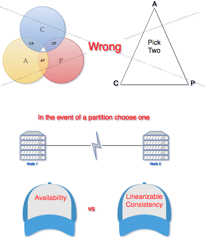

## Дистрибутиран Elixir

---
### Да си припомним

1. Какво е BEAM Node?
2. Какво е OTP Application?
3. Какво е Supersvision дърво?

---
### Как се стартира BEAM node?

```bash
iex -S mix
```

---
### Ако не ни е нужен shell?

```bash
mix run --no-halt
```

```bash
elixir -S mix run --no-halt
```

---
### И пак mix, mix, mix!

```bash
elixir --detached -S mix run --no-halt
```

---


---
#### MIX

* Mix компилира кода и го слага на правилно място.
* Mix генерира app file и оправя зависимостите.
* Mix знае пътищата, които са ни нужни, и как да стартира проекта.

---
#### RELEASE

* Има как да правим release, който да се пуска в production и не ползва Mix.
* OTP Release е нещо, което може да се стартира:
  * Чрез инсталиран Erlang (не трябва Elixir);
  * Или дори без Erlang (енкапсулира ERTS в самия Release).
* Elixir идва командата `mix release` за компилиране на release

---


---
## Дистрибутиран Elixir


---
### Съдържание

1. Какво означава да сме дистрибутирани?
2. Node-ове и функции за свързване и комуникация.
3. Проблемите на дистрибутираните системи.
4. Тестване на дистрибутиран Elixir.
5. Кога да ползваме дистрибутиран Elixir?

---
### Какво означава да сме дистрибутирани?

* Дистрибутираност значи, че програмата ни се изпълнява на две или повече виртуални машини.
* Elixir ни дава добри инструменти за постигане на това.

---
### Какво означава да сме дистрибутирани?

* Един node е една виртуална машина.
* Всеки node може да е отворен или затворен за комуникация с други nodes.

---
## Функции за статус на node

- Как да видим името на node-a си?

```elixir
node()
#=> :nonode@nohost
```

---
### Функции за статус на node

- Как да направим node-а си 'жив'?

```elixir
Node.alive?
#=> false

Node.start(:meddle, :shortnames)
#=> {:ok, #PID<0.115.0>}
node()
#=> :"meddle@meddlandr"
Node.alive?
#=> true
```

---
### Какво е *:net_kernel*

* Това е OTP модул, който се ползва вътрешно от `Node` модула, за да направи node дистрибутиран.
* Като цяло дърво от процеси, които знаят как да комуникират с отдалечени nodes и техните процеси.
* `pid`-ът, който се връща от `Node.start`, е на *supervisor* на това дърво.
* Когато тези процеси вървят, node-ът придобива име и може да бъде намерен в мрежата.

---
### Стартиране от командния ред (кратко име)

```bash
iex --sname njichev
#=> Erlang/OTP 24 [erts-12.0] [source] [64-bit] [smp:12:12] [ds:12:12:10] [async-threads:1] [jit]

#=> Interactive Elixir (1.14.3) - press Ctrl+C to exit (type h() ENTER for help)
#=> iex(njichev@meddlandr)1>
```

---
### Стартиране от командния ред (пълно име)

```bash
iex --name slavi@127.0.0.1
#=> Erlang/OTP 24 [erts-12.0] [source] [64-bit] [smp:12:12] [ds:12:12:10] [async-threads:1] [jit]

#=> Interactive Elixir (1.14.3) - press Ctrl+C to exit (type h() ENTER for help)
#=> iex(slavi@127.0.0.1)1>
```

---
### Свързване на node-ове

- Списък на свързаните node-ове.

```elixir
Node.list()
#=> []
```

---
### Свързване на node-ове

- Свързване на node-ове.

```elixir
# @meddle
Node.connect(:ivan@meddlandr)
#=> true

Node.list()
#=> [:ivan@meddlandr]
```

---
### Свързване на node-ове

- Връзките между node-ове са симетрични и транзитивни.

```elixir
# @ivan
Node.list()
#=> [:meddle@meddlandr]

# @njichev
Node.connect(:ivan@meddlandr)
#=> true

Node.list()
#=> [:ivan@meddlandr, :meddle@meddlandr]
```

---
### Проверка дали node е в мрежата

```elixir
# @ivan
Node.ping(:njichev)
#=> :pang
Node.ping(:njichev@meddlandr)
#=> :pong

Node.ping(:"slavi@127.0.0.1")
#=> [error] ** System NOT running to use fully qualified hostnames **
#=> ** Hostname 127.0.0.1 is illegal **
:pang
```

---
### Файлът *.hosts.erlang*

- Съдържа списък от познати node-ове, които биха могли да се намерят в мрежата.
- Файлът *.hosts.erlang*:

```
'a@127.0.0.1'.
'b@127.0.0.1'.
'c@127.0.0.1'.
'd@127.0.0.1'.
```

- Функциата `:net_adm.names/0` ще листне всичко от там:

```elixir
:net_adm.names()
#=> {:ok, [{'b', 45325}, {'a', 33599}]}
```

---
### Стартиране със синхронизирани node-ове

- Използва се *sys.config* за задаване на node-ове, които искаме да са online.
- Ако използваме `sync_nodes_optional` се чака даденото време в `sync_nodes_timeout` и приложението тръгва:

```erlang
[{kernel,
  [
    {sync_nodes_optional, ['b@127.0.0.1', 'c@127.0.0.1']},
    {sync_nodes_timeout, 30000}
  ]}
].
```

---
### Дистрибутиран Application

- Използва същата идея като синхронизацията.
- За един и същ application се стартират няколко node-a.
- С команди като:

```bash
iex --name a@127.0.0.1 --erl "-config da.sys.config" -S mix
```

---
### Дистрибутиран Application

- Такъв setup ще се нуждае от *sys.config* конфигурации като:

```erlang
[{kernel,
  [{distributed, [{ecio, 5000, ['a@127.0.0.1', {'b@127.0.0.1', 'c@127.0.0.1'}]}]},
   {sync_nodes_mandatory, ['b@127.0.0.1', 'c@127.0.0.1']},
   {sync_nodes_timeout, 20000}
  ]
 }
].
```

---
### Дистрибутиран Application

* Описаният `distributed` Application ще върви само на един node.
* Ако този node падне, един от другите ще стартира application-а.
* Ако се появи най-приоритетният node в списъка, той ще поеме контрола в две стъпки:
  * Node-ът, който изпълнява Application-а, ще го спре
  * Приоритетният node ще стартира Application-a.

---
### Къси и дълги имена

* Късите имена са за локална (localhost) употреба. Не се използва DNS.
* Дългите имена са за мрежа и могат да съдържат достъпен IP адрес или domain name

---
### Създаване на процеси на отдалечени node-ове

- Основата на комуникацията между node-ове са процесите.
- `Node.spawn` и неговите версии:

```elixir
Node.spawn(:ivan@meddlandr, fn -> IO.puts(node()) end)
#=> #PID<13382.125.0>
#=> ivan@meddlandr
```

---
### Създаване на процеси на отдалечени node-ове

```elixir
# @slavi
defmodule DB do
  def tell_us_secret do
    IO.puts("Познавам всички и всеки!")
  end
end
```

---
### Създаване на процеси на отдалечени node-ове

```elixir
# @meddle
Node.spawn(:slavi@meddlandr, DB, :tell_us_secret, [])
#output: Познавам всички и всеки!
#=> #PID<9473.144.0>
```

---
### Създаване на процеси на отдалечени node-ове

* Разбира се има `Node.spawn_link` и `Node.spawn_monitor`.
* Това са процеси, които наистина вървят на отдалечения node.
* Наследяват group_leader-а на процеса, който ги е създал. 
  * Ако първият аргумент на `Node.spawn*` **не** е `node()`, то IO операциите ще изпращат съобщения по мрежата към този node, от който е извикан `Node.spawn*`.

---
### Създаване на процеси на отдалечени node-ове

```elixir
# @meddle
Node.spawn(:ivan@meddlandr, fn -> Process.sleep(60_000); IO.puts(node()) end)
#=> #PID<13382.126.0>
Process.group_leader
#=> #PID<0.66.0>

# @ivan
Process.info(pid(0, 129, 0), :group_leader)
#=> {:group_leader, #PID<11629.66.0>}
```

---
### Глобален регистър на процеси

- Къде ще се отпечата "Hey" и защо?

```elixir
# a@127.0.0.1 (ECIO)
device_pid = Process.whereis(ECIO.Device)
#=> #PID<0.234.0>
:global.register_name(ECIO.Device, device_pid)
#=> :yes

# b@127.0.0.1 (Asynch)

IO.puts(:global.whereis_name(ECIO.Device), "Hey")
#=> :ok
```

---
### Глобален регистър на процеси

* Разбира се има и `:global.unregister_name/1` по атом.
* Глобалният регистър е достъпен за всички connected nodes.

---
### Наблюдаване на Node-ове

- Можем да наблюдаваме node кога става offline.
- Същата функция с `false` ще спре наблюдението.
- Процесът извикал тази функция с `true` трябва да приема съобщението `{:nodedown, <nodename>}`.

```elixir
# @meddle
Node.monitor(:njichev@meddlandr, true)
#=> true

# Kill @njichev!
flush()
#=> {:nodedown, :njichev@meddlandr}
```

---
### Извикване на отдалечени функции

* Използва се Erlang модула `:rpc`.
* Отдолу продължаваме да работим с процеси.

---
### Извикване на отдалечени функции

- `:rpc.call/4` - Извиква отдалечена функция и връща резултат:

```elixir
# @meddle

:rpc.call(:slavi@meddlandr, DB, :tell_us_secret, [])
#=> Познавам всички и всеки!
#=> :ok
```

---
### Извикване на отдалечени функции

- `:rpc.cast/4` - Извиква отдалечена функция асинхронно:

```elixir
# @meddle

:rpc.cast(:ivan@meddlandr, Enum, :map, [[1, 2, 3], fn x -> Process.sleep(10_000); IO.inspect(self()); x * x end])
#=> true
#=> #PID<0.144.0>
#=> #PID<0.144.0>
#=> #PID<0.144.0>

# @ivan, докато се принтира:
Process.alive?(pid("0.144.0"))
#=> true
```

---
### Извикване на отдалечени функции

- Функциите `async_call/4` и `yield/1`:

```elixir
# @ivan
pid = :rpc.async_call(:meddle@meddland,
                      Enum,
                      :sort,
                      [(1..2_000_000) |> Enum.shuffle])
#=> #PID<0.115.0>

# Това няма да забие текущия процес докато резултата е готов.

:rpc.yield(pid)
# Ще чака за резултат, или ако е готов ще го върне
```

---
### Извикване на отдалечени функции

- Функцията `nb_yield/4`

```elixir
# @meddle
pid = :rpc.async_call(:slavi@meddland, Process, :sleep, [50_000])
#=> #PID<0.108.0>

# По подразбиране timeout-ът е нула.
# Пробва и ако няма резултат - :timeout

:rpc.nb_yield(pid)
#=> :timeout
:rpc.nb_yield(pid, 1_000)
#=> :timeout

:rpc.nb_yield(pid, 50_000)
#=> {:value, :ok}
```

---
### Извикване на отдалечени функции

- Функциите `multicall/4` и `eval_everywhere`

```elixir
# @slavi
Node.list()
#=> [:meddle@meddland, :ivan@meddland]

:rpc.multicall([Node.self() | Node.list()], Node, :self, [])
#=> {[:slavi@meddland, :meddle@meddland, :ivan@meddland], []}
```

---
## EPMD


---
### EPMD

* Когато стартираме node с име или пък му дадем име в последствие, той ще се свърже към програма, наречена EPMD или Erlang Port Mapper Daemon.
* Такава програма върви на всеки компютър на който има поне един 'жив' Erlang или Elixir node.

---
### EPMD

* EPMD е нещо като сървър за имена, който позволява регистриране, комуникация и връзка между node-ове.
* EPMD map-ва имена на node-ове към машинни адреси.
* Програмата пази само name частта от name@host, защото си знае хоста.

---
### Кога се стартира EPMD?

* Ако няма вървящ EPMD и стартираме node с име, автоматично се стартира.
* Портът му по подразбиране е 4369, но може да се конфигурира друг.
* Не е добра идея, защото Ericsson са го регистрирати официално за EPMD и би трябвало да е свободен.

---
### EPMD и имена

```bash
iex --sname andi --erl \
  "-kernel inet_dist_listen_min 54300 inet_dist_listen_max 54400"
```

---
### EPMD и имена

```elixir
# @meddle
:net_adm.names()
#=> {:ok, [{'meddle', 38657}, {'ivan', 46597}, {'slavi', 33253}, {'andi', 41137}]}
```

---
## PID


---
### PIDs

```elixir
# @ivan

Node.spawn(:meddle@meddlandr, fn -> send(pid(0, 110, 0), "Hello from ivan!") end)
#=> #PID<11629.200.0>

# @meddle
flush()
#=> "Hello from ivan!"
#=> :ok
```

---
### PIDs

* Това, което `Node.spawn/2` връща е `pid`, но изглежда малко странно.
* Свикнали сме първото число да е 0, а тук не е.
* Това е така защото първото число на pid-а е свързано с node-а, на който процеса му се изпълнява.

---
### PIDs

* Ако процесът върви на текущия node, то винаги е 0.
* Ако обаче процесът върви на друг node, числото уникално ще идентифицира този друг node.
* Тази стойност за един и същи node ще е различна на различни node-ове, свързани с него.

---
### Типа данни PID

* Първото число на pid показва на кой node върви процеса.
* Второто е брояч, а третото допълнение към този брояч.
* Когато минем максималния брой процеси за дадения node, третото число се увеличава с едно.

---
## External Term Format

```elixir
binary_pid = :erlang.term_to_binary(self())
#=> <<131, 88, 100, 0, 16, 109, 101, 100, 100, 108, 101, 64, 109, 101, 100, 100,
#=>  108, 97, 110, 100, 114, 0, 0, 0, 110, 0, 0, 0, 0, 100, 56, 62, 180>>
```

---
### External Term Format

- Винаги започват с 131
- Второто е таг (в 1 байт) - за pid-ове : 88 (103 за по-стар формат)

```elixir
<<131, tag::binary-size(1), rest::binary >> = binary_pid
#=> <<131, 88, 100, 0, 16, 109, 101, 100, 100, 108, 101, 64, 109, 101, 100, 100,
#=>  108, 97, 110, 100, 114, 0, 0, 0, 110, 0, 0, 0, 0, 100, 56, 62, 180>>
```

---
### External Term Format

- За атом след тага следва атом (отново закодиран, името на node-a на процеса).
- След името на node-a имаме 4 * 3 байта, които ще разгледаме след малко.

```elixir
name_size = byte_size(rest) - (4*3)
#=> 19

<<131, tag::binary-size(1), binary_atom::binary-size(name_size), rest::binary >> = binary_pid
#=> <<131, 88, 100, 0, 16, 109, 101, 100, 100, 108, 101, 64, 109, 101, 100, 100,
#=>  108, 97, 110, 100, 114, 0, 0, 0, 110, 0, 0, 0, 0, 100, 56, 62, 180>>
```

---
### External Term Format

- За атом след тага следва атом (отново закодиран, името на node-a на процеса).
- След името на node-a имаме 4 * 3 байта, които ще разгледаме след малко.

```elixir
name_size = byte_size(rest) - (4*3)
#=> 19

<<131, tag::binary-size(1), binary_atom::binary-size(name_size), rest::binary >> = binary_pid
#=> <<131, 88, 100, 0, 16, 109, 101, 100, 100, 108, 101, 64, 109, 101, 100, 100,
#=>  108, 97, 110, 100, 114, 0, 0, 0, 110, 0, 0, 0, 0, 100, 56, 62, 180>>
```

---
### External Term Format

- Името е атом, но във вложени term-ове нямаме *131* за начало.
- Атомите се кодират по няколко начина, *ATOM_EXT*, което е deprecated се ползва все още в pid-ове.
- Тагът на *ATOM_EXT* e 100, след това имаме 2 байта дължина на името и след това името:

```elixir
<<100, atom_len::integer-size(16), name::binary-size(atom_len)>> = binary_atom
#=> <<100, 0, 16, 109, 101, 100, 100, 108, 101, 64, 109, 101, 100, 100, 108, 97,
#=>  110, 100, 114>>

name
#=> "meddle@meddlandr"
```

---
### External Term Format

- Последните 12 байта са 3 integer-a
- id-то е номерът на pid-a (2-рото му число)
- serial e третото число на pid-a
- creation е дата в unix int, кога е бил създаден node-a.

```elixir
<<
  131,
  tag::binary-size(1),
  binary_atom::binary-size(name_size),
  id::integer-size(32),
  serial::integer-size(32),
  creation::integer-size(32)
>> = binary_pid
```

---
### External Term Format

- Всеки term може да се кодира и си има [формат](https://www.erlang.org/doc/apps/erts/erl_ext_dist.html).
- Това включва и функции, така могат да се пращат на други node-ове.
- Или да се съхраняват да речем в база данни за изпълнение по-късно.

---
## Свързване с вървящ node

```bash
elixir --detached --name bot@127.0.0.1 -S mix run --no-halt
iex --name botor@127.0.0.1 --remsh bot@127.0.0.1 --hidden
```

---
## Отклонение от темата #2


---
## Дистрибутирани програми - проблемите

---


---
### Дистрибутирани програми - проблемите

* На мрежата не винаги може да се разчита. Node-ове могат да изчезнат.
* Мрежата може да бъде бавна от време на време. Резултатите от извиквания могат да се забавят.
* Bandwidth. Малки и прости съобщения!
* Security. Това трябва да си го постигнем сами!

---
### Дистрибутирани програми - проблемите

* Топологията на мрежата не е константа - имена и локации - трябва да внимаваме.
* Рядко ние имаме пълен контрол над физическите машини в мрежата.
* Транспортът е скъп. Малки, прости съобщения!
* Мрежата няма определен формат. Трябва ние да определим формат и протокол.

---
### CAP


---
### CAP



---
### CAP


---
### Let there be Iternity : Next time we continue...

