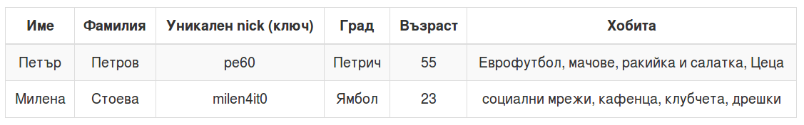

## ETS

---


---
### Да си припомним!

* Какво са процесите?
* Как комуникират процесите?
* Какво е OTP?

---
Досега говорихме, че процесите могат да си комуникират САМО чрез размяна на съобщения...

---


---
### Нуждата от ETS

* С Erlang/OTP идва и Erlang Term Storage или ETS.
* ETS представлява ключ-стойност база данни, живееща в паметта, която е част от BEAM виртуалната машина.
* Тя НЕ Е имплементирана на Erlang. Вместо това е вградена в самата виртуална машина.
* Това означава, че е написана на C и е оптимизирана за конкурентно писане и четене, а вътрешно съхранява данни, които са MUTABLE.

---
### Нуждата от ETS


---
### Нуждата от ETS

* Понякога ни се налага да имаме процес, който съхранява състояние, което трябва да е достъпно от няколко процеса.
* Пример : имаме някакъв service (HTTP Server?) и искаме да си водим статистика, кой потребител, колко request-а е направил.
* Бихме могли да използваме тази информация за доста неща...
* Как бихме могли да направим това?

---
## Нуждата от ETS

```elixir
defmodule RequestsPerUser do
  use GenServer

  def start_link do
    GenServer.start_link(__MODULE__, nil, name: __MODULE__)
  end

  def init(_), do: {:ok, %{}}

  def update(user) do
    GenServer.cast(__MODULE__, {:update, user})
  end

  def get(user), do: GenServer.call(__MODULE__, {:get, user})

  def handle_call({:get, user}, _, state) do
    {:reply, Map.get(state, user, 0), state}
  end

  def handle_cast({:update, user}, state) do
    {:noreply, Map.update(state, user, 1, & &1 + 1)}
  end
end
```

---
### Нуждата от ETS

- За всеки request към нашата услуга, даден процес ще прави нещо и ще връща резултат на потребителя.
- Преди да върне този резултат, ще извиква RequestsPerUser.update/1 за да увеличи броя на request-ите за дадения потребител:

```elixir
RequestsPerUser.update("pe6o")
#=> :ok
```

---
### Нуждата от ETS

* При 1000 рекуеста на секунда, това означава, че на процеса RequestsPerUser ще бъдат изпращани 1000+ съобщения за всяка секунда.
* Всяко от тези съобщения се обработва последователно.
* Извикване до RequestsPerUser.get/1 може да отнеме дадено време...

---
### Нуждата от ETS


---
### Нуждата от ETS

* Имаме **bottleneck**: много процеси използват един процес за пазене и промяна на споделено състояние.
* Ако една програма използва множество нишки/процеси за да постигне конкурентно писане и четене, ако има една нишка/процес, до която всички други опират, все едно имаме последователна програма.
* Как да имплементираме споделено състояние между процеси с конкурентен достъп?
* Отговорът е ETS.

---
### Какво е ETS?


---
### Какво е ETS?

* Както споменахме ETS означава Erlang Term Storage.
* Всеки процес в Elixir/Erlang си има собствен стек и heap
* Също така има споделена памет за по-големите binary-та.
* Има и още една споделена памет - ETS.

---
### Какво е ETS?

* ETS не е имплементирана на Erlang и не е изградена от Erlang процеси и persistent структури като Map или List.
* ETS е част от виртуалната машина, написана е на C и структурите, които използва са *mutable*.
* Интерфейсът към ETS е на Erlang и отвън може да се приеме, че до таблиците ѝ имаме достъп чрез съобщения, но това не е така.
* Достъпът до таблица в ETS е доста бърз и конкурентен.

---
### Какво е ETS?

* ETS се състои от множество таблици.
* Всяка таблица може да се създаде от който и да е процес и се притежава от процес.
* Има 4 типа таблици: `:set`, `:ordered_set`, `:bag` и `:duplicate_bag`.
* Всяка таблица има множество записи, които винаги са представени от tuple.
* Един елемент от всеки от тези tuple-и e ключ и по него може да се търси с бърз достъп.

---


---
#### Таблици от тип `:set`

* Тези таблици могат да имат запис с даден ключ само веднъж.
* Имплементирани са с линейна хеш таблица, която обещава бърз достъп за четене и писане.
* Тази хеш таблица е mutable.
* Това е типа на таблиците в ETS по подразбиране.

---
#### Таблици от тип `:ordered_set`

* Тези таблици се държат по същия начин като `:set` таблиците, но записите им са сортирани по ключовете си.
* Възможно е да обхождаме тези записи, използвайки наредбата им.
* Имплементирани са чрез AVL дърво и имат достъп за четене и писане от порядъка на **O(log(n))**.

---
#### Таблици от пип `:bag` и `:duplicate_bag`

- Таблиците от тип `:bag` позволяват множество записи с един и същи ключ, които обаче не може да са напълно еднакви.
- Пример:

```elixir
{1, "пе6о", 16}
{1, "то6о", 16}
```

---
#### Таблици от пип `:bag` и `:duplicate_bag`

- При `:bag` няма как да имаме:

```elixir
{1, "пе6о", 16}
{1, "пе6о", 16}
```

---
#### Таблици от пип `:bag` и `:duplicate_bag`

- Ако искаме да имаме напълно повтарящи се записи, ще използваме `:duplicate_bag`.
- Тези типове таблици са имплементирани чрез същия тип хеш таблица като `:set` таблиците.

---
### Достъп до таблици


---
### Достъп до таблици

* Когато се създаде ETS таблица, тя принадлежи на процес.
* Когато този процес спре да съществува, таблицата или се предава на друг процес, или се изчиства от паметта.
* Има три възможни типа достъп до ETS таблици.

---
#### protected

* Процесът, който притежава таблица може да чете и пише в нея.
* Останалите процеси могат само да четат от дадената таблица.
* Това е достъпът по подразбиране.

---
#### private

* Процесът, който притежава таблица може да чете и пише от нея.
* Останалите процеси нямат достъп до таблицата.

---
#### public

* Всички процеси имат както достъп за четене, така и достъп за писане до таблицата.

---
### Създаване на таблици


---
### Създаване на таблици

* Таблици могат да бъдат създавани от който и да е процес.
* Този процес става собственик на таблицата.
* За работа с ETS таблици, използваме Erlang-ския модул `:ets`.

---
### Създаване на таблици

```elixir
:ets.new(:users, [])
#=> #Reference<0.4003328283.155844609.148120>
```

---
### Създаване на таблици

```elixir
table = :ets.new(:users, [])
#=> #Reference<0.4003328283.155844609.148120>
```

---
```elixir
:ets.info(table)
#=> [
#=>   read_concurrency: false,
#=>   write_concurrency: false,
#=>   compressed: false,
#=>   memory: 300,
#=>   owner: #PID<0.89.0>,
#=>   heir: :none,
#=>   name: :users,
#=>   size: 0,
#=>   node: :nonode@nohost,
#=>   named_table: false,
#=>   type: :set,
#=>   keypos: 1,
#=>   protection: :protected
```

---
#### Атрибутът `:named_table`:

```elixir
:ets.insert(
  :users,
  {"meddle", 38, "Sofia", [:elixir, :gaming, :meddling]}
)
#=> ** (ArgumentError) argument error
```

---
#### Атрибутът `:named_table`:

```elixir
:ets.insert(
  table,
  {"meddle", 38, "Sofia", [:elixir, :gaming, :meddling]}
)
#=> true


:ets.info(table, :size)
#=> 1
```

---
#### Атрибутът `:named_table`:

```elixir
:ets.new(:users, [:named_table]) # Сега ще е атом
#=> :users

:ets.info(:users, :named_table)
#=> true

:ets.insert(
  :users,
  {"meddle", 38, "Sofia", [:elixir, :gaming, :meddling]}
)
#=> true
```

---
### Писане в ETS таблици


---
### Писане в ETS таблици

- Нека имаме таблица, която съдържа набор от хора. В нея ще имаме:



---
### Писане в ETS таблици

- Искаме редовете да са сортирани по nick-овете и таблицата да е достъпна за четене и писане отвсякъде:

```elixir
:ets.new(
  :people, [:named_table, :public, :ordered_set, keypos: 3]
)
#=> :people
```

---
### Писане в ETS таблици

- insert - Добавя редове, презаписва съществуващи:

```elixir
:ets.insert(
  :people,
  [
    {
      "Петър", "Петров", "pe60", 55,
      ["Еврофутбол", "мачове", "ракийка и салатка", "Цеца"]
    },
    {
      "Милена", "Стоева", "milen4it0", 23,
      ["социални мрежи", "кафенца", "клубчета", "дрешки"]
    }
  ]
)
#=> true
```

---
### Писане в ETS таблици

- insert - Добавя редове, презаписва съществуващи:

```elixir
:ets.info(:people, :size)
#=> 2
```

---
### Писане в ETS таблици

- insert_new - Не създава ако нещо съществува вече:

```elixir
:ets.insert_new(
  :people,
  [
    {
      "Милена", "Стоева", "milen4it0", 23,
      ["социални мрежи", "кафенца", "клубчета", "дрешки"]
    },
    {
      "Слави", "Боянов", "reductions", 25,
      ["база данни", "elixir", "бридж", "разсъждения!"]
    }
  ]
)
#=> false
```

---
### Писане в ETS таблици

- insert_new - Не създава ако нещо съществува вече:

```elixir
:ets.info(:people, :size)
#=> 2
```

---
### Писане в ETS таблици

- Можем да добавим и по-големи или по-малки tuple-и.
- Важното е да имат поне толкова елементи, колкото е `:keypos`.
- В нашия случай - три. Ако опитаме да добавим кортеж с два елемента:

```elixir
:ets.insert(:people, {"Слави", "Боянов"})
#=> ** (ArgumentError) argument error
#=>    (stdlib) :ets.insert(:people, {"Слави", "Боянов"})
```

---
### Четене от ETS таблици


---
### Четене от ETS таблици

- Има много начини да четем от ETS таблици.
- Най-простият начин е да търсим по ключ:

```elixir
:ets.lookup(:people, "pe60")
#=> [
#=>   {"Петър", "Петров", "pe60", 55,
#=>    ["Еврофутбол", "мачове", "ракийка и салатка",
#=>     "Цеца"]}
#=> ]


:ets.lookup(:people, "meddle")
#=> []
```

---
### Четене от ETS таблици

* Функцията `:ets.lookup/2` винаги връща списък.
* Това е така, защото при `:bag` и `:duplicate_bag` таблици има вероятност да имаме повече от един резултат.
* Ако ни трябва само дадена колона за даден ключ можем да ползваме *lookup_element*.
* Забелязвате, че при ETS позициите започват от **1**.

---
### Четене от ETS таблици

```elixir
age = :ets.lookup_element(:people, "pe60", 4)
#=> 55

age = :ets.lookup_element(:people, "meddle", 4)
#=> ** (ArgumentError) argument error
```

---
#### Селектиране чрез match спецификации

* Erlang има специален 'език' за намиране на данни.
* Използва се за селекция и се нарича 'match спецификация'.

---
#### Селектиране чрез match спецификации

- Една match-спецификация се състои от:
  * Head   : Описва редовете, които искаме да match-нем или изберем.
  * Guard  : Допълнителни филтри към тези редове-записи.
  * Result : Как да изглежда резултата (Трансформации).

---
#### Селектиране чрез match спецификации

```elixir
match_spec = [
  {
    {:"$1", :"$2", :_, :_, :"$3"}, # Head
    [
      {:andalso, {:is_list, :"$3"},
      {:>, {:length, :"$3"}, 3}}
    ], # Guard
    [{{:"$1", :"$2"}}] # Result
  }
]

:ets.select(:people, match_spec)
#=> [{"Милена", "Стоева"}, {"Петър", "Петров"}]
```

---
#### Селектиране чрез match спецификации

```elixir
match_func =
  fn {v1, v2, _, _, v3} when is_list(v3) and length(v3) > 3 ->
    {v1, v2}
  end
#=> #Function<6.99386804/1 in :erl_eval.expr/5>

:ets.fun2ms(match_func)
#=> [
#=>   {{:"$1", :"$2", :_, :_, :"$3"},
#=>    [{:andalso, {:is_list, :"$3"}, {:>, {:length, :"$3"}, 3}}],
#=>    [{{:"$1", :"$2"}}]}
#=> ]
```

---
#### Четене чрез прости match-вания

```elixir
:ets.match(:people, {:"$1", :"$2", :"_", :"_", :"_"})
#=> [["Милена", "Стоева"], ["Петър", "Петров"]]
```

---
#### Четене чрез прости match-вания

- Съпоставянето си е нормалното Elixir/Erlang съпоставяне, което означава, че можем да правим и такива неща:

```elixir
:ets.match(:people, {:"_", :"_", :"$2", :"_", [:"$1" | :"_"]})
[["социални мрежи", "milen4it0"], ["Еврофутбол", "pe60"]]
```

---
### Обхождане на ETS таблици


---
### Обхождане на ETS таблици

* ETS съдържа функции за обхождане на редовете на таблица като списък.
* При `:ordered_set` таблици редът е по ключовете, които са сортирани.
* Ако таблицата е друг тип редът зависи от това как се пазят записите вътрешно.
* Функцията `:ets.first/1` ще върне ключа на първия ред.
* Съответно `:ets.last/1` ще върне ключа на последния ред.

---
### Обхождане на ETS таблици

```elixir
:ets.next(:people, :ets.first(:people))
#=> "pe60"

:ets.prev(:people, "pe60")
#=> "milen4it0"

:ets.next(:people, "pe60")
#=> :"$end_of_table"

:ets.prev(:people, "milen4it0")
#=> :"$end_of_table"
```

---
### Обхождане на ETS таблици

- Могат да се задават стойности за които няма ключове в таблицата, те ще се сравнят и ще се намери най-близкия ключ:

```elixir
:ets.prev(:people, "s")
#=> "pe60"

:ets.next(:people, "s")
#=> :"$end_of_table"
```

---
### Модифициране


---
### Модифициране

* Лесен начин е да се използва `:ets.insert/2` за вече съществуващ ключ, което ще презапише реда.
* Има и `:ets.update_element/3` - задава се таблица, ключ и наредена двойка от позиция за промяната и нова стойност.

---
### Модифициране

```elixir
:ets.update_element(:people, "pe60", {1, "Пешо"})
#=> true

:ets.lookup(:people, "pe60")
#=> [
#=>   {"Пешо", "Петров", "pe60", 55,
#=>    ["Еврофутбол", "мачове", "ракийка и салатка",
#=>     "Цеца"]}
#=> ]
```

---
### Модифициране

* Има специализирани функции `update_counter` за атомарно увеличаване или намаляване на брояч, пазен в таблицата.
* Пример е следната имплементация на `RequestsPerUser`:

---
### Модифициране

```elixir
defmodule RequestsPerUserETS do
  use GenServer

  def start_link do
    GenServer.start_link(__MODULE__, nil, name: __MODULE__)
  end

  def init(_) do
    {:ok, :ets.new(__MODULE__, [:named_table, :public])}
  end

  def update(user) do
    :ets.update_counter(__MODULE__, user, {2, 1}, {user, 0})
  end

  def get(user) do
    case :ets.match(__MODULE__, {user, :"$1"}) do
      [[n]] -> n
      [] -> 0
    end
  end
end
```

---
### Модифициране

```elixir
RequestsPerUserETS.start_link()
#=> {:ok, #PID<0.115.0>}

RequestsPerUserETS.get("meddle")
#=> 0

RequestsPerUserETS.update("meddle")
#=> 1
RequestsPerUserETS.get("meddle")
#=> 1
```

---
### Изтриване на записи

- Лесно можем да изтрием запис по ключ:

```elixir
:ets.delete(:people, "pe60")
#=> true

:ets.info(:people, :size)
#=> 1
```

---
### Изтриване на записи

- Или по съвпадение:

```elixir
:ets.match_delete(:people, {"Милена", :"_", :"_", :"_", :"_"})
#=> true

:ets.info(:people, :size)
#=> 0
```

---
### Изтриване на записи

- Можем и да освободим цялата таблица от паметта, когато поискаме:

```elixir
:ets.delete(:people)
#=> true
```

---
### Изтриване на записи

* Публични таблици могат да бъдат изтрити от който и да е процес.
* Ако таблица не е публична, тя може да бъде изтрита само от процесът, който я притежава.

---
### Наследници


---
### Наследници

* Ако процесът *owner* спре да съществува, ETS таблицата му е изчистена от паметта.
* Ако не искаме това да се случи, можем да зададем процес-наследник.
* Това може да стане в `:ets.new/2` с опцията `{:heir, pid, data}`.
* Това е причината, когато ETS таблицата е публична (например cache), да я стартираме в процес, който не извършва никаква друга работа.

---
### Наследници

```elixir
defmodule Heir do
  use GenServer

  def transfer_data(table) do
    GenServer.call(__MODULE__, {:transfer_data, table})
  end

  def init(_), do: {:ok, %{}}

  def handle_info({:"ETS-TRANSFER", table, from, data}, state) do
    IO.puts(
      [
        "#{inspect table} transfered from ",
        "#{inspect from} to #{inspect self()}"
      ]
    )

    {:noreply, Map.put(state, table, data)}
  end

  def handle_call({:transfer_data, table}, _, state) do
    {:reply, Map.get(state, table), state}
  end
end
```

---
### Наследници

```elixir
{:ok, heir_pid} = Heir.start_link()
#=> {:ok, #PID<0.115.0>}

spawn(fn ->
  :ets.new(
    :some_table,
    [:named_table, {:heir, heir_pid, "woo"}]
  )
end)
#=> #PID<0.118.0>

#output: :some_table transfered from #PID<0.118.0> to #PID<0.115.0>
```

---
### Наследници

```elixir
:ets.info(:some_table, :owner)
#=> #PID<0.115.0>
```

---
### Наследници

* Когато има зададен `:heir`, ако процесът-собственик на таблица умре, таблицата не се изчиства от паметта.
* Процесът-наследник получава съобщение от типа `{:"ETS-TRANSFER", име-или-референция-към-таблицата, pid-на-предишния-собственик, информация-зададена-при-определянето-на-наследник}`.

---
### Наследници

* В момента, в който *owner* процесът спре да съществува, таблицата се притежава от *heir* процеса.
* Информацията, зададена при определянето на наследника, може да се използва за дебъг или история на наследяването.

---
### Наследници

* Ако не зададем наследник при създаване на таблицата, можем да го направим в последствие, използвайки `:ets.setopts(table, heir_tuple)`.
* Възможно е да променим собственика на таблица и ръчно, дори когато процесът-собственик на таблицата още съществува.

---
### Наследници

* Това става с `:ets.give_away/3` (`:ets.give_away(table, heir_pid, transfer_data)`).
* По подразбиране наследника има стойност `:none`. Винаги можем да премахнем наследник като зададем тази стойност.

---
### Компресия

* Можем да зададем опцията `:compressed` на таблица.
* Това означава, че всичко освен ключа на даден запис ще е компресирано.
* Това ще оптимизира паметта използвана от таблицата.
* Цената е, че четене на цели редове ще стане по-бавно.
* По-бавно ще стане и добавянето на нови записи.

---
### Опции четене и писане

* Има две опции за оптимизиране на често срещни случаи.
* И двете по подразбиране са изключени (`false`).

---
### Опции четене и писане

* `read_concurrency: true` - Ако имаме множество четения без писания често.
* Ако го направим и често редуваме четения и писания, достъпът до таблицата ще се влоши.

---
### Опции четене и писане

* `write_concurrency: true` - Ако имаме много промени.
* Промени от типа на insert, delete.
* По-бързите конкурентни писания идват с цената на повече използвана памет.
* Писания едно след друго от един и същ процес се забавят.
* Борят на възможни конкурентни четения става по-ограничен.

---
### Опции четене и писане

* Можем да комбинираме двете опции ако имаме периоди на много четения и периоди на множество писания.
* Тези опции са свързани с начина на заключване и синхронизиране на достъпа до записите в таблиците.
* Най-добре е с наблюдение и тестване да определите стойностите на тези опции.

---
### Кога да използваме ETS?

---


---
### Кога да използваме ETS?

* Споделено състояние между процеси, които да имат конкурентен и бърз достъп до него.
* Пазене на текущото състояние на процес, което да бъде възстановено, ако процеса умре.
* Вместо Map или List за оптимизация, макар че не винаги това ще е най-бързото решение.
* За регистриране на познати процеси.

---
### Кога да НЕ използваме ETS?
* Когато искаме да работим с данни, които могат да бъдат изпращани от един node към друг.
* Когато искаме дистрибутирана база данни върху множество node-ове.
* Когато искаме да запазим данните си между рестартирания на node-а си.

---
### Кога да НЕ използваме ETS?

* В повечето случаи проста комуникация между процеси върши работа.
* При тестване, ако имаме нужда от временно състояние в паметта, по-добре да ползваме Agent.

---
### Кога да НЕ използваме ETS?
* При мемоизация на някакъв резултат, докато си строим данни, които ще използваме по-късно в даден процес, по-добре да ползваме структура в heap-а на този процес.
* ETS има основната задача да пребори single-process bottleneck проблема. Ако данните ни живеят само в процеса, който ги ползва, или ако само един процес ги чете/пише, ETS не е необходима.

---
### Абстракции над ETS: DETS

* По-бавен от ETS за всичко, с почти същия интерфейс.
* Но пък записва на диска. Затова е и по-бавен.
* Има `:auto_save` опция, която го flush-ва на 3 секунди по подразбиране.
* Използва се когато не искаме да имаме загуба на state.
* Ако програмата ни излезе без crash, DETS ще се flush-не.
* Не поддържа `:ordered_set` таблици

---
### Абстракции над ETS: DETS

* Ние не сме го ползвали в production.
* Най-големият му use-case е mnesia, но и там можем и да го заменим, да речем с [rocksdb](https://github.com/aeternity/mnesia_rocksdb) или [leveled](https://github.com/aeternity/mnesia_leveled).
* DETS има ограничение за 2GB per file, при което mnesia разхвърля данни по файлове и става по бавна с по-големи бази.


---
### Абстракции над ETS: Mnesia

* Mnesia е множество ETS таблици.
* Ако има запазване на диска, тогава се използва DETS.
* Mnesia има релационен/обектен хибриден модел. Релациите между ETS таблиците са имплементирани с други ETS таблици.
* Mnesia използва spec езика на ETS за заявки.

---
### Абстракции над ETS: Mnesia

* Mnesia поддържа ACID (atomicity, consistency, isolation, durability) транзакции.
* Mnesia поддържа backend плъгини за storage (споменахме два), така че DETS може да бъде заместен на диска.
* Mnesia е дистрибутирана - може да имаме множество node-ове със споделени данни.
* Elixir wrapper за Mnesia: [Amnesia](https://github.com/meh/amnesia)

---
### Алтернативи на ETS: Persistent Term

* Алтернатива на ETS е `:persistent_term`, много прилича на `:ets` като идея - споделена памет.
* Разликата е, че е още по-оптимизиран за четене, но е много неефективен за писане/обновяване.
* Четенето (`get/1`) винаги е **O(1)**.  Няма заключване и **няма копиране** на данни към процеса.
* Писането (`put/2`) е пропорционално на броя на всички Persitent Term-ове, защото всичко се копира, така работи тази памет.
* Писанията и триенията почти винаги водят до GC на всички процеси рефериращи Persistent Term таблицата.
* Ако се изтрие терм, който се ползва от някой процес, то той бива записан в хийпа на този процес. Това може да доведе до използване на неочаквано голямо количество памет.

---
### Алтернативи на ETS: Persistent Term

* По-добре да има малко големи Persistent Term-ове отколкото много малки.
* Добри са за shared конфигурация между процеси.
* Добри са за референции към дълго живеещи ресурси като NIF ресурси.
* Добри са за пазене на референции към ETS таблици и counter-и.
* Това е поредната оптимизация на много специални случаи.

---
### Алтернативи на ETS: Process dictionary

* Локален map с бърз достъп във всеки процес.
* Често се ползва за пазене на metadata свързана с процеса.
* Не го ползвайте ако не знаете защо, вътре в самия процес е глобална стойност!
* Logger го ползва за metadata, IEX го ползва за history.
* Процес, стартиращ Task, го ползва - "$ancestors" ключа.
* Повече прочетете [тук](https://brainlid.org/elixir/2017/09/24/elixir-processes-and-state-abuse.html)


---
### Край

