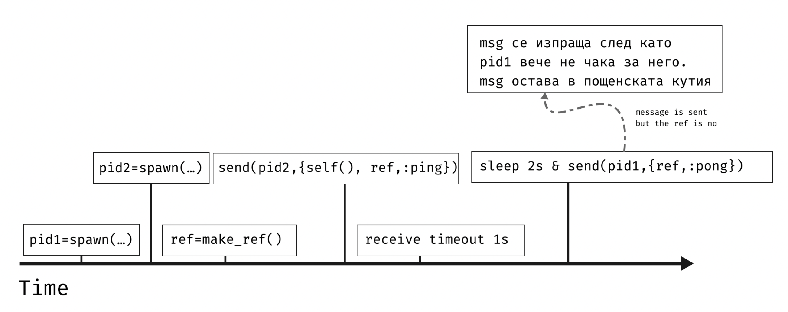
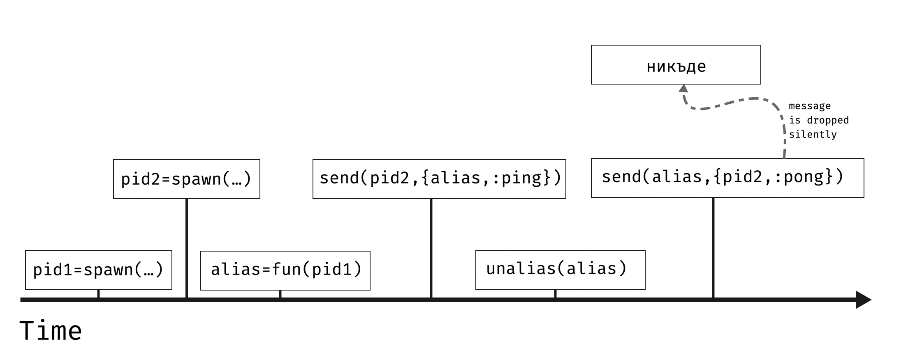
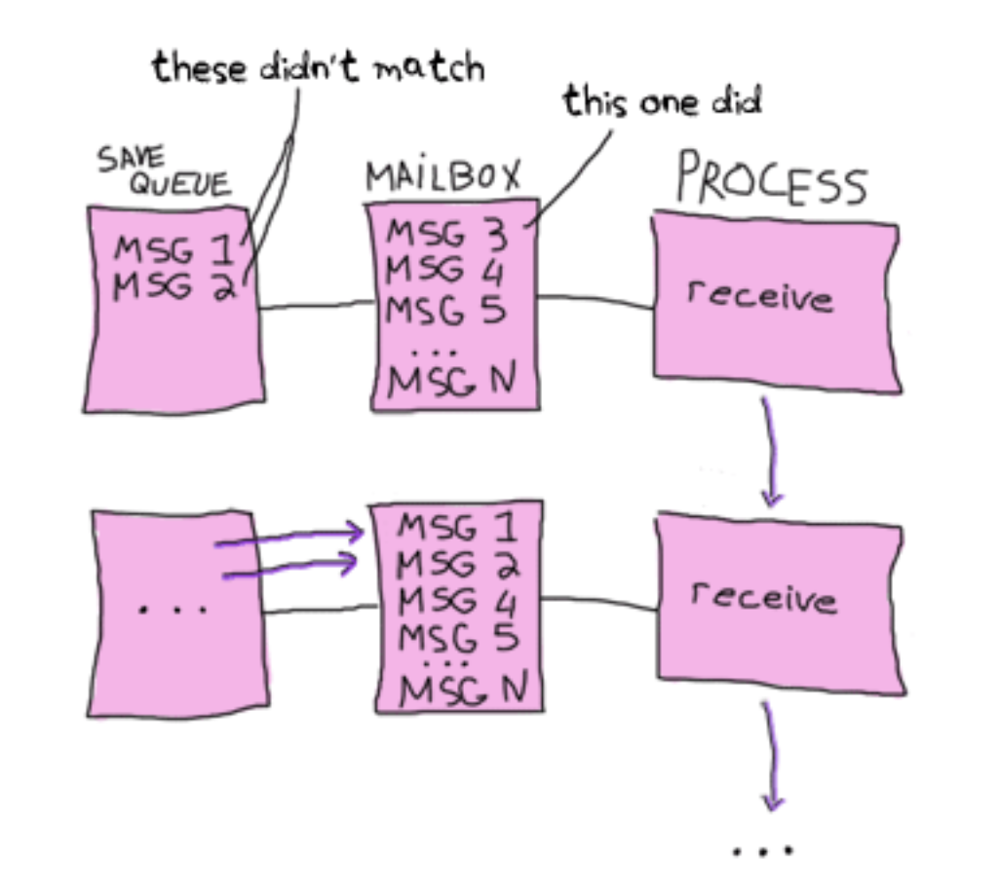

---

theme: uncover
style: |
  .center_img {
    margin: auto;
    display: block;
  }

  .side_by_side {
    display: flex;
    align-items: center;
    justify-content: center;
    gap: 10px;
  }

  .small-text {
    font-size: 0.75rem;
    letter-spacing: 1px;
    font-family: "Times New Roman", Tahoma, Verdana, sans-serif;
  }
  li {
    font-size: 28px;
    letter-spacing: 1px;
  }
  p.quote {
    line-height: 38px;
  }
  q {
    font-size: 32px;
    letter-spacing: 1px;
  }
  cite {
    text-align: right;
    font-size: 28px;
    margin-top: 12px;
    margin-bottom: 128px;
  }
paginate: true
backgroundColor: #FFFFFF
marp: true

---

## Абстракцията GenServer


---

### Съдържание

* Малко теория.
* Демо.
* Какво е GenServer?
* Практически примери с GenServer.

---

## Малко теория

---

### Къде е проблемът?

```elixir
# сървър
pid = spawn(fn -> 
  receive do
    {:call, {pid, ref}, msg} -> 
        # Do the work
        send(pid, {:reply, ref, msg}
  end
end)

# клиент
ref = Process.monitor(pid)
send(pid, {:call, {self(), ref}, msg})

receive do
  {^ref, reply} ->
    Process.demonitor(ref, [:flush])
    reply

  {:DOWN, ^ref, :process, ^pid, status} ->
    exit(status)
after
    5_000 -> 
        Process.demonitor(ref, [:flush])
        :timeout # will retry
end
```

---

### Къде е проблемът?

```elixir
# сървър
pid = spawn(fn -> 
  receive do
    {:call, {pid, ref}, msg} -> 
        Process.sleep(6_000)
        send(pid, {:reply, ref, msg}
  end
end)

# клиент
ref = Process.monitor(pid)
send(pid, {:call, {self(), ref}, msg})

receive do
  {^ref, reply} ->
    Process.demonitor(ref, [:flush])
    reply

  {:DOWN, ^ref, :process, ^pid, status} ->
    exit(status)
after
    5_000 -> 
        Process.demonitor(ref, [:flush])
        :timeout # will retry
end
```

---



---

### Late reply

* Обработката на съобщението отнема по-дълго от времето, което клиентът очаква.
* Все пак съобщението е обработено и отговорът е изпратен.
* Това съобщение никога няма да бъде прочетено от клиента, защото `ref` няма да се съпостави с никой бъдещ `make_ref()`.
* Как да решим проблема?
  * Proxy process - сложно и неефективно;
  * Нещо по-добро.

---

### Late reply - решение

* [EEP 53 - Process aliases preventing late replies reaching clients](https://www.erlang.org/eeps/eep-0053.html)
* `alias` - псевдоним на PID, който може да се използва вместо PID в `send/2` и да живее по-кратко от процеса.
* Псевдонимът е от тип `ref`. От OTP/24 `ref` винаги е валидна дестинация при изпращане на съобщения.
* Ако `ref` не е псевдоним на процес или е деактивиран псевдоним, съобщенията drop-ват без грешки (silently).

---



---

### OTP/24 - Process alias

```elixir
pid = spawn(fn -> 
  receive do
    {:call, ref_alias, msg} -> 
        Process.sleep(6_000)
        send(ref_alias, {:reply, ref_alias, msg}
  end
end)

ref_alias = Process.monitor(pid, alias: :demonitor)
send(pid, {:call, ref_alias, msg})

receive do
  {^ref_alias, reply} ->
    Process.demonitor(ref_alias, [:flush])
    reply

  {:DOWN, ^ref_alias, :process, ^pid, status} ->
    exit(status)
after
    5_000 -> 
        Process.demonitor(ref_alias, [:flush])
        :timeout # will retry
end
```

---

### Обработка на съобщения

* Какво се случва, когато дадено съобщение не е съпоставено с никой шаблон в `receive`?
  * A: Съобщението никога не може да бъде съпоставено и се изтрива.
  * B: Съобщението се връща в пощенската кутия и ще се опита да се съпостави в бъдеще?
* Съобщенията, които не се съпоставят с никой шаблон се добавят в `Save Queue`.
* Когато някое съобщение се съпостави, съобщенията от `Save Queue` се добавят обратно към началото пощенската кутия.
* Защо?

---

### Actor model

* Всичко е Actor (подобно на "всичко е обект").
* Един Actor може:
  * Да изпраща краен брой съобщения до други Actor-и;
  * Да създава краен брой нови Actor-и;
  * **Да дефинира поведение, което ще се изпълни, кога се получи ново съобщение**.
* Съобщенията се пращат асинхронно.

---



---

```elixir
defmodule Looper do 
  def loop(expected) do
    receive do
      {:get_if_third_arg_matches, pid, ^expected} -> 
        send(pid, {:matches, expected})
        loop(expected)

      {:replace_expected, new_expected} -> 
        loop(new_expected)
    end
  end
end

pid = spawn(Looper, :loop, ["expected string"])
send(pid, {:get_if_third_arg_matches, self(), "expected string"})
send(pid, {:get_if_third_arg_matches, self(), "another string"})
send(pid, {:get_if_third_arg_matches, self(), "never match"})
send(pid, {:get_if_third_arg_matches, self(), "another string"})
send(pid, {:replace_expected, "another string"})

flush()
# ???
# ???
# ???
```

---

```elixir
defmodule Looper do 
  def loop(expected) do
    receive do
      {:get_if_third_arg_matches, pid, ^expected} -> 
        send(pid, {:matches, expected})
        loop(expected)

      {:replace_expected, new_expected} -> 
        loop(new_expected)
    end
  end
end

pid = spawn(Looper, :loop, ["expected string"])
send(pid, {:get_if_third_arg_matches, self(), "expected string"})
send(pid, {:get_if_third_arg_matches, self(), "another string"})
send(pid, {:get_if_third_arg_matches, self(), "never match"})
send(pid, {:get_if_third_arg_matches, self(), "another string"})
send(pid, {:replace_expected, "another string"})

flush()
# {:matches, "expected string"}
# {:matches, "another string"}
# {:matches, "another string"}
```

---

### Selective Receive

* Как да дадем приоритет на някои съобщения, игнорирайки реда на пристигането им?
* Пример: Десетото съобщение в кутията е с приоритет `:high` и искаме да го обработим първо.
  * Забележка: Съобщенията нямат приоритет на ниво виртуална машина. Приоритетът съществува само в изискванията на нашата програма.
* Решение: "Навързваме" няколко `receive` блока и "търсим" съобщенията с висок приоритет в първия `receive`.
* Опасно, защото можем да изпълним голям брой повтарящи се съпоставяния.

---

### Selective Receive

* Ако ни се наложи на практика, може би трябва да преосмислим дизайна на нашата система.
* Ако наистина имаме нужда от selective receive, то можем разгледаме алтернативни варианти:
  * Всички съобщения се четат и се записват в `heap` или дърво.
  * Ключът на съобщението съдържа неговия приоритет.
  * Вадим съобщенията с най-висок/най-нисък приоритет и ги обработваме.
* Ако не поддържаме динамична смяна на шаблоните, то е добра идея да имаме catch-all шаблон в края на `receive` блока.

---

### Без Selective Receive

```elixir
defmodule Receiver do
  def loop() do
    Process.sleep(100)
    receive do
      {:high_priority, pid, ref, msg} -> send(pid, {ref, :high})
      {:low_priority, pid, ref, msg} -> send(pid, {ref, :low})
    end
    loop()
  end
end

pid = spawn(Receiver, :loop, [])
send(pid, {:low_priority, self(), make_ref(), :hello})
send(pid, {:low_priority, self(), make_ref(), :hello})
send(pid, {:high_priority, self(), make_ref(), :HELLO})

flush()
# {#Reference<0.2940497199.2689335301.9958>, :low}
# {#Reference<0.2940497199.2689335301.9968>, :low}
# {#Reference<0.2940497199.2689335301.9979>, :high}
```

---

### Selective Receive - неработещ пример

```elixir
defmodule Receiver do
  def important_first() do
    Process.sleep(100)
    receive do
      {:high_priority, pid, ref, msg} -> send(pid, {ref, :high})
    end
    receive do
      {:low_priority, pid, ref, msg} -> send(pid, {ref, :low})
    end
    important_first()
  end
end

pid = spawn(Receiver, :important_first, [])
send(pid, {:low_priority, self(), make_ref(), :hello})
send(pid, {:low_priority, self(), make_ref(), :hello})
send(pid, {:high_priority, self(), make_ref(), :HELLO})

flush()
# ???
# ??? 
# ???
```

---

### Selective Receive - неработещ пример

```elixir
defmodule Receiver do
  def important_first() do
    Process.sleep(100)
    receive do
      {:high_priority, pid, ref, msg} -> send(pid, {ref, :high})
    end
    receive do
      {:low_priority, pid, ref, msg} -> send(pid, {ref, :low})
    end
    important_first()
  end
end

pid = spawn(Receiver, :important_first, [])
send(pid, {:low_priority, self(), make_ref(), :hello})
send(pid, {:low_priority, self(), make_ref(), :hello})
send(pid, {:high_priority, self(), make_ref(), :HELLO})

flush()
# {#Reference<0.2940497199.2689335302.9720>, :high}
# {#Reference<0.2940497199.2689335302.9704>, :low}
# Блокирали сме в първия receive, второто low не се изпълнява
```

---

### Selective Receive - работещ пример

```elixir
defmodule Receiver do
  def important_first() do
    Process.sleep(100)
    receive do
      {:high_priority, pid, ref, msg} -> send(pid, {ref, :high})
    after 0 ->
      receive do
        {:low_priority, pid, ref, msg} -> send(pid, {ref, :low})
      end
    end
    important_first()
  end
end

pid = spawn(Receiver, :important_first, [])
send(pid, {:low_priority, self(), make_ref(), :hello})
send(pid, {:low_priority, self(), make_ref(), :hello})
send(pid, {:high_priority, self(), make_ref(), :HELLO})

flush()
# {#Reference<0.2940497199.2689335302.9720>, :high}
# {#Reference<0.2940497199.2689335302.9704>, :low}
# {#Reference<0.2940497199.2689335302.9714>, :low}
```

---

### Selective Receive - Worst Case

```elixir
defmodule Looper do
  def loop(expected) do
    receive do
      ^expected when rem(expected, 1000) == 0 -> 
        IO.puts("[#{DateTime.utc_now}] Received #{expected}")
        loop(expected - 1)

      loop(expected - 1)
      ^expected -> loop(expected - 1)
    end
  end
end

pid = spawn(Looper, :loop, [1_000_000])
for i <- 1..1_000_000, do: send(pid, i)
# [2023-03-20 17:26:44.533652Z] Received 1000000
# [2023-03-20 17:26:49.362306Z] Received 999000
# [2023-03-20 17:26:54.228245Z] Received 998000
# [2023-03-20 17:26:59.092978Z] Received 997000
# [2023-03-20 17:27:03.910761Z] Received 996000
# Read 4k messages in 20 seconds, 996k to go
```

---

### Selective Receive - Best Case

```elixir
defmodule Looper do
  def loop(expected) do
    receive do
      ^expected when rem(expected, 1000) == 0 -> 
        IO.puts("[#{DateTime.utc_now}] Received #{expected}")
        loop(expected - 1)

      ^expected -> loop(expected - 1)
    end
  end
end

pid = spawn(Looper, :loop, [1_000_000])
for i <- 1_000_000..1, do: send(pid, i)
# [2023-03-20 17:28:32.210224Z] Received 1000000
# [2023-03-20 17:28:32.214683Z] Received 999000
# [2023-03-20 17:28:33.217271Z] Received 1000
# Read 1M messages in 1 second
```


---

### Много съобщения

* Съобщенията се прочитат в реда, в който са получени.
* Проблем: 10 милиона съобщения са получени преди съобщението, което чакаме.
* [OTP/24 - Improved receive optimizations](https://www.erlang.org/blog/my-otp-24-highlights/#improved-receive-optimizations)
* Ако във всички шаблони очакваме референция, то компилаторът прави оптимизация:
  * Нито едно съобщения, изпратено преди извикването на `make_ref()` няма да се прочете.


---

### Много съобщения - без референция

```elixir
defmodule Looper do
  def loop() do
    receive do
      {:get_junk, pid} ->
        IO.puts("Start sending spam...")
        for _ <- 1..10_000_000, do: send(pid, :i_like_to_spam)
        IO.puts("Stop sending spam")
        loop()

      {:call, pid, ref} -> 
        send(pid, {ref, :hello})
        loop()
    end
  end
end

pid = spawn(Looper, :loop, [])
send(pid, {:get_junk, self()})

ref =  :not_a_ref
send(pid, {:call, self(), ref})
receive do
  {^ref, msg} -> msg
end
```

---


### Много съобщения - с референция

```elixir
defmodule Looper do
  def loop() do
    receive do
      {:get_junk, pid} ->
        IO.puts("Start sending spam...")
        for _ <- 1..10_000_000, do: send(pid, :i_like_to_spam)
        IO.puts("Stop sending spam")
        loop()

      {:call, pid, ref} -> 
        send(pid, {ref, :hello})
        loop()
    end
  end
end

pid = spawn(Looper, :loop, [])
send(pid, {:get_junk, self()})

ref =  make_ref()
send(pid, {:call, self(), ref})
receive do
  {^ref, msg} -> msg
end
```

---

### Задача

* Задача:
  * Много конкурентни процеси, които обработват заявки от клиенти.
  * За всяка заявка се записва лог във файл;
  * Ако се записва в база данни - добавя се времето за network заявката. Допълнително, базите поддържат определен брой конкурентни заявки.
* Решение:
  * Всяка заявки си записва данните в базата;
  * Или: буфериране на логовете и записването им групово (batch).
  * Буферът се записва веднъж на всеки N секунди или когато буферът е пълен (съдържа N елемента).
  * Кой и как буферира?

---

### Демо I

[Go to code](https://github.com/ElixirCourse/code2023/blob/master/file_buffer/lib/file_buffer_plain.ex)

---

### Демо II

* "Измисляме" си интерфейс, който да ни позволява да скрием send/receive/loop логиката зад функции.
* Използваме конвенцията:
  * `call` - синхронна заявка. Изпаща съобщение и очаква отговор;
  * `cast` - асинхронна заявка. Изпраща съобщение и не очаква отговор;
  * `handle_call` - обработва синхронни заявки;
  * `handle_cast` - обработва асинхронни заявки;
  * `start_link` - стартира процес и го свързва с текущия процес;
  * `init` - инициализира началното състояние на процеса и извършва нужни допълнителни действия.

---

### Демо II

[Go to code](https://github.com/ElixirCourse/code2023/blob/master/file_buffer/lib/file_buffer_generic_server.ex)

---

### Какво е сървър?

* *a computer or computer program which manages access to a centralized resource or service in a network.*
* *network computer, computer program, or device that processes requests from a client*
* *a computer, a device or a program that is dedicated to managing network resources. They are called that because they “serve” another computer, device, or program called “client” to which they provide functionality*

---

### Какво е GenServer?

* OTP behaviour:
  * Вие имплементирате някоко функции, чието поведение се комбинира с кода на GenServer, за да получите крайния резултат.
* Абстракция на процес, който ви позволява да:
  * Държите и "променяте" (чрез рекурсия) състояние;
  * Изпращате и обработва синхронни съобщения (`call` и `handle_call`);
  * Изпращате и обработва асинхронни съобщения (`cast` и `handle_cast`);
  * Обработвате всички останали съобщения (`handle_info`);
  * Стартирате и спирате процеса чрез определени функции.

---

### Какво е GenServer?

* Процесите, които не си комуникират с други процеси, са с ограничена употреба.
* Абстракцията, която позволява лесна комуникация и поддръжка на състояние, ще бъде полезна.
* Съвместимост с *Hot Code Swapping* чрез `GenServer.code_change/3` (няма да го разглеждаме).
* Мастодон за Erlang/Elixir: https://genserver.social

---

```elixir
defmodule Stack do
  use GenServer
  # client
  def start_link(), do: GenServer.start_link(__MODULE__, [])
  def push(pid, item), do: GenServer.cast(pid, {:push, item})
  def pop(pid), do: GenServer.call(pid, :pop)
  # server
  def init(state), do: {:stop, state}
  def handle_cast({:push, item}, _from, state),
    do: {:noreply, [item | state]}
  def handle_call(:pop, _from, [top|rest]),
    do: {:reply, top, rest}
end
```

---

### Какво не е GenServer?

* Не е сървър в типичния смисъл на думата.
* Не е сървър, който слуша на някой порт и обработва TCP/UDP заявки.

---

### Примери за GenServer в Elixir

* Ecto `DBConnection` - връзката с база данни
* `Supervisor` - процесът, който стартира, спира, свързва се и наблюдава други процеси.
* Phoenix `Channel` - процесът, който обработва WebSocket съобщенията с един клиент.
* Ranch `Server` - TCP Socket Acceptor.
* Ако обработвата HTTP (или просто TCP) заявка, заявка към база данни или стартирате ваш процес под Supervisor, то част от изпълнението на кода минава през GenServer.

---

### start_link/3

* `start_link/3` - стартира процеса и връща `{:ok, pid}`. Приема като аргумент името на модул, имплементиращ GenServer и списък с настройки.
* `GenServer.start_link(MyGenServer, [], name: Keyword.get(opts, :name)`

---

### terminate/2

* Извиква се, когато процесът спира.
  * Някой `handle_X` е върнал `{:stop, ...}`;
  * При неочаквано спиране на свързан процес и `trap_exit: true`;
  * Получи сигнал за спиране (повече за това на лекцията за `Supervisor`).
* Целта му е да направи почистване.
* [Документация за по-подробна информация](https://hexdocs.pm/elixir/1.12/GenServer.html#c:terminate/2)
* Имплементацията на `terminate/2` е опционална.

---

### handle_info/2

* Обработва всички съобщения, изпратени към процеса чрез `send`.
* Форматът на съобщението не е от значение.
* Обработва `:EXIT` (ако `trap_exit: true`) и `:DOWN` съобщенията.
* **Не** може да връща резултат към изпращача.
* Добра идея е винаги да имаме и catch-all `handle_info/2`, за да обработваме неочаквани съобщения.
  * В противен случай неочакваното съобщение ще принтира грешка.
  * `[error] MyModule #PID<0.702.0> received unexpected message in handle_info/2: :hello`

---

```elixir
defmodule MyModule do
  use GenServer

  def start_link(), do: GenServer.start_link(__MODULE__, [])

  def handle_info(msg, state) do
    IO.puts("Got message: #{inspect(msg)}")
    {:noreply, state}
  end
end
{:ok, pid} = MyModule.start_link()
send(pid, :hello)
send(pid, %{a: "this is a map"})
# Got message: :hello
# Got message: %{a: "this is a map"}  
```

---

### init/1

* Използва се за инициализиране на състоянието на процеса.
* Изпълнява се **в** GenServer процеса (`self()` връща `pid` на новия процес).
* Приема втория аргумент на `GenServer.start_link/{2,3}`.
* Докато `init/1` завърши, процесът, който стартира `GenServer`-а, блокира.
* Стартирането и инициализирането на `GenServer` е синхронна операция.
* Като резултат може да върне:
  * `{:ok, ...}` - успешно стартира процеса;
  * `{:stop, ...}` - не стартира процеса.
* [Документация](https://hexdocs.pm/elixir/1.12/GenServer.html#c:init/1)

---

### init/1

* Докато `init/1` не завърши, процесът, който стартира `GenServer`-а, ще блокира.
* Ако имаме дълга инициализация, то бихме я разделили на няколко стъпки:
  * Базова и синхронна инициализация;
  * Асинхронна допълнителна инициализация (заявка към база данни или нещо друго бавно).

---

```elixir
defmodule LongStartingServer do
  use GenServer

  def start_link(), do: GenServer.start_link(__MODULE__, [])

  def init(state), do: {:ok, state, {:continue, :finalize_init}}

  def handle_continue(:finalize_init, state) do
    Process.sleep(5000)
    {:noreply, state}
  end
end
```

---

### init/1 + handle_continue/2

* `Process.send(self(), :finalize_init)` има възможен race-condition, ако процесът е именуван.
* `init/1` може да върне стойност: `{:ok, state, {:continue, any}}`.
* Ако третият елемент е `{:continue, any}`, то `handle_continue/2` ще бъде извикан след `init/1`.
* `handle_continue/2` се изпълнява преди да бъде обработено което и да е друго съобщение.

---

```elixir
defmodule LongStartingServer do
  use GenServer

  def start_link(), do: GenServer.start_link(__MODULE__, [])

  def init(state) do
    send(self(), :finalize_init)
    {:ok, state}
  end

  def handle_info(:finalize_init, state) do
    Process.sleep(5000)
    {:noreply, state}
  end
```

---

### call/{2,3}

* Изпраща съобщение до `pid` на `GenServer`.
* Форматът е `{:'$gen_call', {pid, ref}, message}`, за да не може да бъде объркан със случайно друго съобщение.
* Винаги използваме `GenServer.call/{2,3}` вместо ръчно да форматираме съобщението.
* Блокира изпълнението на текущия процес, докато не получи отговор или не изтече времето за изчакване (timeout).
* Връща резултата от обработката на съобщението или извиква `exit(reason)` при timeout.
* Ако искате да върнете `{error, timeout_reason}`, трябва да използвате `try/rescue`.

---

### call/{2,3}

* Оптимизацията за `receive` с референция е направена, заради тази функция.
* Освен ако не подадете изрично `:infinity`, `GenServer.call/2` винаги има `timeout`.
* `GenServer.call/2` използва `alias` на процеси, за справяне с проблеми при късен отговор.

---

### handle_call/3

* Обработва съобщенията изпратени чрез `GenServer.call`, но не и само чрез `send`.
* Получава аргументи: `message`, `from` и `state`, където:
  * `message` е полученото съобщение;
  * `from` е наредената двойка `{pid, ref}`. В повечто случаи този аргумент се игнорира;
  * `state` е текущото състояние на `GenServer`-a.

---

### handle_call/3

* [Документация и възможни връщани стойности](https://hexdocs.pm/elixir/1.12/GenServer.html#c:handle_call/3)
* Според върната стойност от `handle_call/3`, то поведението е едно от следните:
  * Връща отговор към клиента: `{:reply, ...}`;
  * **Не** връща отговор към клиента: `{:noreply, ...}`;
  * Спира процеса: `{:stop, ...}`;
  * Всеки вариант има няколко подварианта (timeout, hibernate, continue).

---

### Single process bottleneck

* Всеки `GenServer` е един процес и целият код в един процес е последователен.
* Съобщенията се обработват последователно, едно по едно.
* Не е проблем, ако обработката на съобщенията е много бърза.
* Проблем, ако обработката на съобщения е бавна.
* Идеи?

---

```elixir
def handle_call({:get_fib, n}, from, state) do
  # Стартирай Task, който ще продължи да живее и работи и след като
  # тази функция е приключила. Използвай GenServer.reply/2, за да
  # върнеш резултата от Task-а на клиента.
  Task.start(fn ->
    fib = calculate_fib(n)
    GenServer.reply(from, fib)
  end)

  # Не връщай нищо. Клиентът ще продължава да чака отговор.
  # Отговорът ще бъде върнат от стартирания Task.
  {:noreply, state}
end
```

---

```elixir
def handle_call({:reply_in_seconds, seconds}, from, state) do
  spawn(fn ->
    Process.sleep(seconds * 1000)
    GenServer.reply(from, :ok)
  end)
  
  {:noreply, state}
end
```

---

### cast/2

* Изпраща съобщение до `pid` на `GenServer`.
* Форматът е `{:'$gen_cast', message}`, за да не може да бъде объркан със случайно друго съобщение.
* Винаги използваме `GenServer.cast/2` вместо ръчно да форматираме съобщението.
* Не изчаква отговор, а веднага връща `:ok`.

---

### handle_cast/2

* Получава аргументи: `message` и `state`, където:
  * `message` е полученото съобщение;
  * `state` е текущото състояние на `GenServer`-a.

---

### handle_cast/2

* [Документация и възможни връщани стойности](https://hexdocs.pm/elixir/1.12/GenServer.html#c:handle_cast/2)
* Според върната стойност от `handle_cast/3`, то поведението е едно от следните:
  * Не връща отговор към клиента: `{:noreply, ...}`;
  * Спира процеса: `{:stop, ...}`;
  * Всеки вариант има няколко подварианта (timeout, hibernate, continue).

---

### GenServer <-> MyModule

- При извикването на `GenServer.<fun>`, която функция от `MyModule` се извиква?

| GenServer      | MyModule     |
| :-----------   | :----------- |
| start          | init         |
| start_link     | init         |
| call           | handle_call  |
| cast           | handle_cast  |

---

## Край

