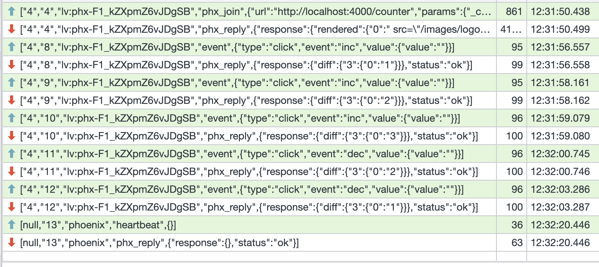

## Phoenix LiveView


---

### Предговор

* Какво е Phoenix?
* HTTP vs WebSocket

---

### Предговор - Behaviour

* Поведение (Behaviour) е обратно на библиотека:
  * Когато използвате библиотека, контролът е във Вашия код и той извиква функции от библиотеката.
    * По време на изпълнението, Вашият код извиква `Req.get/2`, за да изпълни HTTP заявка.
  * Когато използвате поведение, контролът е в поведението и то извиква Вашия код, когато е нужно.
    * По време на изпълнението, поведението извиква `handle_call/3`, за да обработи съобщение.

---

### Съдържание

1. Дефиниции
2. Phoenix LiveView
3. Демо - часовник и брояч
4. Демо - чат

---

### Phoenix LiveView

* Библиотека, написана на Elixir, която надгражда Phoenix.
* Предоставя възможност за писане на уеб приложения, които са:
  * **Rich** - Отнася се до качеството, дълбочината и интерактивността на потребителското преживяване.
  * **Real-time** - Използването на Websocket за транспорт позволява евтината размяна на много съобщения между клиента и сървъра.
  * **Server rendered HTML** - Сървърът рендерира цялата HTML страница и я изпраща като резултат.
* Всичко това **без** Вие да пишете JavaScript.
  * Има солидно количество Javascript, който идва с LiveView, но се използва прозрачно за Вас.

---

### Защо Phoenix LiveView

* Използва един език и технология за изработката на клиент и сървър частта води до:
  * Опрострен технологичен стек;
  * По-лесна поддръжка и разработка;
* Процесите в Elixir са изключително подходящи за имплементация на stateful websocket връзки.
* Съобщенията в Elixir са изключително подходящи за моделиране на websocket съобщения.
* Не пишете Javascript

---

### Как работи Phoenix LiveView?

* Първата заявка е стандартна HTTP Request/Response заявка, която рендерира цялата страница (за SEO нужди).
* HTTP връзката се ъпгрейдва до Websocket.
* Интеракциите в браузъра генерират events, които LiveView обработва.
* LiveView обработва събитията и рендерира нов HTML
* Разликата между стария и новия HTML се пресмята и се изпраща само разликата.

---

### LiveView == Behaviour

* Използването на `LiveView` е подобно на използването на `GenServer`.
* Дефинирате как се инициализира чрез `mount/3`.
* Дефинирате как се обработват събития чрез `handle_event/3`.
* Дефинирате как се обработват останалите съобщения чрез `handle_info/3`.
* Дефинирате как се обработва промяна на параметрите чрез `handle_params/3`.
* Дефинирате как се рендерира HTML чрез `render/1`.

---

### Демо 1

- [Видео](https://www.loom.com/share/59b6574e8c494d3a88057cd70883bb58)


---

```elixir
defmodule PentoWeb.CounterLive do
  use PentoWeb, :live_view

  def mount(_params, _session, socket) do
    {:ok, assign(socket, counter: 0)}
  end

  def render(assigns) do
    ~H"""
    <.header>Counter: <%= @counter %></.header>
    <.button phx-click="inc">+1</.button>
    <.button phx-click="dec">-1</.button>
    """
  end

  def handle_event("inc", _params, socket) do
    {:noreply, assign(socket, counter: socket.assigns.counter + 1)}
  end

  def handle_event("dec", _params, socket) do
    {:noreply, assign(socket, counter: socket.assigns.counter - 1)}
  end
end
```

---



---

### Демо 2

- [Видео](https://www.loom.com/share/788e1d5964254968885d77c12c4f256c)


---

```elixir
defmodule PentoWeb.ClockLive do
  use PentoWeb, :live_view

  def mount(_params, _session, socket) do
    Process.send_after(self(), :tick, 10)
    {:ok, assign(socket, time: time())}
  end

  def render(assigns) do
    ~H"""
    <h1>Time now: <%= @time %></h1>
    """
  end

  def handle_info(:tick, socket) do
    Process.send_after(self(), :tick, 10)
    {:noreply, assign(socket, time: time())}
  end

  def time() do
    DateTime.utc_now() |> DateTime.truncate(:millisecond) |> to_string()
  end
end
```

---


---

### LiveView Life-Cycle

* Всеки LiveView започва като стандартна HTTP заявка.
* `mount/3` се изпълнява в HTTP връзката и инициализира състоянието, HTML-ът се рендерира и цялата страница се връща.
  * Дори в браузъра Javascript да е деактивиран, цялата страница се рендерира правилно;
  * Това поведение е SEO-friendly, тъй като search engine crawler-ите виждат цялата страница;
* Изпраща се HTTP заявка, съдържаща хедъра `Upgrade: websocket`, която ъпгрейдва връзката до Websocket.
* `mount/3` се изпълнява отново в Websocket връзката.
* `handle_params/3` се изпълнява, за да обработи URI и query параметрите.
* `render/1` се извиква и HTML-ът се изпраща към клиента.

---

### mount/3

* Защо `mount/3` се изпълнява 2 пъти?
  * При зареждане се изпълняват две отделни и независими заявки, `mount/3` се извиква веднъж на заявка.
  * Втората заявка може дори да се изпълни на друг BEAM Node.
  * Използваме `connected?/1`, за да проверим дали сме в HTTP или Websocket.
* `mount/3` приема като аргументи:
  * `params` - Съдържа query и path параметри
  * `session` - Речник, описващ сесията. Тук можем да намерим данни за авентикацията и т.н.
  * `socket` - Socket, който описва състоянието на връзката. `socket.assigns` се подава на `render/1`.
* `mount/3` връща `{:ok, socket}`

---

### Coupling/Cohesion

* Coupling (свързаност) - Нивото на взаимна зависимост на отделни модули от системата.
* Cohesion (сплотеност, вътрешна съгласуваност) - До каква степен елементите в един модул принадлежат заедно.
* Coupling описва отношенията между модулите, Cohesion - вътре в модулите.
* Функциите в `Date` модула имат висока кохезия - всички те принадлежат заедно, защото работят с дати.
* Модулите `Enum` и `Date` имат нисък coupling - промяна в един от модулите рядко/никога няма да да доведе
  нуждата от промяна в другия модул.

---

### Coupling/Cohesion

* Когато пишем код се стараем да имаме нисък coupling и висок cohesion.
* Можем да ги разглеждаме на микро- и макрониво.
  * До каква степен функциите принадлежат към един модул/клас.
  * До каква степен фийчърите принадлежат на един сървис (ако HTTP сървър генерира PDF репорти и изпраща мейли, нещо не е наред.)

---


### Highly Coupled parts

* Колокация на високо свързани (highly coupled) елементи: темплейти, състояние и функциите, които работят с тях.
* Идея, която е по-стара от ReactJS, но е широко популяризирана от него.
* Нарича се още Component-based архитектура

---

### Components

* Едно от най-важните умения при разработката на софтуер е разбиването на сложни проблеми в няколко по-малки и прости.
* По-малките проблеми се осмислят и решават по-лесно.
* Компонентите позволяват изолацията, генерализацията и преизползването на често повтарящи се елементи от потребителския интерфейс.
* Компонентите могат да се грижат:
  * За рендерирането на HTML (stateless components);
  * За съхранението на състоянието, неговата промяна чрез събития и рендерирането на HTML (live components).

---

### Function Components (Stateless)

* Представляват функция, която приема `assigns` речник и връща `~H` сигил.
* Абстракция на някой често срещан HTML шаблон.
* Резултатът от изпълнението зависи единствено от входните параметри.
* Пример: Function component, който рендерира бутон, input поле, заглавие и т.н.

---

```elixir
def button(assigns) do
  ~H"""
  <button
    type={@type}
    class={[
      "phx-submit-loading:opacity-75 rounded-lg bg-zinc-900 hover:bg-zinc-700 py-2 px-3",
      "text-sm font-semibold leading-6 text-white active:text-white/80",
      @class
    ]}
    {@rest}
  >
    <%= render_slot(@inner_block) %>
  </button>
  """
end
```

---

### Live Components (Stateful)

- https://hexdocs.pm/phoenix_live_view/Phoenix.LiveComponent.html

---

### Край
