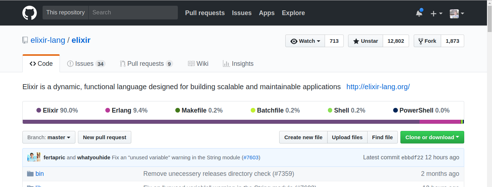

---

theme: uncover
style: |
  .center_img {
    margin: auto;
    display: block;
  }

  .side_by_side {
    display: flex;
    align-items: center;
    justify-content: center;
    gap: 10px;
  }

  .small-text {
    font-size: 0.75rem;
    letter-spacing: 1px;
    font-family: "Times New Roman", Tahoma, Verdana, sans-serif;
  }
  li {
    font-size: 28px;
    letter-spacing: 1px;
  }
  p.quote {
    line-height: 38px;
  }
  q {
    font-size: 32px;
    letter-spacing: 1px;
  }
  cite {
    text-align: right;
    font-size: 28px;
    margin-top: 12px;
    margin-bottom: 128px;
  }
paginate: true
backgroundColor: #FFFFFF
marp: true

---

# Мета-програмиране
(Metaprogramming)

---


---


---

```elixir
# elixir/kernel.ex
defmacro defmacro(call, expr \\ nil) do
  define(:defmacro, call, expr, __CALLER__)
end
```

---

- Или код, който пише код.

---

- Нека видим първо малко приложения, за да видим за какво става въпрос!

---

- Можем автоматично да дефинираме функции:

```elixir
defmodule QuickMathz do
  @values [{:one, 1}, {two: two}, {:three, 3}]

  Enum.each(@values, fn {name, value} ->
    def unquote(name)(), do: unquote(value)
  end)
end

QuickMathz.three # => 3
```

---

- Може да пишем DSL-и:

---


---

```elixir
html do
  head do
    title do
      text "Hello To Our HTML DSL"
    end
  end
  body do
    h1 class: "title" do
      text "Introduction to metaprogramming"
    end
    p do
      text "Metaprogramming with Elixir is really awesome!"
    end
  end
end
```

---

Ecto (Database Access, Data Mapping & Validation):

```elixir
from o in Order,
where: o.created_at > ^Timex.shift(DateTime.utc_now(), days: -2)
join: i in OrderItems, on: i.order_id == o.id
```

---

Plug (~~http library~~ web specification)

```elixir
get "/hello" do
  send_resp(conn, 200, "world")
end

match _ do
  send_resp(conn, 404, "oops")
end
```

---

ExUnit

```elixir
defmodule Blogit.ComponentTest do
  use ExUnit.Case, async: true

  describe "when a module uses it with `use Blogit.Component`" do
    test "injects a function base_name/0, which returns the name of " <>
           "the module in underscore case" do
      assert TestComponent.base_name() == "test_component"
    end
  end

  # ... блогът има повече от 1 тест, вярвайте!
end
```

---

В други езици в тестовете пишем:

```ruby
assert true
assert_equal 5, 4
assert_operator 5, :< 4
```

---

В Elixir можем само така:

```elixir
assert true
assert 5 == 4
assert 5 < 4
```

---

Всъщност мета-програмирането в Elixir е толкова силно, че ни позволява:


---

## Въведение в мета-програмирането в Elixir

---

* Elixir ни дава удобен достъп до неговото AST (Abstract Syntax Tree).
* Elixir ни позволява да манипулираме AST-то чрез макроси.

---

### Elixir Abstract Syntax Tree

* Междинен код по време на компилация.
* Имаме достъп до него и можем да го променяме чрез макроси.
* Можем да генерираме програмно AST и да го вмъкваме в модули.

---

#### quote

- Връща абстрактното синтактично дърво на всеки израз

```elixir
quote do: 1 + 1
# => {:+, [context: Elixir, import: Kernel], [1, 1]}
```

---

```elixir
quote do: sum(1, 2, 3)
# => {:sum, [], [1, 2, 3]}
```

---

- Пример с map, всъщност той също е представен като извъкване към `%{}`

```elixir
quote do: %{1 => 2}
# => {:%{}, [], [{1, 2}]}
```

---

Малко по-дълъг пример:

```elixir
quote do
  html do
    head do
      title do
        text "Hello To Our HTML DSL"
      end
    end
  end
end
```

---

```elixir
{:html, [],
 [
   [
     do: {:head, [],
      [
        [
          do: {:title, [],
           [
             [
               do: {:text, [],
                ["Hello to our HTML DSL"]}
             ]
           ]}
        ]
      ]}
   ]
 ]}
```

---

- Пример с променлива:
```elixir
quote do: x
# => {:x, [], Elixir}
```

---

Видяхме, че са в следния формат:
```
{<име на функция | tuple>, <контекст>, <списък от аргументи | атом>}
# ^ важно
#                                                 ^ важно
#                            ^ няма да говорим за това
```

---

Това са единствените неща, чийто AST е самият израз.

```elixir
:sum         #=> Atoms
1.0          #=> Numbers
[1, 2]       #=> Lists
"strings"    #=> Strings
{key, value} #=> Tuples with two elements
# Идеи защо списъците от 2 елемента са литерали?
```

---


---

Какво става с променливите в тези изрази?

---

```elixir
iex(3)> x = 1
1
iex(4)> quote do: x + 1
{:+, [context: Elixir, import: Kernel], [{:x, [], Elixir}, 1]}
#                                          ^ Защо!?
```

---

- `quote` ни дава вътрешната репрезентация на някой израз.
- Понякога бихме искали да можем да заменяме части от тези изрази с други изрази.

---

#### unquote

* Оценява даден израз (AST) спрямо даден контекст.
* Един вид интерполация на AST-та.

---

```elixir
quote do: unquote(x) + 1
# => {:+, [context: Elixir, import: Kernel], [1, 1]}
```

---

- Пример с по-голям `unquote`:

```elixir
ast1 = quote do: 1 + 2
ast2 = quote do: unquote(ast1) + 3
Macro.to_string(ast2)
# => "1 + 2 + 3"
```

---

- Можем да сме яки и да `unquote`-ваме извикване на функция:

```elixir
fun = :hello
Macro.to_string(quote do: unquote(fun)(:world))
# => "hello(:world)"
```

---

- Какво става ако имаме израз от типа: `[1, 2, 6]` и искаме да вмъкнем `[3, 4, 5]` между `2` и `6`?

```elixir
inner = [3, 4, 5]
Macro.to_string(quote do: [1, 2, unquote(inner), 6])
# => "[1, 2, [3, 4, 5], 6]"
```

---

#### unquote_splicing

- Позволява ни да интерполираме изрази върху списъци, речници и наредени n-орки


```elixir
inner = [3, 4, 5]
Macro.to_string(quote do: [1, 2, unquote_splicing(inner), 6])
# => "[1, 2, 3, 4, 5, 6]"
```

---

- Още един пример с речник този път:
```elixir
kw = [foo: :bar, baz: :quix]
Macro.to_string(quote do: %{unquote_splicing(kw)})
# => "%{foo: :bar, baz: :quix}"
```

---

#### bind_quoted

---

- Това е опция на `quote`, позволява ни това:

```elixir
defmodule Hello do
  defmacro say(name) do
    quote bind_quoted: [name: name] do
      "Здравей #{name}, как е?"
    end
  end
end
```

---

- Вместо:

```elixir
defmodule Hello do
  defmacro say(name) do
    quote do
      "Здравей #{unquote(name)}, как е?"
    end
  end
end
```

---

- И ето примерът в действие:

```elixir
iex(1)> Hello.say("Ники")
"Здравей Ники, как е?"
iex(2)> name
** (CompileError) iex:4: undefined function name/0
```

---

[Пълен списък с опции на quote](https://hexdocs.pm/elixir/Kernel.SpecialForms.html#quote/2-options)

---

## Макроси

* изпълняват се по време на компилация
* приемат AST като аргументи
* връщат AST като резултат

---

### Дефинираме ги с `defmacro`:

* [Не можем да използваме така наречените специални форми за имена на макроси](https://hexdocs.pm/elixir/Kernel.SpecialForms.html)

---

```elixir
defmodule FMI do
  defmacro if(condition, do: do_clause, else: else_clause) do
    quote do
      case unquote(condition) do
        x when x, [false, nil] -> unquote(else_clause)
        _ -> unquote(do_clause)
      end
    end
  end
end
```

---


```elixir
iex(1)> require FMI
# => FMI
iex(2)> FMI.if true do
...(2)>   1
...(2)> else
...(2)>   2
...(2)> end
# => 1
```
---

- Всъщност if-ът ни прие като аргументи:

```elixir
FMI.if(true, [do: 1, else: 2])
```

---

Пример `unless/if`

---

#### Macro.expand_once

- Можем на една стъпка да "разгъваме/оценяваме" AST-та

```elixir
ast = quote do
  FMI.unless true do
    IO.puts "Hello"
  end
end
# {{:., [], [{:__aliases__, [alias: false], [:FMI]}, :unless]}, [],
#  [
#    true,
#    [
#      do: {{:., [], [{:__aliases__, [alias: false], [:IO]}, :puts]}, [],
#       ["Hello"]}
#    ]
#  ]}
```

---

След това:

```elixir
require FMI
Macro.expand_once(ast, __ENV__)
# {:if, [context: FMI, import: Kernel],
#  [
#    {:!, [context: FMI, import: Kernel], [true]},
#    [
#      do: {{:., [],
#        [
#          {:__aliases__, [alias: false, counter: -576460752303423390], [:IO]},
#          :puts
#        ]}, [], ["Hello"]},
#      else: nil
#    ]
#  ]}
```

---

- Чакай малко!
  * Q: Какво е __ENV__?
  * A: Текущият контекст.

---

`__ENV__` е структура от `Macro.Env.t`, която съдържа информация за текущия контекст - import/require и т.н.

---

##### [Macro](https://hexdocs.pm/elixir/Macro.html) модулът има доста удобни функции, повечето приемат за втори аргумент някакъв контекст.

---

- Забелязахте ли, че макросите и AST-то приличат на LISP макросите, ами то даже е [инспирирано от там](https://www.youtube.com/watch?v=IZvpKhA6t8A&feature=youtu.be&t=12m10s)

---

#### Macro.expand

- Пълното затваряне на операцията `Macro.expand_once` върху дадено AST

---

- Можем динамично да дефинираме функции.:

---

Пример: `Adder`

---

Пример: [ExActor](https://github.com/sasa1977/exactor)

---

#### __using__

* макро, което ни дава да дефинираме callback, когато някой ни използва модула

---

- На кратко:

```elixir
defmodule SeeUsing do
  use OurModule, option: "Hello"
end
```

---

- Е същото като:

```elixir
defmodule SeeUsing do
  require OurModule
  OurModule.__using__(option: "Hello")
end
```

---

[Other module callbacks](https://hexdocs.pm/elixir/Module.html)

---

##### За деня ще е важен @before_compile

* приема модул/{модул, функция}

---

Пример:

---

```elixir
defmodule A do
  defmacro __before_compile__(_env) do
    quote do
      def hello, do: "world"
    end
  end
end

defmodule B do
  @before_compile A
end

B.hello()
#=> "world"
```

---

- Пример вече за `use GenServer`

---

- Какво става, ако искаме да използваме променлива отвън?

---

### "Чисти" макроси и `var!`

* всъщност, като пишем макроси не само генерираме код, ние го инжектираме в подадения контекст от извикващата функция
* контекстът държи локалния binding/scope, вмъкнати модули и псевдоними
* по подразбиране не можем да променяме външния скоуп
* ако искаме - можем да ползваме `var!`

---

Пример:

```elixir
ast = quote do
  if a == 42 do
    "The answer is?"
  else
    "Mehhh"
  end
end
Code.eval_quoted ast, a: 42
# warning: variable "a" does not exist and is being expanded to "a()", please use parentheses to remove the ambiguity or chang
# e the variable name
#   nofile:1
# 
# ** (CompileError) nofile:1: undefined function a/0
#     (stdlib) lists.erl:1354: :lists.mapfoldl/3
#     (elixir) expanding macro: Kernel.if/2
#     nofile:1: (file)
# # BOOOOOOOOOM
```

---

- Въпреки, че инжектирахме променливата, Elixir не ни позволява да правим такива опасни неща.

---

- Нека да го накараме да работи:

---

```elixir
ast = quote do
  if var!(a) == 42 do
    "The answer is?"
  else
    "Mehhh"
  end
end
Code.eval_quoted ast, a: 42
# => {"The answer is?", [a: 42]}
Code.eval_quoted ast, a: 1
# => {"Mehhh", [a: 1]}
```

---


---

- За сравнение - кода на [ecto](https://github.com/elixir-ecto/ecto) не ползва `var!`

---

- Нека видим по-oпасен пример:

```elixir
defmodule Dangerous do
  defmacro rename(new_name) do
    quote do
      var!(name) = unquote(new_name)
    end
  end
end
# => {:module, Dangerous, .....
require Dangerous
# => Dangerous
name = "Слави"
# => "Слави"
Dangerous.rename("Вало")
# => "Вало"
name
# => "Вало"
```

---

- Това има един много лош ефект:

---

```elixir
require Dangerous
# => Dangerous
Dangerous.rename("Вало")
# => "Вало"
name
# => "Вало"
```

---

- Имам няколко предизвикателства за вас:

---

- Макро, което дефинира `def` да връща линията, на която е дефинирана функцията.
  * Hint -  Kernel ще се скара, понеже `def` вече съществува.

---

- Макро, което ни дава да имаме повече от 255 аргумента.
  * Hint - какво би било ast-то на:

```elixir
quote do: sum all 1, -1
```

---

* Demo testing library(ExUnit subset)
  * Assertion library
  * Save defined tests
  * Run defined tests
