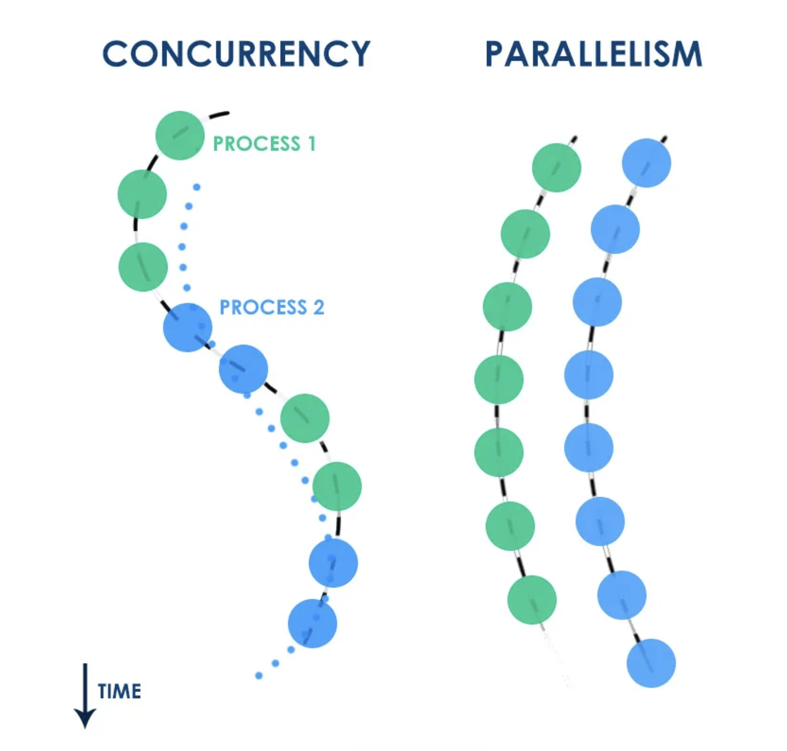

## Phoenix



---

### Съдържание

1. Основи на уеб програмирането.
2. HTTP протокол.
3. Plug

---

### Първи стъпки

* `mix archive.install hex phx_new` - Създаване на нов Phoenix проект
* Сайт: https://www.phoenixframework.org/
* Github: https://github.com/phoenixframework/phoenix/

---

```bash
➜ mix phx.new app

We are almost there! The following steps are missing:
    $ cd app
Then configure your database in config/dev.exs and run:
    $ mix ecto.create
Start your Phoenix app with:
    $ mix phx.server
You can also run your app inside IEx (Interactive Elixir) as:
    $ iex -S mix phx.server
```
---


### Phoenix

* `Phoenix` е една голяма функция.

---

### Phoenix.Router

---

### Phoenix.Endpoint

---

### Schema Modules (Core)

---


### Context Modules (Boundary)

* Access External Services
  * The context allows a single point of access for external services.
* Abstract Away Tedious Details
  * The context abstracts away tedious, inconvenient concepts.
* Handle uncertainty
  * The context handles uncertainty, often by using result tuples.
* Present a single, common API
  * The context provides a single access point for a family of services.

---

### Core or Boundary?

* Build a query in the core and execute it in the boundary.
* Pipe-land vs With-land

---

### 

Schemas don’t actually interact with the database. Instead, think of them as
road maps that describe how to tie one Elixir module to a database table. The
schema doesn’t actually connect to the database; it just has the data that
answers key questions about how to do so:
• What’s the name of the table?
• What are the fields the schema supports?
• What are the relationships between tables?