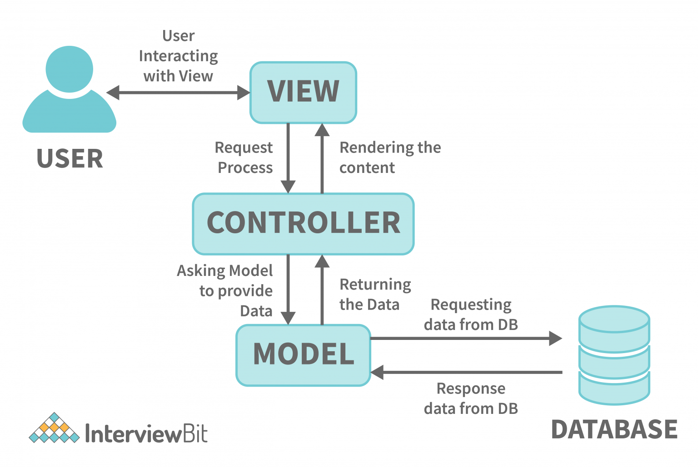
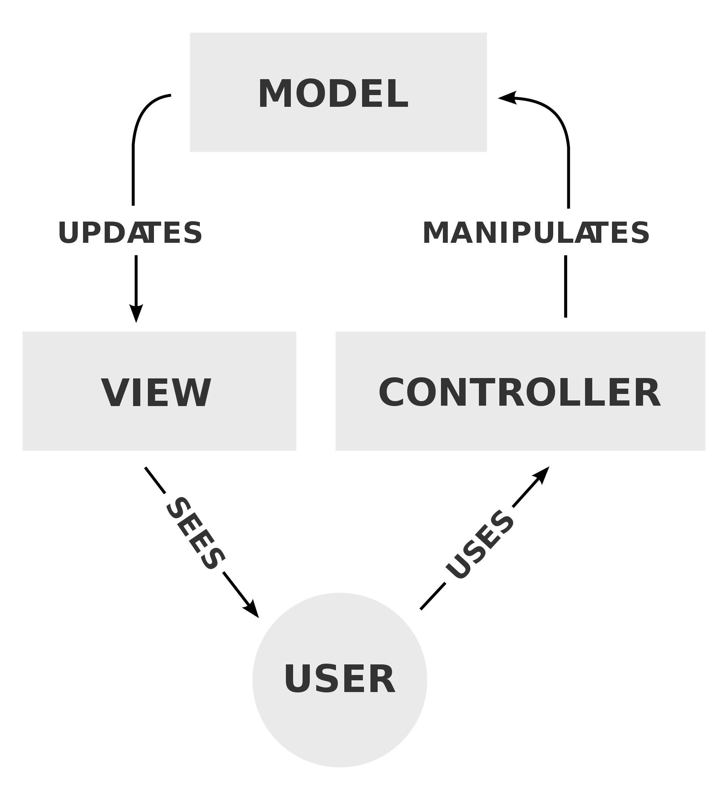
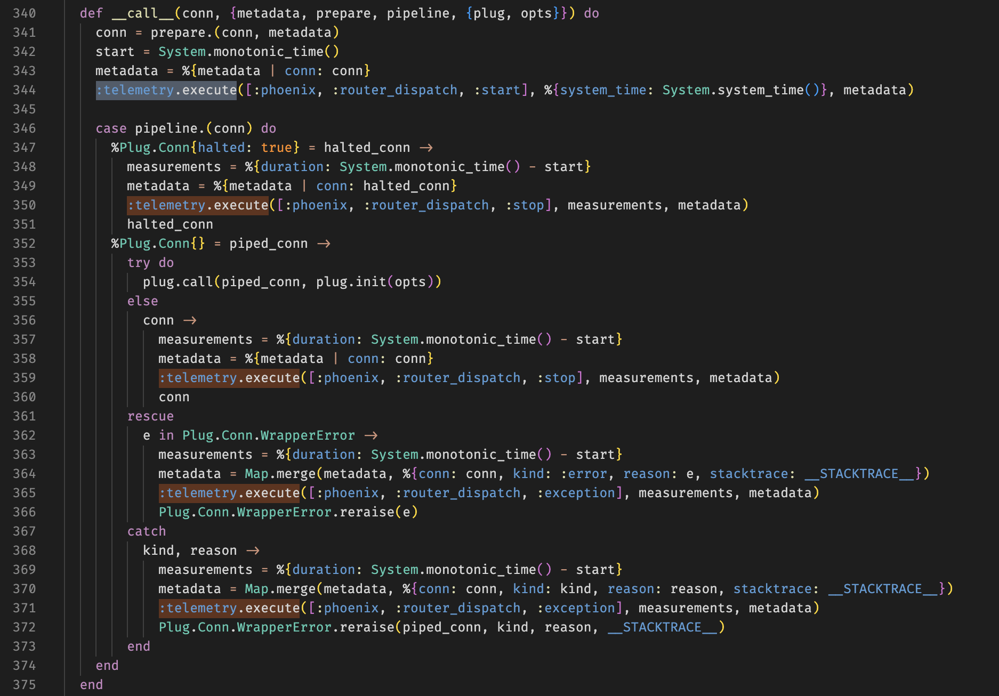

---

### Предговор

* Какво е Plug?
* Пример: [Линк](https://gist.github.com/IvanIvanoff/a7f0c94ee6815b5cfc776ce3011879b8)

---

### Съдържание

* Ще разгледаме:
  1. Какво е Phoenix и как да го инсталираме;
  2. Какво е MVC архитектура;
  3. Как е структуриран кодът във Phoenix приложение;
  4. Генератори;
  5. Разглеждане на примерен код.
* Няма да разглеждаме:
  1. Писане на JS/CSS/HTML;
  2. Сложни примери и детайли. 90 минути са недостатъчни за навлизане в дълбочина в нито една тема.

---

### Какво е Phoenix?

* MVC уеб фреймурък, написан на Elixir.
* Също предоставя и абстракции над Websocket - Channels.
* MVC е архитектурен шаблон за изграждане на уеб приложения, разделяйки го в 3 главни части:
  * **M**odel: Кодът, отговорен за бизнес логиката, комуникацията с базата данни и т.н.
  * **V**iew: Кодът, свързан с потребителския интерфейс.
  * **C**ontroller: Играе ролята на посредник между Model и View. Обработва входящите заявки.

---

### Какво е Phoenix?

* Може да използвате само някои части от Phoenix или да не го използвате като MVC фреймуърк.
* Може да мислите за Phoenix като кабор с инструменти като вие избирате кои от тях да използвате.
* Може да не използвате Ecto.
* Може да не използвате View/HTML.
* Може да пишете приложение, което е само JSON API.
* Може да пишете приложение, което е само GraphQL сървър.
* Може да поддържате само websocket endpoints.

---



---



---

### Първи стъпки

* `mix archive.install hex phx_new` - Създаване на нов Phoenix проект.
* Може и без `mix phx.new`, така се спестява писането на много boilerplate.
* Сайт: https://www.phoenixframework.org/
* Github: https://github.com/phoenixframework/phoenix/
* Създаване на нов Phoenix проект в стъпки: [линк](https://hexdocs.pm/phoenix/up_and_running.html)

---

```bash
➜ mix phx.new app

We are almost there! The following steps are missing:
    $ cd app
Then configure your database in config/dev.exs and run:
    $ mix ecto.create
Start your Phoenix app with:
    $ mix phx.server
You can also run your app inside IEx (Interactive Elixir) as:
    $ iex -S mix phx.server

➜ cd app 
➜ mix ecto.create # Създаваме базата данни
➜ mix phx.gen.auth Accounts User users # Създаваме authentication
```

---

### Структура на Phoenix проект

* `assets` съдържа frontend assets - най-вече Javascript и CSS.
* `lib` съдържа кода на нашето приложение.
  * `lib/my_app` съдържа бизнес логиката. Тук се случва интеракцията с базата данни, т.е. тук живее Model частта.
  * `lib/my_app_web` съдържа кода, отговорен за предоставянето на програмата като уеб приложение, т.е. тук живеят Controller и View частите.
  * Всичко, което сме правили на лекции и домашни досега (освен лекцията за Plug), е код, който живее в `lib/my_app`
* `priv` съдържа файлове и скриптове, които не са част от приложението, но са нужни в production. Това включва статични файлове, скриптове за миграция на базата данни, файлове свързани с i18n и др.
* `test` съдържа всички тестове.

---

```sh
.
├── assets
│   ├── ...
├── config
├── lib
│   ├── test_structure
│   └── test_structure_web
│       ├── components
│       │   └── layouts
│       └── controllers
│           └── page_html
├── priv
│   ├── gettext
│   │   └── en
│   │       └── LC_MESSAGES
│   ├── repo
│   │   └── migrations
│   └── static
│       └── images
└── test
    ├── support
    └── test_structure_web
        └── controllers
```

---

```sh
./test_structure_web
├── components
│   ├── core_components.ex
│   ├── layouts
│   │   ├── app.html.heex
│   │   └── root.html.heex
│   └── layouts.ex
├── controllers
│   ├── error_html.ex
│   ├── error_json.ex
│   ├── page_controller.ex
│   ├── page_html
│   │   └── home.html.heex
│   └── page_html.ex
├── endpoint.ex
├── gettext.ex
├── router.ex
└── telemetry.ex
```

---

### Model

* Бизнес логиката на приложението.
* Имплементира връзката с външни сървиси - API-та, бази данни и т.н.
* Имплементира връзката с базата данни, трансформацията на данните и правилата според които данните се променят.
* Кодът е независим от визуализацията, а е отговорен за самите данни:
  * Кодът, който валидира и съхранява потребител в базата данни.
  * Кодът, който променя потребителското име.
  * Кодът, който изпраща мейли.

---

### Структуриране на кода в моделите

* В литературата и документацията за Elixir често ще срещнете термини като:
  * Core/Schema Module
  * Context/Boundary Module
* Phoenix генераторите създават код, който е организиран по този начин.

---

### Schema (Core) Modules

* Най-често съдържа дефиниция на Ecto схема, changeset функции и дефиниции на заявки.
* Тук поставяме код, който е детерминистичен
* Функциите връщат `Ecto Query` и извикващият функцията трябва да изпълни тази заявка.
  * Композицията на заявка е детерминистична операция;
  * Изпълнението на заявка не е детерминистична операция.
* Външният свят не работи директно с тези модули.
* Пример: [Линк](https://gist.github.com/IvanIvanoff/9384462be1a922bcc178df6ef62dd672)
---


### Context (Boundary) Modules

* Предоставят връзка с външни ресурси - бази данни, API-та и т.н.
* Скриват досадни детайли.
  * При смяна на парола трябва да се изтрие старата, да се изтрият всички съществуващи токени, да се запише новата парола, (опционално) да се изпрати мейл, че е настъпила промяна (без да пращате парола в текстов вид) и т.н.
* Грижат се за несигурността/недетерминистичността на поведението.
  * Най-често като връщат `{:ok, result}` или `{:error, reason}`
* Групират много сървиси/core модули и предоставят единно API за достъп
  * `Accounts` контекст модула използва с `User`, `UserToken`, `UserNotifier` и т.н., за да предостави API за работа с потребители.
* Пример: [Линк](https://gist.github.com/IvanIvanoff/9ecfd2130e97963e1b62ec0bad2667d1)

---

### Core или Boundary?

* По усет/интуиция. Разгледайте кода, генериран от Phoenix, за да ги добиете.
* Добавете Ecto Query в Core и изпълнението на заявката в Context.
* Pipe-land vs With-land (Opinionated, изобщо не е твърдо правило)
  * `|>` е "детерминистично" в смисъл, че ако някоя функция не върне очакван резултат, то ще получим `MatchError`
  * Използваме `with` вместо `|>`, когато очакваме възможност за грешки.
* Детерминистичните неща отиват в Core, недетерминистичните в Context
* Ако за изпълнението на някоя функционалност се изисква комбинирането на няколко схеми и функционалности от различни модули - в Context.

---

### Schema (Core) Modules - Extra

* Схема модулите предоставят логика, която описва как да свържем един Elixir модул с таблица в базата данни.
* Схема модулите не взаимодействат с базата данни, а предоставят код, който отговарят на някои въпроси:
  * Какво е името на таблицата в базата?
  * Какви полета има схемата и таблицата (може да предоставим колона от таблицата с друго име в схемата)?
  * Какви са връзките между отделни таблици (`belongs_to`, `has_one`, `has_many` и т.н.) ?
  * Каква заявка да използваме, за да вземем/променим данни в таблицата?
  * Как да валидираме данните, преди да ги запишем в базата данни?
  * Други.
* Context модула взима нужните заявки от Schema модула и ги изпълнява.

---

```sh
./lib/pento
├── accounts # folder named as the context module, holds the schema modules
│   ├── user.ex # schema/core module
│   ├── user_notifier.ex # schema/core module
│   └── user_token.ex # schema/core module
├── accounts.ex # context module
├── application.ex
├── catalog
│   └── product.ex # schema/core module
├── catalog.ex  # context module
├── mailer.ex
├── promo # folder named as the context module, holds the schema modules
│   └── recipient.ex # schema/core module
├── promo.ex  # context module
├── release.ex
└── repo.ex
```

---

### Controller

* Контролерът е модул, действащ като посредник.
* Той приема постъпила заявка, комуникира с модела и избира какъв отговор ще бъде върна, визуализиран чрез View.
* За да бъде един модул контролер: `use MyWebWeb, :controller`.
* Използва `Plug` и е `plug`.
* Функциите в контролера се наричат `actions`.

---

```elixir
# router.ex
get "/", PageController, :index

# page_controller.ex
defmodule HelloWeb.PageController do
  use HelloWeb, :controller

  def index(conn, _params) do
    render(conn, :index)
  end
end
```

---

```elixir
defmodule MyAppWeb.UserController do
  use MyAppWeb, :controller

  alias MyApp.Accounts
  alias MyApp.Accounts.User
  # ...

  def create(conn, %{"user" => user_params}) do
    case Accounts.create_user(user_params) do
      {:ok, user} ->
        conn
        |> put_flash(:info, "User created successfully.")
        |> redirect(to: ~p"/users/#{user}")

      {:error, %Ecto.Changeset{} = changeset} ->
        render(conn, :new, changeset: changeset)
    end
  end
end
```

---

### Actions

* Controller actions са просто функции, които приемат `Plug.Conn` и параметри и връщат `Plug.Conn`.
* Можем да ги именуваме както пожелаем, стига да съвпадат с някоя дефиниция в рутера.
* Phoenix ни предоставя помощни функции като `render/2`, `render/3`, `json/2`, `text/2` и др.
  * Тези функции по подадените аргументи създават отговор;
  * Добавят нужните response headers;
  * Изпращат отговор чрез `Plug.Conn.send_resp/2`;
  * `Plug.Conn.send_resp/2` изпраща отговора и извиква `halt`, с което заявката е приключена.

---

### Action parameters

* Вторият аргумент на всеки `action` е речник с параметри.
* Тези параметри са обединение на множество параметри.
* Прието е да ги именуваме `params`.
* Съдържат всички параметри от заявката.
* Получават се чрез обединение на `conn.path_params`, `conn.body_params` и `conn.query_params`
  * Параметрите от пътя: `/hello/:name`;
  * Параметрите от тялото на заявката (например при `POST` заявка);
  * Параметрите от URL-а `?param1=value1&param2=value2&param3=value3`;
  * Да не се бъркат `path_params` и `query_params`.

---

### render/{2,3}

* render/рендериране е процесът на генериране на HTML, който ще бъде върнат на клиента.
* Използва се когато връщаме HTML, който ще бъде визуализиран от браузър.
* Функция, която използва темплейт, за да създаде HTML отговор, попълни параметрите в темплейта, добави правилния HTTP хедър и изпрати отговори на потребителя.
* Приема като аргументи:
  * `conn`;
  * Темплейт като атом или низ;
  * Речник `assigns` със стойности, които ще бъдат интерполирани в темплейта.

---

```elixir
def render(conn, template, assigns) do
  # ...
  conn 
  #...  
  |> render_and_send(...)
end

defp render_and_send(conn, format, template, assigns) do
  view = view_module(conn, format)
  conn = prepare_assigns(conn, assigns, template, format)
  data = render_with_layouts(conn, view, template, format)

  conn
  |> ensure_resp_content_type(MIME.type(format))
  |> send_resp(conn.status || 200, data)
end
```

---

### View във Phoenix

* В последната major версия (1.7 от 02.2023) са направени значителни промени във View частта.
* Преди 1.7 се използваше `:phoenix_view` библиотеката, която генерира `render` функции използвайки
  темплейти от файлове на диска.
* От 1.7 се препочита писането на Components.
  * Function/Stateless components - функция, която приема `assigns` и връща `~H` структура.
  * Module/Live components - модул, който дефинира Component. Грижи се за своето състояние, обработва събития и т.н.
* В тази лекция ще дадем примери само с Components.

---

### View

* Грижи се за визуалната репрезентация на данните.
* Включва писането на templates/components/layouts чрез използването на HTML/CSS/Javascript.
* От Phoenix 1.7 по подразбиране използва Tailwind CSS.
* Използва се също Elixir:
  * Написване на помощни функции в .ex файлове
  * Embedded Elixir в самите темплейти - `.heex` файловото разширение и `~H` сигил.

---

```elixir
attr :for, :any, required: true, doc: "the data structure for the form"
attr :as, :any, default: nil, doc: "the server side parameter to collect all input under"

attr :rest, :global,
  include: ~w(autocomplete name rel action enctype method novalidate target),
  doc: "the arbitrary HTML attributes to apply to the form tag"

slot :inner_block, required: true
slot :actions, doc: "the slot for form actions, such as a submit button"

def simple_form(assigns) do
  ~H"""
  <.form :let={f} for={@for} as={@as} {@rest}>
    <div class="mt-10 space-y-8 bg-white">
      <%= render_slot(@inner_block, f) %>
      <div :for={action <- @actions} class="mt-2 flex items-center justify-between gap-6">
        <%= render_slot(action, f) %>
      </div>
    </div>
  </.form>
  """
end
# More examples here: https://gist.github.com/IvanIvanoff/f2034c33e162eb6dde551d9f0c242bd5
```

---

### View vs Template vs Layout vs Component

* `Template` е HTML структурата, която има "празни" места, които се попълват от параметри.
* `View` е частта от кода, която е отговора за рендерирането на темплейтите. Допълнително може да се грижи и за обработката на параметрите, който се използват в темплейта.
* `Layout` е template, който "обгръща" нашите темплейти. Обикновено тук включваме `<html>`, `<head>` и `<body>` таговете, като всички наши темплейти се добавят между `<body>` и `</body>`.
  * Използва се, за да спести повтарянето на код.
  * Layouts могат да се влагат.

---

### View vs Template vs Layout vs Component

* `Component` може да значи две неща:
  * Function Component - функция, която приема `assigns` и връща `~H` структура.
  * Module Compontent - модул, който дефинира Component. Грижи се за своето състояние, обработва събития и т.н.
  * Функцията-компоненет може да живее в самия controller/live модул, което опростява значително сложността на структурата - няма нужда от oтделни view и template файлове. Особено полезно и използвано е при LiveView (следващата лекция).

---

### Phoenix.Endpoint

* `Phoenix.Endpoint` е входната точка за всяка заявка. 
* Представлява поредица от `plug`-ове (които се изпълняват за всяка заявка) свързани със:
  * Сервиране на статични файлове (img, css, js, etc.);
  * Настройки на сесията;
  * Добавяне на request_id;
  * Добавяне на telemetry plug;
  * Други.
* Последният `plug` е рутерът - изпълнението се предава на нашия код.
* [Пример](https://github.com/meddle0x53/presentem/blob/master/lib/presentem_web/endpoint.ex)

---

### Phoenix.Router

* Надгражда Plug.Router
* Добавя `scope` макрос за създаване на namespaces.
* Добавя `pipeline` макрос за изграждане на именувана поредица от plug-ове и макрос `pipe_through` за употребата му.
* Добавя `get/3`/`post/3`/т.н. макроси за обработка на HTTP заявки чрез делегация към контролер.

---

```elixir
defmodule MyApp.Router do
  use PresentemWeb, :router

  pipeline :browser do
    plug :accepts, ["html"]
    plug :fetch_session
    plug :fetch_live_flash
    plug :put_root_layout, {MyApp.LayoutView, :root}
    plug :protect_from_forgery
    plug :put_secure_browser_headers
  end

  pipeline :api do
    plug :accepts, ["json"]
  end

  scope "/", MyApp do
    pipe_through :browser

    get "/users/:id", UserController, :show
    get "/users", UserController, :index
    post "/users", UserController, :create
  end
end
```

---

```elixir
defmodule MyAppWeb.UserController do
  use MyAppWeb, :controller

  alias MyApp.Accounts
  alias MyApp.Accounts.User

  def index(conn, _params) do
    users = Accounts.list_users()
    render(conn, :index, users: users)
  end

  def create(conn, %{"user" => user_params}) do
    case Accounts.create_user(user_params) do
      {:ok, user} ->
        conn
        |> put_flash(:info, "User created successfully.")
        |> redirect(to: ~p"/users/#{user}")

      {:error, %Ecto.Changeset{} = changeset} ->
        render(conn, :new, changeset: changeset)
    end
  end

  def show(conn, %{"id" => id}) do
    user = Accounts.get_user!(id)
    render(conn, :show, user: user)
  end
end
```

---

### Generators

* `Mix Task`, който генерира код за вас.
* Удобни са, когато трябва бързо да създадем приложение.
* Удобни са за изграждане на скелет върху който след това да добавяме.
* Предоставените генератори са добре обмислени и написани от опитни програмисти.
* Добавят и тестове.
* Има различни видове генератори:
  * Създават таблица в базата данни и модули за работа с тях
  * Създават и HTML страници за интеракция с базата
  * Създават логика за регистрация и автентикация.
* Четете внимателно какво принтира всеки генератор, защото може вие да трябва да довършите част от работата

---

### mix phx.new

* Генератор, който създава нов Phoenix проект.
* Създава структурата на проекта, Router, Endpoint, Telemetry, Gettext и др.
* HTML/CSS компонентите в 1.7+ са написани от екипа на Tailwind CSS.
* Помислили са за accessability на ключовите компоненти, предоставени с новия проект:
  * Компонентите в `core_components.ex` са написани имайки предвид screen readers потребители;
  * Тоест слепите хора ще могат по-лесно да използват сайта;
  * Това не е вярно за всички уеб сайтове - при грешно имплементиран фокус може да се получи разминаване между това, което е на екрана (някой modal) и това къде се намира фокуса на screen reader-a

---

### mix phx.gen.auth

* `mix phx.gen.auth Accounts User users`
* Създава система за автентикация на потребители, която включва:
  * Таблици в базата данни;
  * Модули за работа с тези таблици;
  * Уеб интерфейс;
  * Спазва OWASP препоръките.
* Пример: [Видео](https://www.loom.com/share/8e684f8386bd4301892dc9f1ec01f399)

---

### mix phx.gen.html

* `mix phx.gen.html Catalog Product products sku:string name:string price:integer`
* Добавяме `/products` в `router.ex` (както принтира и генератора)
* Създава context и schema модули, миграция за базата данни и CRUD HTML уеб интерфейс за работа с този ресурс.
* Пример: [Видео](https://www.loom.com/share/cfbd3cb872b848e390f415015001733e)

---

### Други генератори

* `mix phx.gen.json` - Генерира таблица в базата данните, схема и контекст модули и контролер. Сервира ресурса като JSON API, а не HTML. Принтира на екрана какво трябва да добавите в Router
* `mix phx.gen.live` - Генерира LiveView ресурс.
* `mix phx.gen.release --docker` - Генерира нужните файлове за създаване на Mix Release, както и Dockerfile.
* `mix phx.gen.secret` - Генерира случаен низ с достатъчна ентропия, за да може да бъде използват като тайна.
* И други.


---

### Sigils

* Механизъм за представяне на данни чрез тяхната текстова репрезентация.
* `~D[2023-05-05]` вместо `Date.new(2023, 5, 5)`
* `~r/foo|bar/` вместо `Regex.compile!("foo|bar")`
* Това позволява добавянето на функционалност чрез библиотека, а не чрез разширяване на синтаксиса на езика.
  * Синтаксис: `%{}`, `{}`, `[]`, etc.
  * Сигил: `~r/foo/`, `~D[2023-05-15]` и т.н.
* До Elixir 1.14 името на сигилите е една буква: `~s`, `~r`, `~U`, `~D` и т.н.
* От Elixir 1.15, името на сигилите може да е повече от една буква, но задължително всички букви да са главни.
  * За да се избегнат неясноти: `var=~opts[bar]` vs `var =~ opts[bar]` vs `var = ~opts[bar]`
  * Очаква се да добавят `~PID`, `~PORT` и други подобни сигили.

---

```elixir
defmacro sigil_D({:<<>>, _, [string]}, []) do
  {{:ok, {year, month, day}}, calendar} = parse_with_calendar!(string, :parse_date, "Date")
  to_calendar_struct(Date, calendar: calendar, year: year, month: month, day: day)
end

defmacro sigil_r({:<<>>, _meta, [string]}, options) when is_binary(string) do
  binary = :elixir_interpolation.unescape_string(string, &Regex.unescape_map/1)
  regex = Regex.compile!(binary, :binary.list_to_bin(options))
  Macro.escape(regex)
end

defmacro sigil_r({:<<>>, meta, pieces}, options) do
  binary = {:<<>>, meta, unescape_tokens(pieces, &Regex.unescape_map/1)}
  quote(do: Regex.compile!(unquote(binary), unquote(:binary.list_to_bin(options))))
end
```

---

### Verified Routes sigil ~p

* Когато правим линк към някой път в нашето приложение може да използваме просто стрингове: `"/users/#{user.id}"`
* Но в този случай, ако допуснем грешка, няма да разберем веднага, а чак по време на изпълнение.
* Искаме по време на компилация да получим грешка, ако сме използвали невалиден път като `/user/#{user.id}`
* Преди Phoenix 1.7 използваме функция, която генерира път: `Routes.user_path(conn, :show, user)`

---

### Verified Routes sigil ~p

* От Phoenix 1.7 използваме `~p` сигил: `~p"/users/#{user.id}`, който е много по-прост за употреба, но 
  * В `~p` сигила интерполацията работи по по-различен начин.
  * Можем да напишем просто `~p"/users/user"` ако `user` има поле `:id`
  * Когато генерираме query параметри можем да интерполираме речник, вместо да използваме `URI.encode_query/2`.
* [Verified Routes Имплементация](https://github.com/phoenixframework/phoenix/blob/main/lib/phoenix/verified_routes.ex)

---

### HEEX (HTML+EEx) Sigil ~H

* Когато трябва да пишем HTML, използваме `~H` сигил
* `~H"<span class={[@name, @class]} />"`
* Низовете в този сигил минават през HTML валидация.
  * Преди въвеждането на `~H` ако във вашия HTML код има грешка, липсващ затварящ таг и т.н. ще разберете доста по-късно.
* Низовете в този сигил се форматиран чрез специален плъгин на Elixir Formatter
  * `plugins: [Phoenix.LiveView.HTMLFormatter]`
  * Форматира HTML кода, т.е. форматира вътрешността на низ.
* Може да embed-вате Elixir код чрез `<%= <elixir code> %>` и `<% <elixir code> %>`
* Ако искате да embed-вате Elixir в HTML таг: `<div id={@id}>`

---

```elixir
~H"""
<.form :let={f} for={@for} as={@as} {@rest}>
  <div class="mt-10 space-y-8 bg-white">
    <%= render_slot(@inner_block, f) %>
    <div :for={action <- @actions} class="mt-2 flex items-center justify-between gap-6">
      <%= render_slot(action, f) %>
    </div>
  </div>
</.form>
"""
```

---

### Instrument/Instrumentation

* `Instrumentation` означава измерване и мониториране на изпълнението/производителността на дадена програма.
  * `Binary Instrumentation`
* Това се прави с цел събиране на данни нужни за профилиране, откриване на грешки, проследяване на изпълнението, откриване на бавни части от програмата и т.н.
* `Instrument` (глагол) - извървшване на Instrumentation
* `Instrument` (съществително) - Парче код/библиотека/tool, които извършват логиката по Instrumentation.
* Можем да наречем инструменти profiler/logger/tracer.

---

### Telemetry

* `:telemetry` библиотеката за dynamic dispatching на евенти.
* Фокусът е върху метрики и instrumentation.
* Тези събития (events) могат да бъдат каквото пожелаете, например:
  * Започване/завършване на Phoenix заявка;
  * Започване/завършване на Ecto заявка.
* След това тези евенти могат да бъдат агрегиране:
  * 95-и персентил за времето за изпълнение на цялата заявка;
  * Среден брой Ecto заявки в минута/час;
  * Други

---

```elixir
# event emitting
:telemetry.execute(
  [:web, :request, :done],
  %{latency: latency},
  %{request_path: path, status_code: status}
)

# event handling
defmodule LogResponseHandler do
  require Logger

  def handle_event([:web, :request, :done], measurements, metadata, _config) do
    Logger.info(
      "[#{metadata.request_path}] #{metadata.status_code} sent in #{measurements.latency}"
    )
  end
end

```
---



---

### i18n

* `Internazionalization` е процесът по дизайн и имплементация на софтуер така, че да може да бъде адаптиран за различни езици.
* В Elixir това се постига чрез използване на библиотеката `:gettext`.
* Вместо директно използване на низове `"Hello World!"` се използва `gettext("Hello world!")`, където `"Hello world!"` е `msgid`
* Поддържа и други функции:
  * `ngettext` - За "превод" между единствено и множествено число
  * `dgettext` - Приема като допълнителен аргумент домейн
  * `pgettext` - Съобщение с контекст, който може да се използва за разрешаване на неясноти. Например `file` може да е както глагол, така и съществително.
* `locale` - Посочва езика, на който ще бъдат визуализирани текстовете.

---

### Mailer

* Phoenix генераторът добавя модули, свързани с изпращане на мейли.
* Използва `:swoosh` библиотеката.
* По подразбиране работи с локален адаптер, който вместо да праща мейли, ги записва на диска.
* В `config.runtime.exs` в коментар е описание на нужната конфигурация, за да заработи.
* Може да използвате Mailchimp/Mailjet/Mailgun/etc. 
---

### Phoenix.Channel

* Абстракция над Websocket
* Позволява писането на soft real-time приложения:
  * Чат;
  * Push notifications;
  * Интерактивни приложения;
* Начин на работа:
  * Клиент установява връзка със сървъра използвайки Websocket;
  * Клиентът се присединява към един или повече Topics (идентифицирани чрез произволен низ);
  * Един Topic може да е публичен (всички могат да се присединят);
  * Един Topic може да е частен, например позволявате на клиентът да се присъедини към Topic `my_room:10` само ако ID-то на потребителят е 10.
  * Клиентът може да пише (push) съобщения в Topic и да получава съобщения от този Topic.

---

```elixir
defmodule HelloWeb.RoomChannel do
  use Phoenix.Channel

  def join("room:lobby", _message, socket) do
    {:ok, socket}
  end

  def join("room:" <> _private_room_id, _params, _socket) do
    {:error, %{reason: "unauthorized"}}
  end

  def handle_in("new_msg", %{"body" => body}, socket) do
    broadcast!(socket, "new_msg", %{body: body})
    {:noreply, socket}
  end
end
```

---

```js
let channel           = socket.channel("room:lobby", {})
let chatInput         = document.querySelector("#chat-input")
let messagesContainer = document.querySelector("#messages")

chatInput.addEventListener("keypress", event => {
  if(event.key === 'Enter'){
    channel.push("new_msg", {body: chatInput.value})
    chatInput.value = ""
  }
})

channel.on("new_msg", payload => {
  let messageItem = document.createElement("p")
  messageItem.innerText = `[${Date()}] ${payload.body}`
  messagesContainer.appendChild(messageItem)
})

channel.join()
  .receive("ok", resp => { console.log("Joined successfully", resp) })
  .receive("error", resp => { console.log("Unable to join", resp) })

export default socket
```

---

### Край