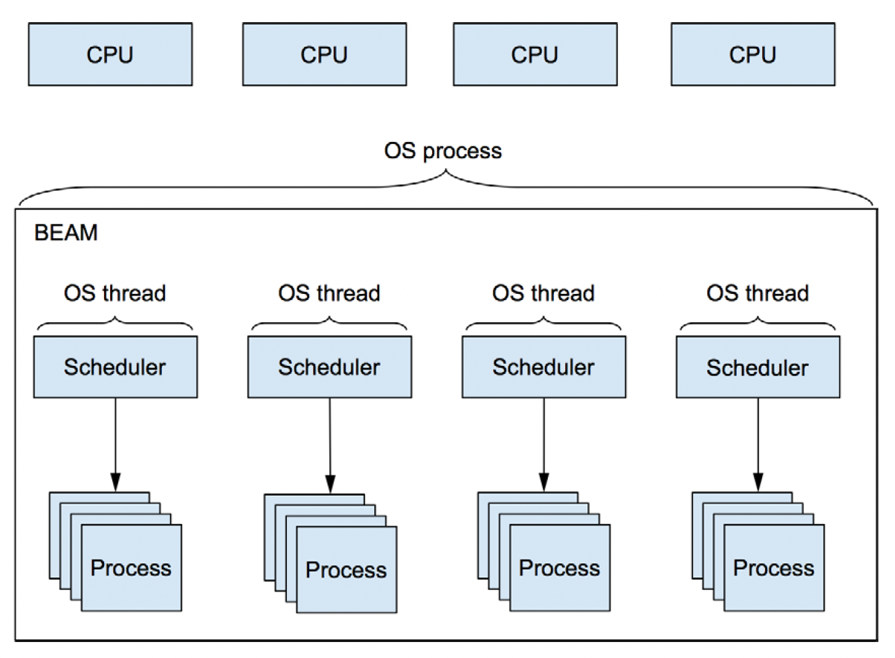

---

theme: uncover
style: |
  .center_img {
    margin: auto;
    display: block;
  }

  .side_by_side {
    display: flex;
    align-items: center;
    justify-content: center;
    gap: 10px;
  }

  .small-text {
    font-size: 0.75rem;
    letter-spacing: 1px;
    font-family: "Times New Roman", Tahoma, Verdana, sans-serif;
  }
  li {
    font-size: 28px;
    letter-spacing: 1px;
  }
  p.quote {
    line-height: 38px;
  }
  q {
    font-size: 32px;
    letter-spacing: 1px;
  }
  cite {
    text-align: right;
    font-size: 28px;
    margin-top: 12px;
    margin-bottom: 128px;
  }
paginate: true
backgroundColor: #FFFFFF
marp: true

---

## Увод в конкурентното програмиране с Elixir


---

### Дефиниции

* **Конкурентност**
  * Способността различни части от една програма да се изпълняват out-of-order или частично, без това да повлияе на резултата.
  * [Concurrent Programming, Mutual Exclusion (1965; Dijkstra)](https://citeseerx.ist.psu.edu/document?repid=rep1&type=pdf&doi=30e83735eb72af97e7ab3ec7f0823b9a9ae5493c).
* **Паралелизъм**
  * Способността две или повече задачи или под-задачи да се изпълняват едновременно, използвайки множество ресурси (процесорни ядра).
* **Скалируемост**
  * Способността на една система да се справи с повишаването на натоварването чрез добавяне на хардуерни ресурси.

---


---


---


---

### Защо има нужда от конкурентност?

* По-пълноценно използване на ресурсите.
* Подобряване на бързината на отговор от системата.
* Позволява да изпълняваме повече задачи едновременно (според външен наблюдател) от броя налични процесорни ядра.
* Не позволява на една или няколко задачи да монополизират ресурсите.
  
---

### Проблемите на конкурентността

* Програмите са по-трудни за писане и поддръжка;
  * Синхронизация, координация, планиране на изпълнението;
* Програмите са по-трудни за дебъгване;
* Допълнително натоварване породено от постоянната смяна на контекста;

---

### Конкурентност и паралелизъм

* **Конкуретност** се отнася до структурата на една програма.
  * За да бъде една програма конкурентна, то задачите, които изпълнява трябва да могат да бъдат прекъсвани и възобновявани. Редът на изпълнение на под-задачите **не** е строго определен.
* **Паралелизъм** се отнася до изпълнението на една програма.
  * Дали има или няма паралелизъм се определя по време на изпълнението и е пряко зависимо от **хардуерните** ресурси (брой процесорни ядра)
* Пример за **конкурентна** програма:
  * Уеб сървър, който използва 1 процесорно ядро, но обслужва множество заявки, изпълнявайки частично всяка една заявка до нейното завършване.
* Пример за **паралелна** програма:
  * Същия пример като горния, но разполагаме с 8 процесорни ядра. Уеб сървърът може да обработва 8 заявки наистина едновременно.

---

### Конкурентност и паралелизъм

* Една програма може да е конкурентна и паралелна.
* Една програма може да е конкуретна, но не паралелна.
* Една програма може да е паралелна, но не конкурентна.
* Една програма може да е нито паралелна, нито конкурентна.

---

### Конкурентност и паралелизъм

* Кодът, написан на Elixir е **конкурентен** и **при възможност, паралелен**.
* `iex --erl "+S 1" -S mix` - Стартира проекта с 1 Scheduler; използва една нишка на едно процесорно ядро. Имаме **конкурентност**, но **без паралелизъм**
* `iex --erl "+S 8" -S mix` (при изпълнение на процесор с 8 ядра) - Имаме **конкурентност** и **паралелизъм**.

---

### Модели за конкурентно програмиране

* **Чрез споделена памет**
  * Пример: A и B са две програми, които се изпълняват на един компютър и споделят файловата система.
  * Пример: А и B са две нишки, които достъпват обща променлива-стек и добавят и премахват елементи от него.
* **Чрез изпращане на съобщения**
  * Пример: A и B са уеб браузър и уеб сървър - А изпраща заявки за уеб страница и ресурси на B; B обработва заявките и изпраща резултатите на A.

---

<div class="side_by_side">


</div>

---

### Процеси

* Всичко в Elixir се изпълнява в процес.
* Кодът, изпълняван в процеса, е последователен и функционален.
* Ако искаме да изпълним конкурентно задача A и задача B, то трябва да ги изпълним в отделни процеси.
* Когато един процес приключи своята работа, то той "умира". (`Process.alive?` връща `false`).
  
---


 
---


---

### Типове данни - PID

* Пример: `#PID<0.481.0>`
* `pid` - Process identifier. Уникален идентификатор на жив процес. PID на приключил процес може да бъде преизползван.
* `pid` се визуализира като наредена тройка числа: `{node, id, serial}`.
  * Всички процеси на един node имат `node` равен на `0`.
  * `id` се увеличава с 1 при всяко създаване на процес.
  * Когато `id` стигне `MAXPROCS`, `serial` се увеличава с 1 и `id`.
  * Ако един `pid` има `node` различно от 0, то той сочи към процес на друг node.
* `self`, `spawn` и `spawn_link` връщат `pid`
* https://www.erlang.org/doc/efficiency_guide/advanced.html

---

### Създаване на процеси

* `spawn/1` - създава процес, който изпълнява функцията, подадена като аргумент
* `spawn/3` - създава процес, който изпълнява функцията зададена чрез тройката Module, Function, Arguments (MFA)
* `spawn_link/{1,3}` - създава процес, подобно на `spawn`, но също така двата процеса се "свързват" (повече за това по-късно)
* `spawn_monitor/{1,3}` - създава процес, подобно на `spawn`, но също така създаденият процес бива "наблюдаван" от създаващия го процес (повече за това по-късно)

--- 

```elixir
spawn(fn -> IO.puts("Hello from a process #{inspect(self())}!") end)
# => Hello from a process #PID<0.1303.0>!
# PID<0.1303.0>
```

```elixir
defmodule T do
  def print_sum(a, b, c) do
    IO.puts("#{a} + #{b} + #{c} = #{a + b + c}")
  end
end

spawn(T, :print_sum, [1, 2, 3])
#=> 1 + 2 + 3 = 6
#PID<0.1344.0>
```

---

```elixir
f = fn x -> Process.sleep(30); IO.puts(x) end
#Function<42.3316493/1 in :erl_eval.expr/6>
for i <- 1..20, do: spawn(fn -> f.(i) end)   
```

---


---

### Комуникация между процеси

* Процесите изпращат съобщения: `send/2`
* Процесите получават съобщения: `receive/1`
* Съобщенията са асинхронни - `send/2` винаги връща изпратеното съобщение, без гаранции, че то е получено.
  * Трябва сами да имплементираме синхронна комуникация, когато е необходимо (или да използваме готови шаблони от библиотеката).
* Всеки процес има пощенска кутия (mailbox) - място, където се съхраняват съобщенията, които са изпратени до него.

---


---

### Комуникация между процеси

* Selective receive

```elixir
defmodule Looper do
  def loop() do
    receive do
      {:pattern_1, from} -> send(from, :received_pattern_1)
      {:pattern_2, from} -> send(from, :received_pattern_2)
      :print_info -> IO.inspect(Process.info(self(), :messages), label: "Messages")
    end

    loop()
  end
end

pid = spawn(fn ->
  receive do
    {:pattern_1, from} -> send(from, :received_pattern_1)
    {:pattern_2, from} -> send(from, :received_pattern_2)
    :print_info -> IO.inspect(Process.info(self(), :messages), label: "Messages")
  end
end)

send(pid, {:pattern_100, self()})
send(pid, {:pattern_101, self()})
send(pid, {:pattern_2, self()})

flush()
# :received_pattern_2
---

### Имаш поща

* Пощенската кутия на процес структура, която съдържа получените съобщения.
* Когато процес изпраща съобщение, то той **копира** данните в пощенската кутия на другия процес.

---

### Имаш поща и паралелизъм

* При множество паралени процеси, писането в поща на друг процес не е безопасно.
* `m-buf`:
  * Парче памет извън хийпът, където други процеси могат да пишат безопасно.
  * Когато цялото съобщение е копирано, съобщението в `m-buf` се свръзва се добавя в края на пощенската кутия.
  * Използва се когато lock-ът на пощенската кутия е взет от друг.

---

### Гаранции

* Почти никакви. Приема се, че съобщенията могат да не бъдат доставени.
* `send` връща директно, без да се интересува дали съобщението е получено.
* Ако процеси A, B, и C изпращат съобщения на D, то няма гаранции за реда на получаване.
* Ако процес A изпраща съобщения a1, a2 и a3 на процес B, то е гарантирано, че съобщенията ще бъдат получени в този ред (ако бъдат получени).

---

```elixir
printer_pid = spawn(fn ->
  receive do
    {:print, text} -> IO.puts(text)
  end
end)

send(printer_pid, {:print, "Hello from #{inspect(self())}!"})
#=> Hello from #PID<0.1303.0>!
# {:print, "Hello from #PID<0.111.0>!"}
send(printer_pid, {:print, "1+2 = 3"})
#=> 1+2 = 3
# {:print, "1+2 = 3"})
```
---

```elixir
fun = fn -> {:error, "something went wrong"} end
spawn(fn -> :ok = fun.() end)
spawn(fn -> 1 / 0 end)
spawn(fn -> raise "error" end)
spawn(fn -> throw 10 end)
spawn(fn -> exit(normal) end)
```

---

### Връзки между процеси - link

* `link` - специална двупосочна връзка между два процеса.
* Когато единият процес приключи своята работа "неочаквано“, то другият процес получава съобщение `{:EXIT, from, reason}`.
  * Неочаквано: Когато процесът терминира чрез `exit`, `throw` или `raise`.
* Свързване на един процес с друг става:
  * по време на създаването му чрез `spawn_link/{1,3}`;
  * след създаването му чрез `Process.link/1` (свързва текущия процес с друг процес).

---

### Връзки между процеси - monitor

* `monitor` - специална еднопосочна връзка между два процеса - единият процес наблюдава другия (stalker).
* Когато наблюдаваният процес терминира, наблюдаващият го получава съобщение
* Дори когато наблюдаваният процес терминира нормално, наблюдаващият го получава съобщение.


---


---




---

### Типове данни - Ref

* Пример: `#Reference<0.3339068074.245366785.27512>`
* `ref` - Терм, уникален измежду всички свързани nodes
* Използва се за имплементация на синхронна комуникация чрез асинхронни съобщения (Как? За бонус точка.)
* https://www.erlang.org/doc/efficiency_guide/advanced.html

---

### Комуникация между процеси

* **Съобщенията** са специален вид **сигнали**
* **Сигнали**

---

### Шаблони

---

#### Синхронна комуникация чрез асинхронни съобщения

```elixir
pid = spawn(fn ->
  state = %{a: 1, b: 2, c: 3}
  receive do
    {:get_state, pid, ref} -> send(pid, {:state, ref, state})
  end
end)

ref = make_ref()
send(pid, {:get_state, self(), ref})
state = receive do
  {:state, ^ref, state} -> state
end
IO.puts(inspect(state))
#=> %{a: 1, b: 2, c: 3}
```

---

#### "Mutable" state

```elixir
defmodule Counter do
  def get_next(pid) do
    ref = make_ref()
    send(pid, {:get_counter, self(), ref})
    receive do
      {:counter, ^ref, counter} -> counter
    end
  end

  def loop(counter) do
    receive do
      {:get_counter, pid, ref} -> 
        send(pid, {:counter, ref, counter})
        loop(counter + 1)
    end
  end
end

pid = spawn(Counter, :loop, [0])
IO.puts(Counter.get_next(pid))
IO.puts(Counter.get_next(pid))
```

---

### Демо

```elixir
Process.list()
 |> Enum.map(&{&1, Process.info(&1)}) 
 |> Enum.map(fn {pid, info} -> {pid, info[:reductions]} end) 
 |> Enum.sort_by(&elem(&1, 1), :desc)
 |> Enum.take(10)
```

* :dbg.tpl(:_, []); Process.sleep(1); :dbg.stop()

---

### Ресурси

- https://freecontent.manning.com/concurrency-vs-parallelism
- https://www.manning.com/books/elixir-in-action
- https://learnyousomeerlang.com/the-hitchhikers-guide-to-concurrency
- https://learnyousomeerlang.com/errors-and-processes
- https://github.com/happi/theBeamBook
- https://cs.lmu.edu/~ray/notes/introconcurrency/
- https://www.researchgate.net/publication/228756317_Erlang-Programming_the_Parallel_World