---

theme: uncover
hidden: true
style: |
  .center_img {
    margin: auto;
    display: block;
  }

  .side_by_side {
    display: flex;
    align-items: center;
    justify-content: center;
    gap: 10px;
  }

  .small-text {
    font-size: 0.75rem;
    letter-spacing: 1px;
    font-family: "Times New Roman", Tahoma, Verdana, sans-serif;
  }
  li {
    font-size: 28px;
    letter-spacing: 1px;
  }
  p.quote {
    line-height: 38px;
  }
  q {
    font-size: 32px;
    letter-spacing: 1px;
  }
  cite {
    text-align: right;
    font-size: 28px;
    margin-top: 12px;
    margin-bottom: 128px;
  }
paginate: true
backgroundColor: #FFFFFF
marp: true

---

## Увод в конкурентното програмиране с Elixir

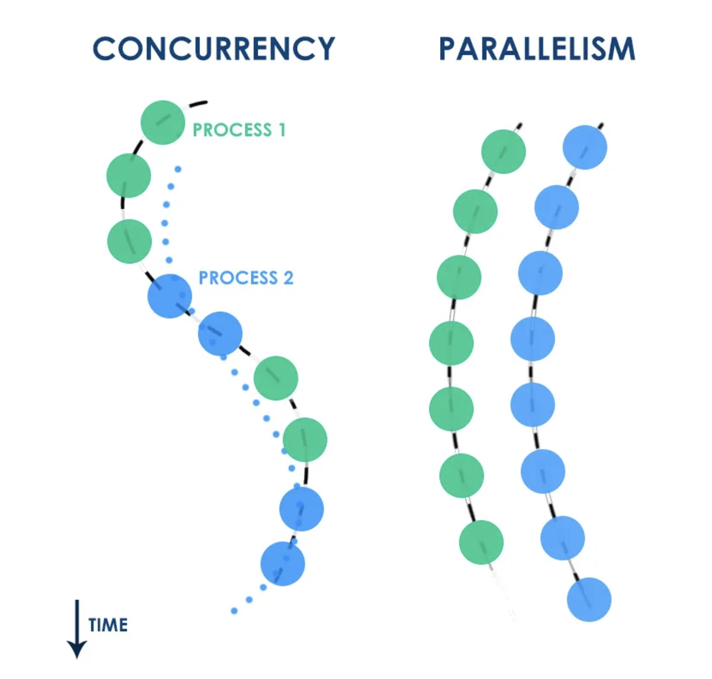

---

### Съдържание

* Дефиниции на конкурентност, паралелизъм и скалируемост. Примери.
* Създаване на процеси.
* Комуникация между процеси.
* Наблюдаване на процеси. Разпространение на грешките.
* В следващата лекция: Live coding имплементация на конкурентни абстракции.

---

### Дефиниции

* **Конкурентност**
  * Способността различни части от една програма да се изпълняват out-of-order, частично и припокриващо се, без това да повлияе на резултата.
  * [Concurrent Programming, Mutual Exclusion (1965; Dijkstra)](https://citeseerx.ist.psu.edu/document?repid=rep1&type=pdf&doi=30e83735eb72af97e7ab3ec7f0823b9a9ae5493c).
* **Паралелизъм**
  * Способността две или повече задачи или подзадачи да се изпълняват едновременно, използвайки множество ресурси (процесорни ядра).
* **Скалируемост**
  * Способността на една система да се справи с повишаването на натоварването чрез добавяне на хардуерни ресурси.

---

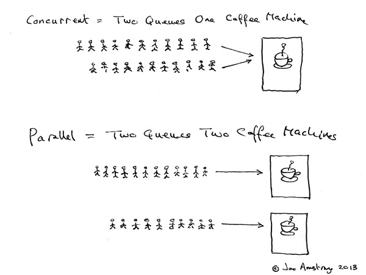

---

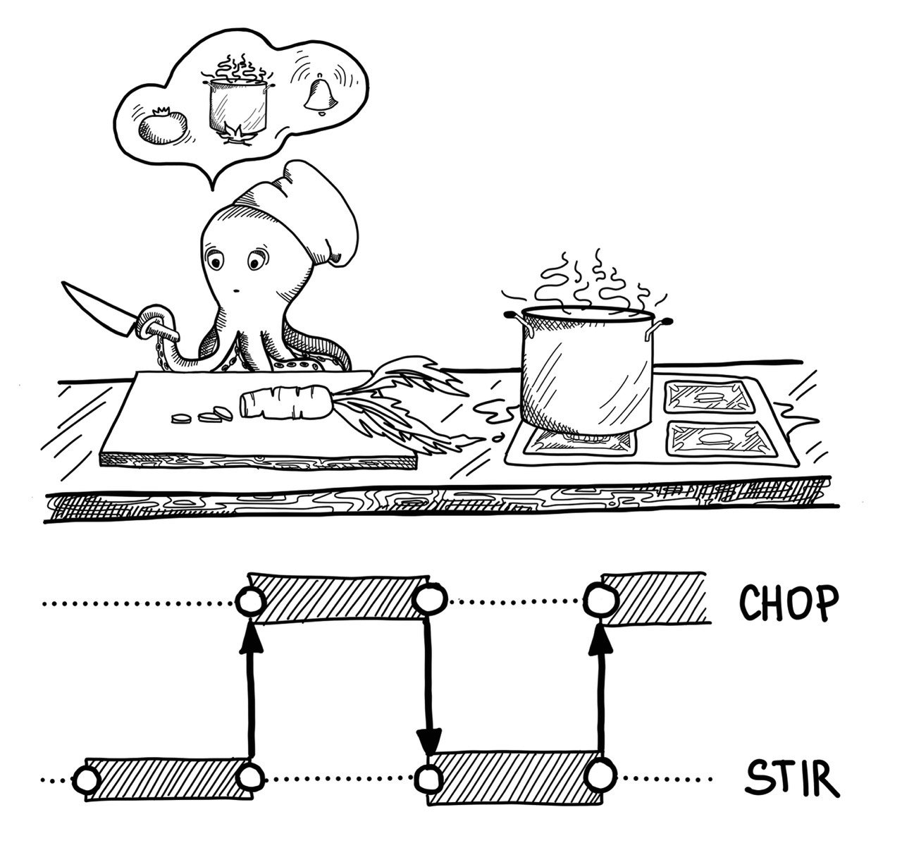

---

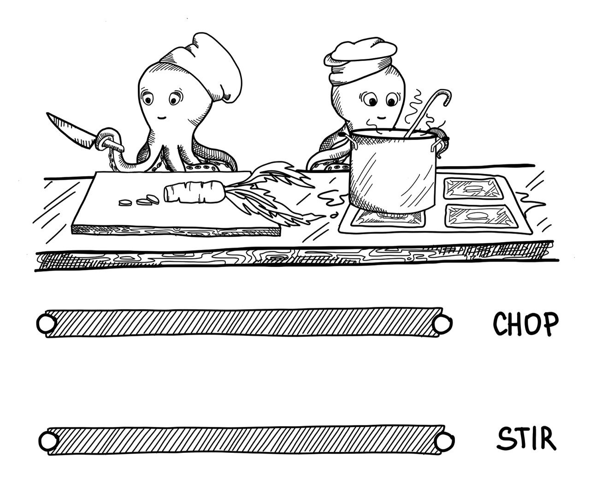

---

### Конкурентност и паралелизъм

* **Конкуретност** се отнася до структурата на една програма.
  * За да бъде една програма конкурентна, то задачите, които изпълнява трябва да могат да бъдат прекъсвани и възобновявани. Редът на изпълнение на подзадачите **не** е строго определен.
* **Паралелизъм** се отнася до изпълнението на една програма.
  * Дали има или няма паралелизъм се определя по време на изпълнението и е пряко зависимо от **хардуерните** ресурси (брой процесорни ядра)
* Пример за **конкурентна** програма:
  * Уеб сървър, който използва 1 процесорно ядро, но обслужва множество заявки, изпълнявайки частично всяка една заявка до нейното завършване.
* Пример за **паралелна** програма:
  * Същия пример като горния, но разполагаме с 8 процесорни ядра. Уеб сървърът може да обработва 8 заявки наистина едновременно.

---

### Конкурентност и паралелизъм

* Една програма може да е конкурентна и паралелна.
* Една програма може да е конкуретна, но не паралелна.
* Една програма може да е паралелна, но не конкурентна.
* Една програма може да е нито паралелна, нито конкурентна.

---

### Конкурентност и паралелизъм

* Кодът, написан на Elixir, е **конкурентен** и **при възможност, паралелен**.
* `iex --erl "+S 1" -S mix` - Стартира проекта с 1 Scheduler; използва една нишка на едно процесорно ядро. Имаме **конкурентност**, но **без паралелизъм**
* `iex --erl "+S 8" -S mix` (при изпълнение на процесор с 8 ядра) - Имаме **конкурентност** и **паралелизъм**.

---

### Проблемите на конкурентността

* Програмите са по-трудни за писане и поддръжка.
  * Синхронизация, координация, планиране на изпълнението.
* Програмите са по-трудни за дебъгване.
* Допълнително натоварване породено от постоянна смяна на контекста.
* Конкурентните подзадачи отнемат по-дълго време за изпълнение при натоварване.
* Не всички програми могат да бъдат написани конкурентно.

---

### Защо има нужда от конкурентност?

* По-пълноценно използване на ресурсите.
* Подобряване на бързината на отговор от системата.
* Позволява да изпълняваме повече задачи едновременно (според външен наблюдател) от броя налични процесорни ядра.
* Не позволява на една или няколко задачи да монополизират ресурсите.
  
---

### Комуникация между участници в конкурентна система

* **Чрез споделена памет**
  * Пример: A и B са две програми, които се изпълняват на един компютър и споделят файловата система.
  * Пример: А и B са две нишки, които достъпват обща променлива-стек и добавят и премахват елементи от него.
* **Чрез изпращане на съобщения**
  * Пример: Всичко в Elixir.
  * Пример: A и B са уеб браузър и уеб сървър - А изпраща заявки за уеб страница и ресурси на B; B обработва заявките и изпраща резултатите на A.

---

<div class="side_by_side">
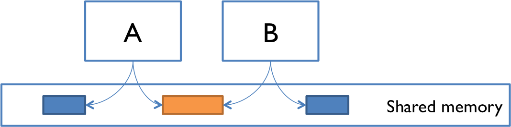

</div>

---

### Процеси

* Процесът винаги има адрес, понякога има и име.
* Всичко в Elixir се изпълнява в процес.
* Кодът, изпълняван в процеса, е последователен и функционален.
* Ако искаме да изпълним конкурентно задача A и задача B, то трябва да ги изпълним в отделни процеси.
* Когато един процес приключи своята работа, то той "умира".
* Elixir проектът, чрез който виждате тази презентация, изпълнява ~320 процеса (по време на писането на презентацията).

---

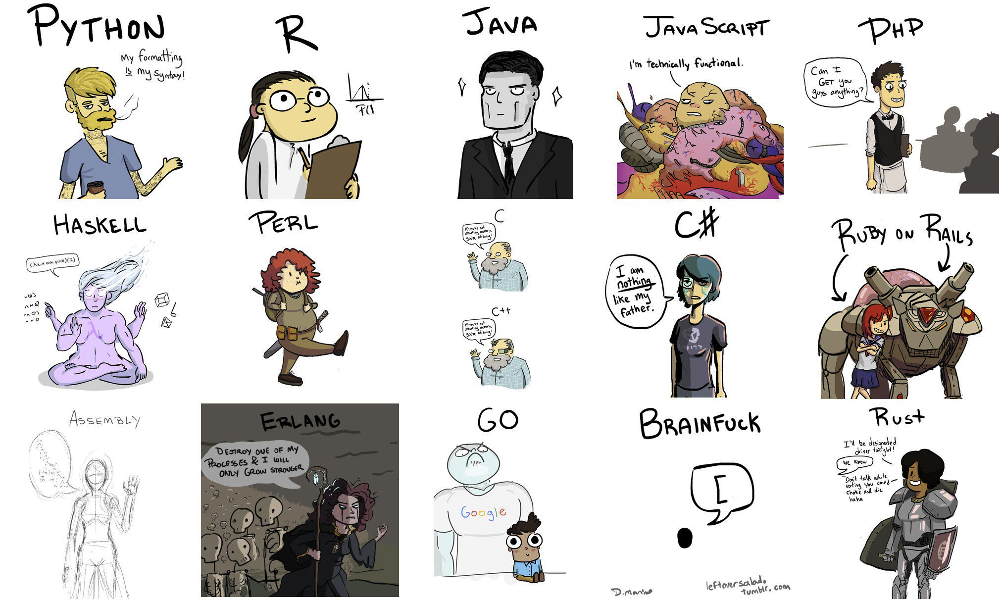

---

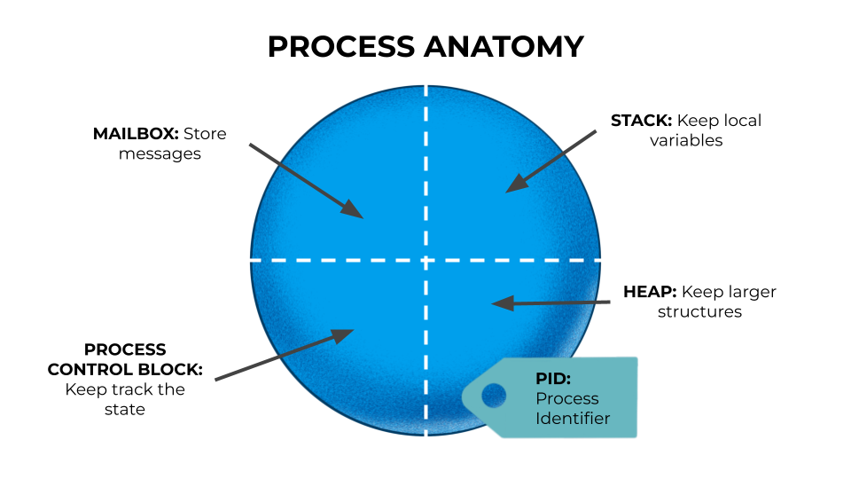

---

- [PCB C Struct](https://github.com/erlang/otp/blob/5400ccf243a31d664153a4b9ceb9de3edfce1e0e/erts/emulator/beam/erl_process.h#L1007)

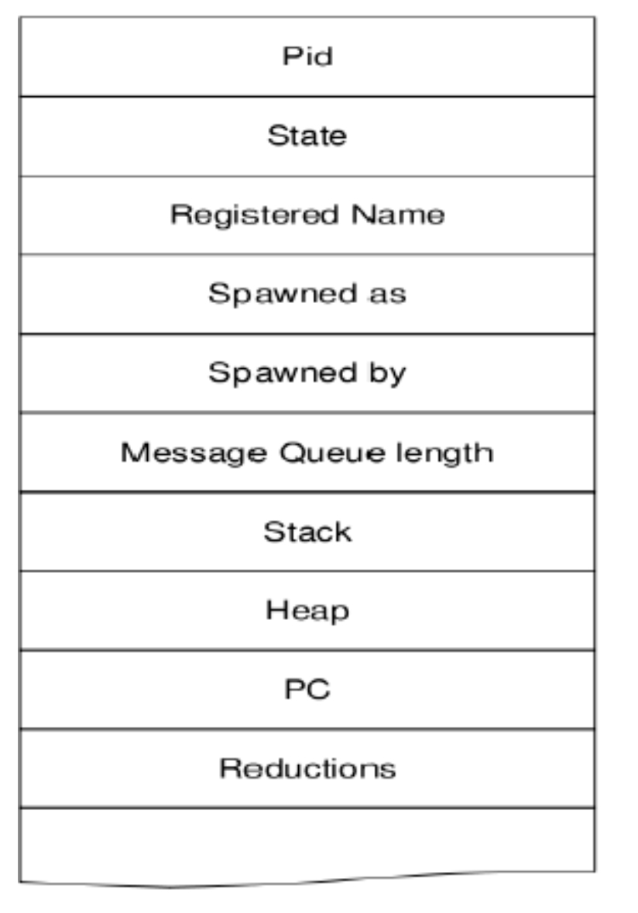

---

### Процеси

* Процесът е "парче памет".
* Достъп до данни на друг процес може да се осъществи само чрез съобщения.
* Процесът се състои от:
  * **Собствен** стек;
  * **Собствен** хийп;
  * **Собствена** пощенска кутия;
  * **Собствен** контролен блок.

---

### Пълна изолация


---

### Освен нещата, които са общи и/или променими

* `refc binaries`, `ets`, `persistent_term`, `process dictionary`, `mailbox`, etc.
* Все неща, предоставени от платформата, които са правилно имплементирани.


---

### Stop The World Garbage Collection

- Когато GC спира целия свят, то броят обработени задачи през това време спада до 0.
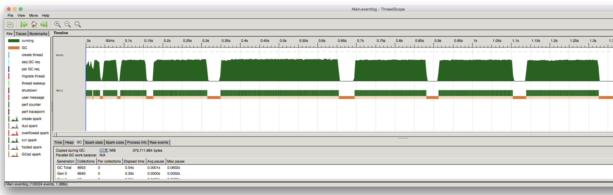

---

### Per Process Garbage Collection

* В Elixir GC не "спира света".
* Всеки процес изпълнява Garbage Collection самостоятелно.
* Докато един процес изпълнява GC, другите процеси могат да правят каквото си искат.
* Generational semi-space copying collector (using Cheney's copy collection algorithm)
* Технически детайли: [тук](https://www.erlang.org/doc/apps/erts/garbagecollection) и [тук](https://blog.stenmans.org/theBeamBook/#_the_garbage_collector_gc)
* [Haskell vs Go vs Elixir GC](https://www.theerlangelist.com/article/reducing_maximum_latency)

---

### Типове данни - PID

* Пример: `#PID<0.481.0>`
* `pid` - Process identifier. Уникален идентификатор на жив процес. PID на приключил процес може да бъде преизползван.
* `self/0`, `spawn/{1,3}` и `spawn_link/{1,3}` връщат `pid`.
* `pid` се визуализира като наредена тройка числа: `{node_id, id, serial}`.
  * Всички процеси на един node имат `node_id` равен на `0`;
  * `id` се увеличава с 1 при всяко създаване на процес;
  * Когато `id` стигне `MAXPROCS`, `serial` се увеличава с 1 и `id`;
  * Ако един `pid` има `node` различно от 0, то той сочи към процес на друг node.
* https://www.erlang.org/doc/efficiency_guide/advanced.html

---

### Създаване на процеси

* `spawn/1` - създава процес, който изпълнява функцията, подадена като аргумент.
* `spawn/3` - създава процес, който изпълнява функцията зададена чрез тройката `Module, Function, Arguments` (`MFA`).
* `spawn_link/{1,3}` - създава процес, подобно на `spawn`; двата процеса се "свързват" (повече за това по-късно).
* `spawn_monitor/{1,3}` - създава процес, подобно на `spawn`; създаденият процес бива "наблюдаван" от създаващия го процес (повече за това по-късно)

--- 

```elixir
spawn(fn -> IO.puts("Hello from process #{inspect(self())}!") end)
# => Hello from process #PID<0.1303.0>!
# PID<0.1303.0>
IO.puts("Hello from #{inspect(self())}, too!")
# => Hello from #PID<0.1299.0>, too!

defmodule T do
  def print_sum(a, b, c) do
    IO.puts("#{a} + #{b} + #{c} = #{a + b + c}")
  end
end

spawn(T, :print_sum, [1, 2, 3])
#=> 1 + 2 + 3 = 6
#PID<0.1344.0>
```

---

```elixir
for i <- 1..20, do: spawn(fn -> IO.puts(i) end)   

# 1
# 3
# 4
# 2
# 5
# ...  
```

---

### Живота на един процес

- Когато един процес свърши своята работа, то той бива терминиран.
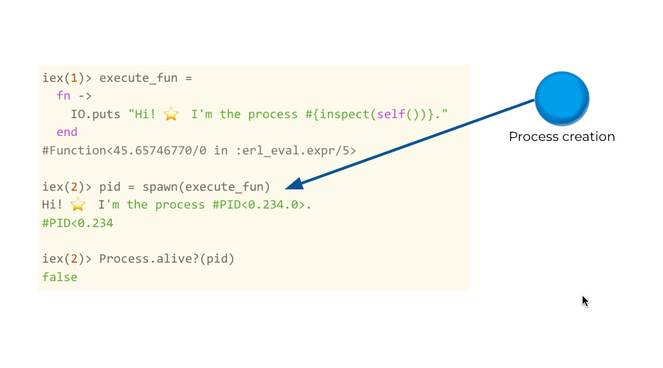

---

### Комуникация между процеси

* Процесите изпращат съобщения: `send/2`.
* Процесите получават съобщения: `receive/1`.
* Съобщенията са асинхронни - `send/2` винаги връща изпратеното съобщение, без да проследи получаването.
  * Трябва сами да имплементираме синхронна комуникация, когато е необходимо (или да използваме готови шаблони от библиотеката).
* Всеки процес има пощенска кутия (mailbox) - място, където се съхраняват съобщенията, които са изпратени до него.

---

### Send

* `send/2` - изпраща съобщение до процес.
* Първият аргумент е `pid` на процеса, към който се изпраща съобщението.
* Вторият аргумент е самото съобщение.
  * Всеки валиден тип в Elixir може да бъде съобщение.
* `send(self(), :hello)` - изпраща съобщение към себе си.
  * `flush()` - само в `iex` - чете всички съобщения на текущия процес.

---

### Receive

* `receive` дефинира, подобно на `case`, множество шаблони, които се съпоставят последователно.
* Ако някой от шаблоните се съпостави, то кодът му се изпълнява и `receive` завършва.
* Ако никой от шаблоните не се съпостави, то `receive` блокира процеса:
  * Докато не се получи съобщение, което да се съпостави с някой от шаблоните.
  * Докато не изтече таймаут, дефиниран с `after`.
* Ако отляво има само име на променлива, то всяко съобщение успешно се съпоставя с него.

---

```elixir
# Чете всяко съобщение, без да го съпоставя с някой шаблон
receive do
  msg -> IO.inspect(msg)
end

# Чете само съобщения, които са наредени двойки с първи аргумент :hello
receive do
  {:hello, from} -> IO.inspect(from)
end

# Чете съобщения, които са стрингове
receive do
  msg when is_binary(msg) -> IO.inspect(msg)
end
```

---

```elixir
pid = spawn(fn ->
  IO.puts(DateTime.utc_now())
  # Чака за съобщение :some_msg. Ако не го получи в рамките на 5 секунди,
  # изпълнява кода в after.
  receive do
    :some_msg -> :ok
  after 
    5_000 -> 
      IO.puts("#{DateTime.utc_now()} Terminating because of timeout!")
      :timeout
  end
end)

# 2023-03-08 22:30:42
# 2023-03-08 22:30:47 Terminating because of timeout!
```

---

```elixir
pid = spawn(fn ->
  # selective receive - съпоставя съобщенията с шаблони
  receive do
    {:pattern_1, from} -> send(from, :received_pattern_1)
    {:pattern_2, from} -> send(from, :received_pattern_2)
    :print_info -> IO.inspect(Process.info(self(), :messages), label: "Messages")
  end
end)

send(pid, {:pattern_100, self()})
send(pid, {:pattern_101, self()})
send(pid, {:pattern_101, self()})
send(pid, {:pattern_2, self()})

flush()
# :received_pattern_2
```

---

```elixir
pid = spawn(fn ->
  receive do
    {:pattern_1, from} -> send(from, :received_pattern_1)
    {:pattern_2, from} -> send(from, :received_pattern_2)
    :print_info -> IO.inspect(Process.info(self(), :messages), label: "Messages")
  end
end)

send(pid, {:pattern_100, self()})
send(pid, {:pattern_101, self()})
send(pid, {:pattern_101, self()})
send(pid, :print_info)
# Messages: {:messages,
#  [
#    pattern_100: #PID<0.111.0>,
#    pattern_101: #PID<0.111.0>,
#    pattern_101: #PID<0.111.0>
#  ]}
```

---

```elixir
pid = spawn(fn ->
  receive do
    {:pattern_1, from} -> send(from, :received_pattern_1)
    {:pattern_2, from} -> send(from, :received_pattern_2)
    :print_info -> IO.inspect(Process.info(self(), :messages), label: "Messages")
  end
end)

send(pid, {:pattern_100, self()})
send(pid, {:pattern_101, self()})
send(pid, {:pattern_2, self()})
send(pid, :print_info)
# ????
```

* Нищо не се случва, защото процесът е терминиран.

---

### Имаш поща


* Един процес има една пощенска кутия.
* Пощенската кутия на процес се държи като опашка, която съдържа получените съобщения.
* Пощенската кутия няма адрес или име.
  * *Именувани процеси и безименни пощенски кутии* vs *Безименни горутини и именувани канали*.
* Когато процес изпраща съобщение, то той **копира** данните от своята памет в пощенската кутия на другия процес.
* Имплементация: [The Beam Book](https://blog.stenmans.org/theBeamBook/#_mailboxes_and_message_passing)

---

### Имаш поща и паралелизъм

* При множество паралени процеси, писането в поща на друг процес не е безопасно.
* `m-buf`:
  * Парче памет извън хийпът, където други процеси могат да пишат безопасно.
  * Когато цялото съобщение е копирано, съобщението в `m-buf` се свързва с пощенската кутия.
  * Използва се когато lock-ът на пощенската кутия е взет от друг.

---

### Изпращане на съобщение

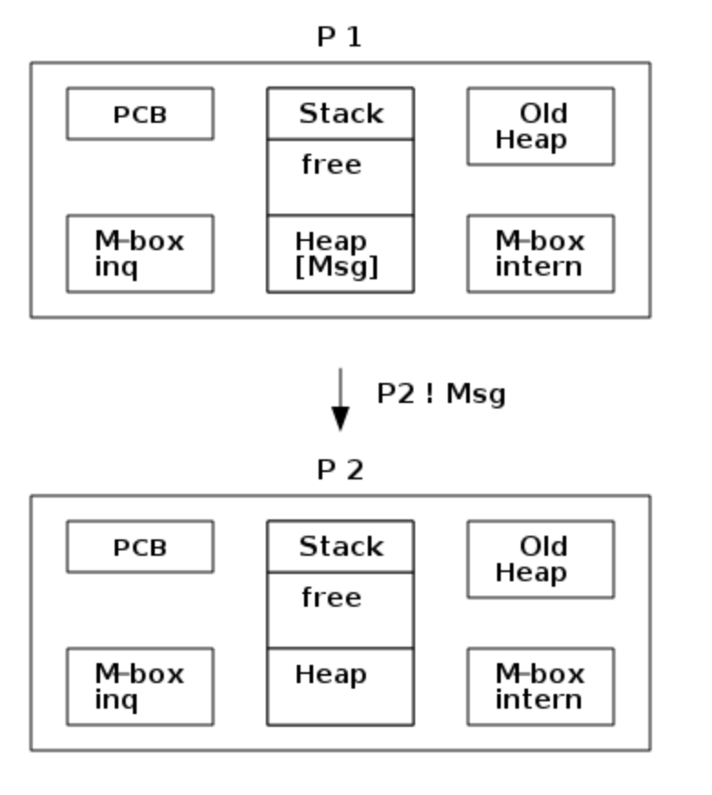

* Пресмята размера на Msg.
* Алокира място за съобщението (в хийпа на P2 или в `m-buf`).
* Копира съобщението от хийпа на P2 в алокираното място.
* Алокира и свързва структура ErlMessage, обвиваща съобщението.
* Свързва ErlMessage с пощенската кутия.

---

### Гаранции при изпращане на съобщение

* Почти никакви. Приема се, че съобщенията могат да не бъдат доставени.
* `send` връща директно, без да се интересува дали съобщението е получено.
* Ако процеси **A**, **B**, и **C** изпращат съобщения на D, то няма гаранции за реда на получаване.
* Ако процес **A** изпраща съобщения *a1*, *a2* и *a3* на процес **B**, то е гарантирано, че съобщенията ще бъдат получени в този ред (ако бъдат получени).

---

### Group Leader

* Всеки процес участва в някаква група и всяка група има лидер.
* Процес се присъединява към групата на процеса, който го е създал.
* Всички IO операции се пренасочват към груповия лидер.

---

```elixir
printer_pid = spawn(fn ->
  receive do
    {:print, text} -> IO.puts(text <> " from #{self()}!"
  end
end)

IO.puts("Hello from #{self()}!")
#=> Hello from #PID<0.111.0>!

# `self()` и `pid` имат общ групов лидер, затова виждаме IO.puts
# изпълнен в процес, различен от текущия
send(printer_pid, {:print, "Hello"})
#=> Hello from #PID<0.1303.0>!

send(printer_pid, {:print, "1 + 2 = 3"})
#=> 1 + 2 = 3 from #PID<0.1303.0>!
```

---

### Грешки в друг процес

```elixir
fun = fn -> {:error, "something went wrong"} end
spawn(fn -> :ok = fun.() end)
spawn(fn -> 1 / 0 end)
spawn(fn -> raise "error" end)
spawn(fn -> throw 10 end)
spawn(fn -> exit(:normal) end)
```

* Можем само да видим принтирана грешка на екрана заради общ групов лидер
* Поради изолацията на процесите, грешките в тях не се пренасят на други процеси.

---

### Връзки между процеси - link

* `link` - специална двупосочна връзка между два процеса.
* Когато единият процес приключи своята работа неочаквано, то всички свързани с него процеси също терминират.
  * Неочаквано: Когато процесът терминира чрез `exit`, `throw` или `raise`;
  * `MatchError`, `FunctionClauseError`, ръчно извикване на `exit`/`throw`.
* Свързване на един процес с друг става:
  * по време на създаването му чрез `spawn_link/{1,3}`;
  * след създаването му чрез `Process.link/1` (свързва текущия процес с друг процес).
  * `spawn_link/{1,3}` е атомарна операция, `spawn/{1,3}` + `Process.link/1` не е.

---

```elixir
self()
#PID<0.111.0>
spawn_link(fn -> raise "error" end)
# ** (EXIT from #PID<0.111.0>) shell process exited with reason: an exception was raised:
#     ** (RuntimeError) error
#         iex:1: (file)
# 
# 18:32:45.788 [error] Process #PID<0.113.0> raised an exception
# ** (RuntimeError) error
#     iex:1: (file)
```

---

### Връзки между процеси - link

* Ако процесите са толкова изолирани, защо `link` убиваа всички свързани с него процеси?
* По този начин не разпространяваме ли грешките, вместо да ги изолираме и обработваме?
* Можем да превърнем грешките в инструменти!
* `Process.flag(:trap_exit, true)`
  * Преобразува грешките в съобщения;
  * Изпраща съобщение, също и когато процесът приключи успешно.

---


---

```elixir
self()
#PID<0.111.0>
Process.flag(:trap_exit, true)

spawn_link(fn -> raise "error" end)

# Процес PID<0.111.0> не умира
# 18:40:18.477 [error] Process #PID<0.115.0> raised an exception
# ** (RuntimeError) error
#     iex:3: (file)
 
flush()
# {:EXIT, #PID<0.115.0>,
#  {%RuntimeError{message: "error"},
#   [{:elixir_eval, :__FILE__, 1, [file: 'iex', line: 3]}]}}
```

---

```elixir
self()

spawn_link(fn -> :ok end)
 
flush()
# Когато свързаният процес приключи успешно и нямаме trap_exit=true
# нашият процес не получава нищо
```

---

```elixir
self()
Process.flag(:trap_exit, true)
spawn_link(fn -> :ok end)
 
flush()
# {:EXIT, #PID<0.554.0>, :normal}
```

---

### Типове данни - Ref

* Пример: `#Reference<0.3339068074.245366785.27512>`
* Създава се чрез `make_ref/0`.
* `ref` - Терм, уникален измежду всички свързани nodes
* Използва се за имплементация на синхронна комуникация чрез асинхронни съобщения (Как? За бонус точка.)
* https://www.erlang.org/doc/efficiency_guide/advanced.html

---

### Връзки между процеси - monitor

* `monitor` - специална еднопосочна връзка между два процеса - единият процес наблюдава другия (stalker).
* Когато наблюдаваният процес терминира (успешно или неочаквано), наблюдаващият получава съобщение.
* Няма нужа от `trap_exit`
* `spawn_monitor` - създава процес и го наблюдава. Връща `{pid, ref}`.
* `Process.monitor(pid)` - започва да наблюдава процес. Връща `ref`.
* Може да имаме множество от `monitor` от един процес към друг.
* `spawn_monitor/{1,3}` е атомарна операция, `spawn/{1,3}` + `Process.monitor/1` не е.

---

```elixir
spawn_monitor(fn -> :ok end)
spawn_monitor(fn -> 1/0 end)
spawn_monitor(fn -> raise("error") end)

flush()
# {:DOWN, #Reference<0.2157985570.1367343105.170114>, :process, #PID<0.732.0>,
#  :normal}
#
# {:DOWN, #Reference<0.2157985570.1367343105.170219>, :process, #PID<0.734.0>,
#  {:badarith,
#   [
#     {:erlang, :/, [1, 0], [error_info: %{module: :erl_erts_errors}]},
#     {:elixir_eval, :__FILE__, 1, [file: 'iex', line: 25]}
#   ]}}
#
# {:DOWN, #Reference<0.2157985570.1365508098.140719>, :process, #PID<0.736.0>,
#  {%RuntimeError{message: "error"},
#   [{:elixir_eval, :__FILE__, 1, [file: 'iex', line: 26]}]}}
```

---

### Разлика между link и monitor

* `link` е двупосочна връзка, `monitor` е еднопосочна.
* `link` има нужда от `trap_exit`, за да не убива свързаният процес.
* Може да имаме `monitor`-и от процес A към процес B (полезно е при писане на библиотеки).
* `monitor` е "неинваразивен" - не влияе на живота на наблюдавания процес.
* `link` се отнася повече към организацията на процесите и разпространението на грешките.
  * Отношението между уеб сървър <-> заявка.
  * Ако уеб сървърът терминира, то заявката също трябва да терминира. Обратното не е вярно.
  
---

### Шаблони

---

```elixir
# Синхронна комуникация чрез асинхронни съобщения
pid = spawn(fn ->
  receive do
    {:get_state, pid} -> send(pid, {:state, "state"})
  end
end)

send(pid, {:get_state, self()})

receive do
  {:state, state} -> state
end
```

---

```elixir
# Синхронна комуникация чрез асинхронни съобщения
pid = spawn(fn ->
  receive do
    {:get_state, pid, ref} -> send(pid, {:state, ref, "state"})
  end
end)

ref = make_ref()
send(pid, {:get_state, self(), ref})

receive do
  {:state, ^ref, state} -> state
end

```

---

```elixir
# Синхронна комуникация чрез асинхронни съобщения
pid = spawn(fn -> 
  receive do
    {:call, {pid, ref}, msg} -> send(pid, {:reply, ref, msg}
  end
end)

ref = Process.monitor(pid)
send(pid, {:call, {self(), ref}, msg})

receive do
  {^ref, reply} ->
    Process.demonitor(ref, [:flush])
    reply

  {:DOWN, ^ref, :process, ^pid, status} ->
    exit(status)
end
```

---

```elixir
# Синхронна комуникация с timeout
pid = spawn(fn -> 
  receive do
    {:call, {pid, ref}, msg} -> 
    Process.sleep(Enum.random(0..10_000))
    send(pid, {:reply, ref, msg}
  end
end)

ref = Process.monitor(pid)
send(pid, {:call, {self(), ref}, msg})

receive do
  {^ref, reply} ->
    Process.demonitor(ref, [:flush])
    reply

  {:DOWN, ^ref, :process, ^pid, status} ->
    exit(status)
after
  5_000 ->
    Process.demonitor(ref, [:flush])
    raise "timeout"
end
```

---

```elixir
# "Mutable" state
defmodule Counter do
  def start_link() do
    spawn_link(__MODULE__, :loop, [0])
  end

  def get_next(pid) do
    ref = make_ref()
    send(pid, {:get_counter, self(), ref})
    receive do
      {:counter, ^ref, counter} -> counter
    end
  end

  def loop(counter) do
    receive do
      {:get_counter, pid, ref} -> 
        send(pid, {:counter, ref, counter})
        loop(counter + 1) # StackOverflow???
    end
  end
end

pid = Counter.start_link()
IO.puts(Counter.get_next(pid)) # => 0
IO.puts(Counter.get_next(pid)) # => 1
IO.puts(Counter.get_next(pid)) # => 2
```

---

```elixir
# Sneak peek: GenServer синхронна комуникация и mutable state
defmodule Counter2 do
  use GenServer

  def start_link(opts) do
    GenServer.start_link(__MODULE__, %{}, name: Keyword.get(opts, :name))
  end

  def init(_), do: {:ok, %{counter: 0}}
 
  def handle_call(:get, _from, state) do
    {
      :reply,  # Ще отговорим на извикващия процес
      state.counter, # Това е отговорът
      Map.update!(state, :counter, & &1 + 1) # Новото състояние
    }
  end
end

{:ok, pid} = Counter2.start_link(name: :counter)
IO.puts(GenServer.call(:counter, :get)) # => 0
IO.puts(GenServer.call(pid, :get)) # => 1
IO.puts(GenServer.call(:counter, :get)) # => 2
```
---

## Именуване на процеси

* В някои случаи е по-удобно вместо променящ се `pid`, да имаме име на процеса.
* Ако един процес е уникален/специален, то може да му дадем име.
* Ако един уеб сървър обработва всяка заявка в отделен процес, то тези процеси не трябва да имат име.
* Има различни механизми за именуване на процеси.
  * `:erlang.register/2`;
  * `:global.register_name/2`;
  * `Registry` модул;
  * `pg2`;
  * Библиотеки: `swarm`, `horde` и др.

---

```elixir
pid = Counter.start_link() # От предишните слайдове
:erlang.register(:counter, pid)

# Изпраща съ
send(:counter, {:get_counter, self(), make_ref()})
send(pid, {:get_counter, self(), make_ref()})

resolved_pid = :erlang.whereis(:counter)
send(resolved_pid, {:get_counter, self(), make_ref()})

flush()
# {:counter, #Reference<0.997260736.984612865.46599>, 0}
# {:counter, #Reference<0.997260736.984612865.51911>, 1}
# {:counter, #Reference<0.997260736.984612865.62775>, 2}
```

---

```elixir
{:ok, _} = Registry.start_link(keys: :unique, name: MyRegistry)
pid = Counter.start_link() # От предишните слайдове
Registry.register(MyRegistry, :counter, pid)

[{_, resolved_pid}] = Registry.lookup(MyRegistry, :counter)
send(resolved_pid, {:get_counter, self(), make_ref()})
send(pid, {:get_counter, self(), make_ref()})
# send(:counter, {:get_counter, self(), make_ref()}
# * 1st argument: invalid destination

flush()
# {:counter, #Reference<0.997260736.985399297.2709>, 0}
# {:counter, #Reference<0.997260736.985399297.8026>, 1}
```

---

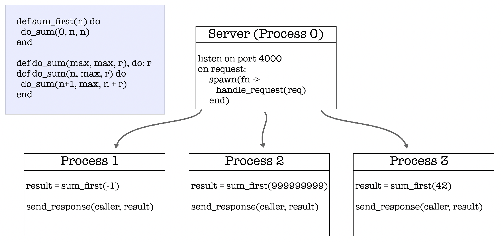

---

### Ресурси

- https://freecontent.manning.com/concurrency-vs-parallelism
- https://www.manning.com/books/elixir-in-action
- https://learnyousomeerlang.com/the-hitchhikers-guide-to-concurrency
- https://learnyousomeerlang.com/errors-and-processes
- https://github.com/happi/theBeamBook
- https://cs.lmu.edu/~ray/notes/introconcurrency/
- https://www.researchgate.net/publication/228756317_Erlang-Programming_the_Parallel_World
