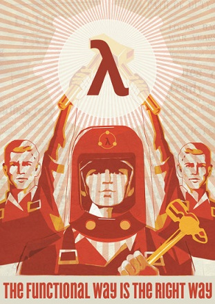
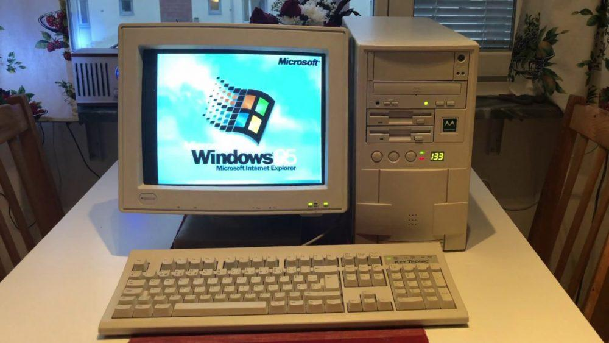
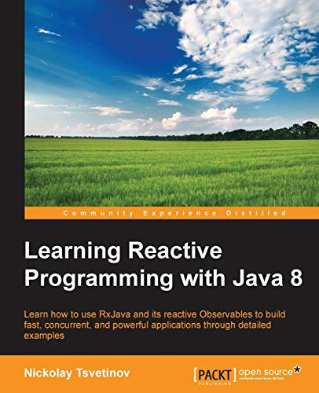
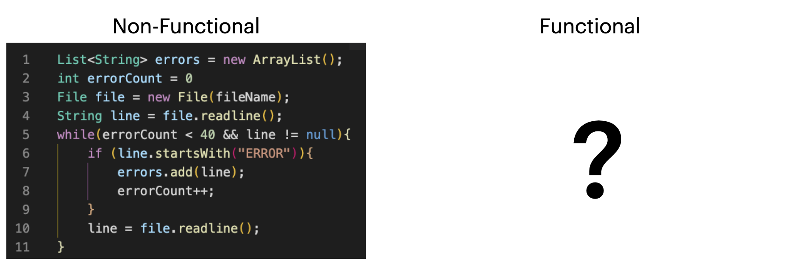
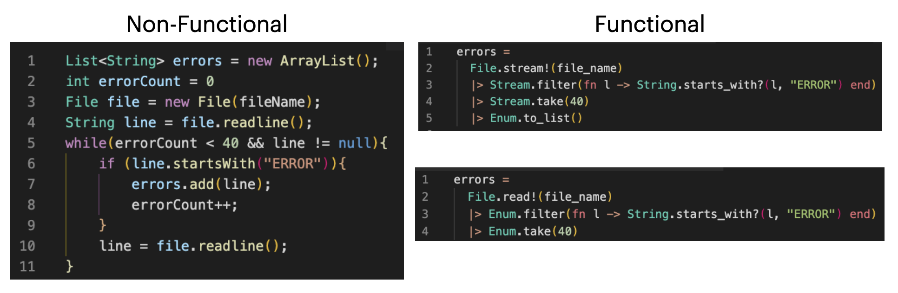
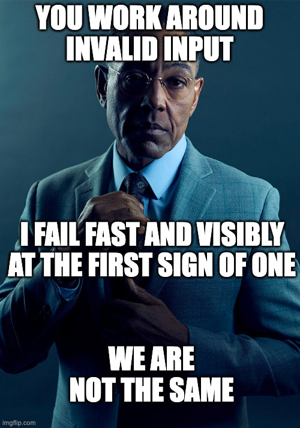
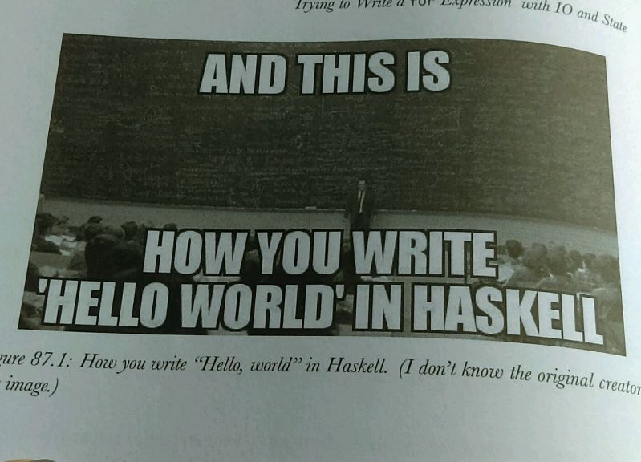

## Functional Programming as a Career (Elixir and Beyond)

---
### Who am I?

* My name is Nikolay, some call me Meddle.
* I've been professional programmer for ~18 years now.
* I'm an Elixir developer, doing things mainly on the backend of the world.
* I'm part of the Sofia University Elixir course.
* I'm a musician and a poet, other things too, but that's not important.

---

Blog: https://themeddle.com
Github: https://github.com/meddle0x53
Bandcamp: https://smerch.bandcamp.com

---
### Who are you?

* People that are intereseted in learning about functional programming
* People that like functional programming but don't work with it?
* People that work with functional technologies (JavaScript??)
* Anyway, we'll be talking about why it is viable option now

---

FMI Elixir course site: https://elixir-lang.bg

---
### The Past

* Around 15 years ago, to find backend job you had two main choices Java and PHP.
* Why was it like that?
* Well because the requirements...

---
### The Past, requirements

* Nobody required 100 000 users at the same time..
* Nobody required the site to be 99.999% available.
* Nonody required voice over IP.
* Nobody required collaboration in real time.
* Simpler times! (Actually there were niches that required the above things).

---

But does this super cool search engine backed advertising business site support IE6??

---
### The Past and the niches

* Interesting is, that even in the 80s there were businesses that had very different requirements.
* The Telecommunications Companies!

---
### The Past and the Telecoms

Telecom software had to be:

* Concurrent (had to be able to support 1000s transactions happening at the same time).
* Fault tolerant - To be tolerant to errors and troubles, both software and hardware.
* No down time at all!
* The code had to be replacable while they were running (see the above requirement)

---
### The Past and the Telecoms

Well, there was a language/technology/ecosystem designed for that:

#### Erlang!

---
### The Past and the reality

* That's true but that was a niche thing. There were others like that.
* The great imperative OOP idea was the corporate buzz word.
* And that's normal, most computers were with CPUs that had just one core and not much power.
* Requirements drive the marketplace and that's OK!

---
### Times change!

---
### Times change!

* With time we started receiving similar requirements to the ones of the Telecoms.
* For example Netflix came with the idea of streaming movies to the homes of its customers.
* What were the requirements : multiple concurrent data streams to 1000s of users.
* What they did to acieve that : they came up with RX (The Reactive idea), a very functional idea.

---
### Times change!

* Computers got multi-core, more powerful, great ideas of the past that were not easy to implement before were now possible.
* Collaboration software - collaborate on writing books, designing UI, coming with diagrams and ideas!
* Servers had to be very concurrent, state had to be shared between 1000s of people at the same time, threads and locks were getting complex!

---
### Life is complex...

---
### Life is complex...

* Turns out the physics make sense!
* You can't phisically have the same data in two places at the same time.
* You can copy it!
* Be pure, be immutable, make your life simple!
* People started thinking about these old ideas - functional programming?

---
### Life is complex...

---
### Changes!

* What about the old Actor model? Have you seen Erlang?
* What about transforming by copying and reusing immutable data, not mutating data?
* What about pure functions that we can pass and return from another function?
* What about persistent data structures?

---
### Changes!

* OOP languages like Java got "lambda functions" and RXJava.
* Languages like Scala and F# were created - they were "functional".
* BTW F# is very cool, have you seen OCaml??
* Akka anyone?
* Use the roots of JavaScript - write functional code!

---
### Monkeys writing books!

---
### Also different minds, different productivity!

---
### Also different minds, different productivity!

---
### My message!

* My message is that functional programming is in demand!
* If you want to be concurrent, fault-tolerant, resilient - that's the easiest way.
* Even imperative languages are integrating functional idioms! Rust,C#,Java,C++,etc
* Learning some Erlang/Haskell/OCaml/Common lisp for the greater good is always a bonus!

---

---
### Elixir!

* But for me Elixir is the technology for the win.
* It's Erlang, but it's also more, it has all the layers of erlang:
    * Functional : Simple sequential functional languages inside the **processes**
    * Concurrent : All runs in actor-like **processes** that run concurrently and don't share state.
    * Fault-tolerant and resilient : Comes with the great OTP behaviors that if used right lead to 99.999% availability.
    * Distributed : if a **process** is running on a node in Bulgaria it can just send and receive messages to and from a node in Japan.

---

---
### Elixir!

* Elixir is wonderful for:
  * IOT : 1000s of devices sending streams of data to the same (distributted) server at the same time.
  * Instant Messaging and Voice Over IP : Have you heard of Discord?
  * Blockchain : For listening for new blocks and updating indexes on the chain, for managing transactions, for good integration with low level langs like Rust!
  * Even for machine learning : Check **Nx**/**Axon**, maybe we'll get rid of Python some day?!
  * Web : Rails, PHP, JEE??, Express : Why not Phoenix? We have **Live View**

---
### Elixir!

---
### Who uses Elixir?

* **Pepsi** - Yup the sugar bombs, they use it for their marketing software.
* **Spotify** - 1000s of requests in second for their sites work good for them.
* **Discord** - Calls, messages, many requests in real time.
* **Apple** - Environment and supply chain innovation (ESCI)

---
### Who uses Elixir?

* **Pinterest** - Niche stuff has traffic too you know!
* **Toyota** - Servers for traffic updates, car sharing services
* **Financial Times** - Inside GraphQL APIs.
* **Square Enix** - User accounts for their games.

---
### Who uses Elixir?

* **Aeternity** - Bockchains, smart contract management (btw also us, **Eiger**)
* **Weedmaps** - 420 man!
* **Sketch** - Designers use it a lot.
* **Moodle** - Yup, they have now MoodleNet a teacher's social network.

---
### Who uses Elixir?

* Me!
* My friends!
* Other people!
* Why not you??

---

---
### Thanks!
* Thanks to F# for the **|>** pipe, and thanks to OCaml for F# and Rust!
* Thanks to Haskell for making our lives interesting.
* Thanks to Math (and FMI) for showing us the way!

---
### Thanks!
* Thanks to Ivan from the Elixir course for providing half of the content of that lecture : we did it for the opening of our course!
* Thanks to José Valim for Elixir!

---
### Thanks and bye!
* Thanks to *Pure:#code* that we met!
* Thank you for spending your time with me!

---
### Thanks and bye!

