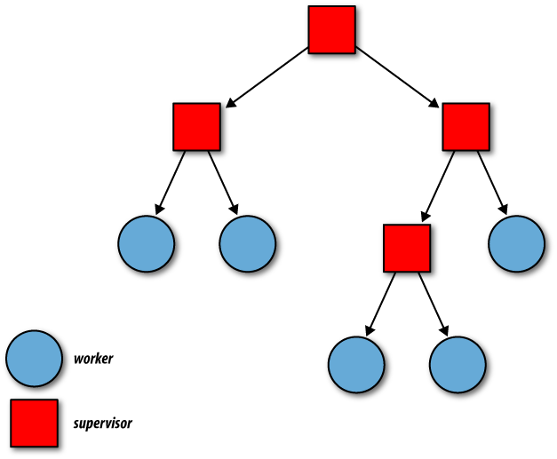

---

theme: uncover
style: |
  .center_img {
    margin: auto;
    display: block;
  }

  .side_by_side {
    display: flex;
    align-items: center;
    justify-content: center;
    gap: 10px;
  }

  .small-text {
    font-size: 0.75rem;
    letter-spacing: 1px;
    font-family: "Times New Roman", Tahoma, Verdana, sans-serif;
  }
  li {
    font-size: 28px;
    letter-spacing: 1px;
  }
  p.quote {
    line-height: 38px;
  }
  q {
    font-size: 32px;
    letter-spacing: 1px;
  }
  cite {
    text-align: right;
    font-size: 28px;
    margin-top: 12px;
    margin-bottom: 128px;
  }
paginate: true
backgroundColor: #FFFFFF
marp: true

---

## Supervisors and Applications

---

## Supervisor


---
### Какво е Supervisor?
* Това е процес, чиято роля е да наглежда други процеси и да се грижи за тях.
* С помощта на Supervisor, по лесен начин можем да изградим fault tolerant система.
* Идеологията около това поведение е лесна за възприемане.
* Трудното е да направим добър дизайн на такава система.

---
* Често сме споменавали за идеологията "Let it crash!".
* Тази мантра се базира върху следното:

---
* Важно е програмата да върви.
* Ако части от нея се сринат, не е проблем - нещо наблюдава тези части.
* Нещо ще се погрижи те да бъдат възстановени с начално валидно
състояние.
* Това нещо е Supervisor.

---

- Подобно на GenServer, Supervisor е поведение, за което callback функциите имат имплементации по подразбиране.
```elixir
defmodule SomeSupervisor do
  use Supervisor
end
```

---
*В модула Supervisor има код, който може:
  * Да инициализира и стартира Supervisor процес.
  * Да осигури, че Supervisor процесът прихваща EXIT сигнали.
  * Да стартира определен списък от процеси-деца, зададени на Supervisor-а и да ги link-не към него.

---
* Поведението Supervisor дава възможност:
  * Ако някой от процесите-деца 'умре' непредвидено (т.е. с причина различна от `{:EXIT, _, :normal}`), Supervisor-ът ще получи сигнал и ще предприеме конкретно действие, зададено при имплементацията му.
  * Ако Supervisor-ът бъде терминиран, всичките му процеси-деца биват 'убити'.

---
### Supervisor: Стратегии


---
`:one_for_one`

* Ако наблюдаван процес 'умре', той се рестартира.
* Другите не се влияят.
* Тази стратегия е добра за процеси които нямат връзки и комуникация помежду си, които могат да загубят състоянието си без това да повлияе на другите процеси-деца на Supervisor-а им.

---
`:one_for_all`

* Ако наблюдаван процес 'умре', всички наблюдавани процеси биват 'убити' и след това всички се стартират наново.
* Обикновено тази стратегия се използва за процеси, чиито състояния зависят доста едно от друго и ако само един от тях бъде рестартиран ще е се наруши общата логина на програмата.

---
`:rest_for_one`

* Ако наблюдаван процес 'умре', всички наблюдавани процеси стартирани СЛЕД него също 'умират'.
* Всички тези процеси, включително процесът-причина се рестартират по първоначалния им стартов ред.
* Тази стратегия е подходяща за ситуация като : процес 'A' няма зависимости, но процес 'Б' зависи от 'А', а има и процес 'В', който зависи както от 'Б', така и транзитивно от 'А'.

---
### Supervisor: max_restarts и max_seconds

* С опцията :max_restarts задаваме колко пъти може един процес да бъде рестартиран в даден период от време.
* По подразбиране е 3.
* Ако за :max_seconds секунди пробваме да рестартираме процеса :max_restarts пъти, трябва да се откажем.


---
### Пример

```elixir
defmodule Stack do
  use GenServer

  def start_link(state), do: GenServer.start_link(__MODULE__, state, name: Stack)

  # Callbacks
  def init(state), do: {:ok, state}

  def handle_cast({:push, item}, _from, state), do: {:noreply, [item | state]}

  def handle_call(:pop, _from, [top | rest]), do: {:reply, top, rest}
end
```

---
### Пример

```elixir
children = [
  # Stack е процес-дете, което ще стартираме със: Stack.start_link([:hello])
  # Това се нарича "Child specification"
  %{
    id: Stack,
    start: {Stack, :start_link, [[:hello]]}
  }
]

# Сега можем да стартираме Супервайзър с тези деца и някоя стратегия
{:ok, pid} = Supervisor.start_link(children, strategy: :one_for_one)

# Можем да видим, че децата са стартирани:
GenServer.call(Stack, :pop)
#=> :hello

GenServer.cast(Stack, {:push, :world})
#=> :ok

GenServer.call(Stack, :pop)
#=> :world
```


---
### Пример

```elixir
# Обаче имаме бъг:
GenServer.call(Stack, :pop)
# ** (exit) exited in: GenServer.call(Stack, :pop, 5000)

# И тук детето вече е рестартирано:
GenServer.call(Stack, :pop)
#=> :hello
```

---
### Child specification


---

### Child specification
* Спецификацията на децата определя как супервайзърът ще ги
стартира, изключва и рестартира.
* Това е един речник с 6 елемента - 2 задължителни и 4 опционални аргументи и задават поведението на
процеса-дете.


---
```elixir
@type child_spec() :: %{
  :id => atom() | term(),
  :start => {module(), atom(), [term()]},
  optional(:restart) => :permanent | :transient | :temporary,
  optional(:shutdown) => timeout() | :brutal_kill,
  optional(:type) => :worker | :supervisor,
  optional(:modules) => [module()] | :dynamic
}

```

---
#### id

* Това е стойност която се ползва от Supervisor-ите вътрешно.
* Може да се ползва за debugging да речем.
* Ако процесът има име - това е името му.
* По подразбиране, името е модула. Ако искаме да ползваме един и същ модул за много деца и не даваме име - трябва да я специфицираме

---
#### start

* Тази стойност е tuple съдържащ MFA.
* Използва се за стартиране на процеса-дете.
* По подразбиране, функцията за стартиране на процеса е `:start_link`.

---
* Задължително тази функция трябва да стартира процес и да го свързва със процеса, който я е извикал.
* Аргументите ще се подадат на зададената като атом функция при старт.
* Тези аргументи се специфицират тук

---
```elixir
@type child_spec() :: %{
  :id => atom() | term(),
  :start => {module(), atom(), [term()]},
  optional(:restart) => :permanent | :transient | :temporary,
  optional(:shutdown) => timeout() | :brutal_kill,
  optional(:type) => :worker | :supervisor,
  optional(:modules) => [module()] | :dynamic
}

```

---
#### restart

* Атом, който указва кога и дали 'терминиран' процес-дете ще се рестартира. Възможните стойности са:

---
#### `restart: :permanent`

* Процесът винаги се рестартира от Supervisor-а.
* Това е стойността по подразбиране на restart.
* Този начин на рестартиране е подходящ за дълго-живеещи процеси, които не трябва да 'умират'.

---
#### `restart: :transient`

* С тази опция, даденият процес-дете няма да бъде рестартиран ако излезе нормално - с exit(:normal) или просто завърши изпълнение.
* Ако обаче излезе с друга причина (exit(:reason)), ще бъде рестартиран.

---
#### `restart: :temporary`

* Процесът-дете няма да бъде рестартиран ако 'умре'.
* Няма значение дали е излязъл с грешка или не.
* Подходяща е за кратко-живеещи процеси за които е очаквано, че могат да 'умрат' с грешка и няма много код зависещ от тях.

---
#### shutdown

* Когато Supervisor трябва да убие някои или всички свои процеси-деца, той извиква `Process.exit(child_pid, :shutdown)` за всеки от тях.
* Стойността зададена като shutdown се използва за timeout след като това се случи.
* По подразбиране е 5000 или пет секунди.

---
* Когато процес получи `:shutdown`, ако е Genserver, ще му се извика `terminate/2` функцията.
* Изчистването на някакви ресурси може да отнеме време.
* Ако това време е повече от зададеното в shutdown, Supervisor-ът ще изпрати нов EXIT сигнал с `Process.exit(child_pid, :kill)`.

---
* Ако зададем стойност `:brutal_kill` за shutdown, Supervisor-ът винаги ще терминира даденият процес направо с `Process.exit(child_pid, :kill)`.
* Можем да зададем и `:infinity` за да оставим процеса да си излезе спокойно.

---
#### type

* Това свойство определя дали процесът дете е `:worker` процес или
`:supervisor`.

---
#### modules

* Трябва да е списък от един елемент - модул.
* Това е модулът съдържащ callback функциите на GenServer имплементация или на Supervisor имплементация.

---
### Функцията child_spec/1
* По лесен начин за задаване на спецификация
* За да не задаваме map, можем да ползваме нея
* За наше щастие `use GenServer` автоматично я създава за нас

---
### Наредена двойка за спецификация

```elixir
children = [
  {MyModule, [<args>]}
]
```

---
* Ще се ползват дефаултните стойности за спецификация
* Модулът ще е MyModule и трябва да дефинира start_link/1, на която ще се подадат аргументите
* Автоматично Supervisor-а ще извика `MyModule.child_spec(arg)`

---

Модулът трябва да има зададена `child_spec/1` функция:
```elixir
def child_spec(arg) do
  %{
    id: <id>,
    start: {MyModule, :start_link, [arg]},
    # Другите ключове на спецификация могат да се зададат
  }
end
```

---
### Или просто модулът за спецификация

```elixir
children = [
  MyModule
  # Същото като {MyModule, []} или MyModule.start_link()
]
```

---
### Child specification
- В крайна сметка спецификацията може да е:
  - Речник с цялата спецификация
  - Наредена двойка - Модул и аргументи - ще бъде извиканa `child_spec/1` с аргументите, за да се вземе спецификацията
  - Просто модул - аналогично на горния вариант, но с празен лист за
  аргументи

---
### Supervisor - друг начин за направа като модули

---
```elixir
defmodule StackSupervisor do
  use Supervisor

  def start_link(init_arg) do
    Supervisor.start_link(__MODULE__, init_arg, name: __MODULE__)
  end

  def init(_arg) do
    children =
    [
      {Stack, [:hello]}
    ]

    Supervisor.init(children, strategy: :one_for_one)
  end
end
```

---
### Supervisor Модули

* Като цяло Супервайзърите като модули ни дават много повече контрол
върху това как се инициализира.
* На практика предпочитаме да ги използваме винаги пред това ръчно
някъде да инициализираме супервайзър
* `use Supervisor` дефинира `child_spec`, това ни позволява:

---

### Дърво от Supervisor-и


---
### Функциите на Supervisor


---
#### Supervisor.init/2

* Приема списък от спецификации и опции за Супервайзърите
* Най-често се извиква в края на init callback-a в модулни Supervisor-и

---
#### Supervisor.start_child/2

* Динамично добавя нова спецификация към Supervisor и стартира процес за нея.
* Първият аргумент е pid на Supervisor процес, а вторият - валиден child_spec.

---
#### Supervisor.count_children/1

```elixir
SomeSupervisor |> Supervisor.count_children
# %{active: 3, specs: 3, supervisors: 0, workers: 3}
```

---
* active - това е броят на всички активни процеси-деца, които се управляват от подадения Supervisor.
* specs - това е броят на всички процеси-деца, няма значение дали са 'живи' или 'мъртви'.
* supervisors - броят на всички активни процеси-деца, които се управляват от подадения Supervisor и са Supervisor-и на свой ред. Няма значение дали са активни или не.
* workers - това е броят на всички активни процеси-деца, които се управляват от подадения Supervisor и не са Supervisor-и. Няма значение дали са активни или не.

---
#### Supervisor.which_children

* Връща списък с информация за всичките процеси-деца на Supervisor.

---
#### Supervisor.terminate_child

* Може да 'убие' процес-дете на Supervisor, подаден като първи аргумент.

---
#### Supervisor.restart_child

* Рестартира процес-дете, чиято спецификация се пази в подаденият като първи аргумент Supervisor.

---
#### Supervisor.delete_child

* Изтрива спецификация за дадено child_id.

---
#### Supervisor.stop

* Спира подаденият като първи аргумент Supervisor с подадена като втори аргумент причина и изчаква с timeout - трети аргумент.


---
### DynamicSupervisor


---
* Специален вид Supervisor
* Обикновено започва без процеси-деца
* Когато има нужда - такива процеси се стартират със start_child/2
* Обикновено работи с деца с една и съща спецификация, но може и други да се задават

---
* Добър е когато можем да имаме множество подобни процеси, които се създават динамично.
* Да речем за изграждане на pool от процеси
* Или за процес на нов request към нашата логика
* Пример е Task.Supervisor (ще покажем пример с него)

---
### Task.Supervisor

* Понякога искаме задачите да изпращат резултат, но да не се link-ват към текущия процес.
* Да речем това са задачи, които си говорят с отдалечен компонент/service и биха могли да получат грешка отвън.

---
* Бихме могли да стартираме специален DynamicSupervisor като част от нашия Application, който да отговаря за тези задачи.
* Този Supervisor ще създава задачи, които могат и да излязат с грешка, но няма да убият процеса, който ги използва.
* Даже ще връщат резултат ако са създадени с правилната функция.

---
### GenServer и Task

- Когато създадем задача в GenServer с Task.Supervisor.async_nolink, ако не използваме Task.await/2, можем да си дефинираме handle_info callback, който ще бъде извикан с резултата от задачата във формата `{ref, result}`.
- Важното в подобни случаи е да дефинираме един допълнителен handle_info callback:

```elixir
def handle_info({:DOWN, _ref, :process, _pid, _status}, state)
```

---
## Application


---
### Какво е Application?

* Application е компонент в Elixir/Erlang, който може да бъде спиран и стартиран като едно цяло.
* Може да бъде използван от други Application-и.
* Един Application се грижи за едно supervision дърво и средата в която то върви.

---
* Винаги, когато виртуалната машина стартира, специален процес, наречен 'application_controller', се стартира с нея.
  * [Let there be light: from nothing to a running application - ElixirConfEU 2019](https://www.youtube.com/watch?v=_AqmxltiV9I)
* Този процес стои над всички Application-и, които вървят в тази виртуална машина.
* Mожем да го наречем Supervisor на Application-ите.

---
* Можем да приемем application_controller процеса за корена на дървото от процеси в един BEAM node.
* Под този 'корен' стоят различните Application-и, които са абстракция, обвиваща supervision дърво, която може да се стартира и спира като едно цяло.
* Те са като мега-процеси, управлявани от application_controller-a.
* Отвън те изглеждат като един процес за който имаме функции start и stop.
* Често dependency, което изтегляте, стартира нов Application, с който можете да комуникирате.
  * Не трябва да прекалявате с това. Ако може вашата библиотека да не стартира Application, а да предоставите само функции, с които потребителят да работи, ще е по-добре.
  * `:observer.start()` -> `Applications tab`, за да видите всички Application-и, които са пуснати.

---
* Когато се стартира един Application се създават два специални процеса, които заедно са наречени 'application master'.
* Тези два процеса създават Application-а и стоят между application_controller процеса и Supervisor-а служещ за корен на supervision дървото.

---
### Пример : Presentem

---
### Поведението Application


---
#### start

* Извиква се при стартиране на Application-а.
* Очаква се да стартира процеса-корен на програмата, обикновено това е root Supervisor.

---
* Очаква се да върне {:ok, pid}, {:ok, pid, state} или {:error, reason}.
* Този state може да е каквото и да е, може да бъде пропуснат и ще е [].
* Той се подава на stop/1 callback функцията при спиране.

---
На start/2 се подават два аргумента.
* Първият обикновено е атома :normal, но при дистрибутирана програма би могъл да е {:takeover, node} или {:failover, node}.
* Вторият са аргументи за програмата, които се задават при конфигурация.

---
#### stop

* Когато Application-а бъде спрян, тази функция се извиква със състоянието върнато от start/2.
* Използва се за изчистване на ресурси и има имплементация по подразбиране, която просто връща :ok.

---
### Функциите на модула Application

---
#### Application.load

* Зарежда Application в паметта.
* Зарежда environment данните му и други свързани Application-и.
* Не го стартира.

---
#### Application.start

* Стартира Application.
* За първи аргумент взима атом, идентифициращ Application.
* За втори типа на Application-а.

---
Типът на програмата може да бъде: `:permanent`
* Ако Application-ът умре, всички други Application-и на node-а също умират.
* Няма значение дали Application-а е завършил нормално или не.

---
Типът на програмата може да бъде: `:transient`
* Ако Application-ът умре с :normal причина, ще видим report за това, но другите Application-и на node-а няма да бъдат терминирани.
* Ако причината обаче е друга, всички други Application-и и целия node ще бъдат спрени.

---
Типът на програмата може да бъде: `:temporary`
* Това е типът по подразбиране.
* С каквато и причина да спре един Application, другите ще продължат изпълнение.

---
- Ако спрем ръчно Application с функцията `Application.stop/1`, тези стратегии няма да се задействат.


---
#### Application.ensure_all_started

* Прави същото като Application.start/2 и взима същия тип аргументи, но също стартира всички други Application-и, конфигурирани като зависимости.

---
#### Application.get_application

* Взима модул, който представлява Application, тоест има "use Application".
* Връща атом представляващ Application.
* Няма значение дали този Application е активен или не.
* Важно е да е специфициран.

---
#### Функции за четене и писане на Application environment

* Application environment е keyword list, който се конфигурира при дефиниране на Application.
* Има няколко функции за четене от него.

---
#### Application.spec

Тази функция има две версии.
* Първата взима само Application и връща цялата му спецификация.
* Втората взима Application и ключ в спецификацията, за да върне част от нея.

---
#### Application.stop

* Спира Application. Без да задейства стратегията му. Application-ът остава зареден в паметта.

---
#### Application.unload

* Премахва от паметта спрян Application и неговите зависимости, зададени като included_applications.

---
### Създаване и конфигурация на Application


---
* OTP Application поведението и логиката около него идват от Erlang/OTP.
* Application-ите се конфигурират със специален .app файл, написан на Erlang.
* Той се слага при .beam файловете, които описва и след това може да се зареди на node, който има в пътя си директорията с него и тези .beam файлове. |

---


---
```bash
mix new <app_project_name> --sup
```

---
### mix файл и конфигурация на един Application


---
### Как стартираме един Application?

```bash
iex -S mix run
```


---
## Край

